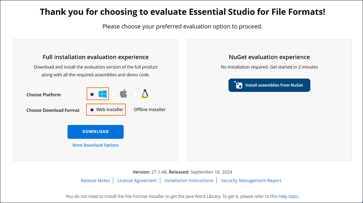
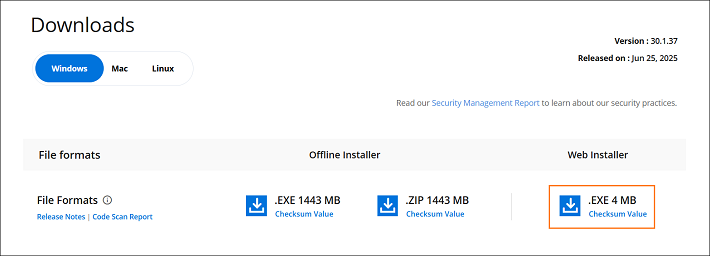

# Downloading Syncfusion&reg; FileFormats Web Installer

[DocIO](https://www.syncfusion.com/word-framework/net), [PDF](https://www.syncfusion.com/pdf-framework/net), [Presentation](https://www.syncfusion.com/powerpoint-framework/net), and [XlsIO](https://www.syncfusion.com/excel-framework/net) controls are included in the Syncfusion&reg; FileFormats installer. You can either download the licensed installer or try our trial installer depending on your license. 

   - Trial Installer
   - Licensed Installer

## Download the Trial Version

Our 30-day trial can be downloaded in two ways.

   * Download Free Trial Setup
   * Start Trials if using components through [Maven Repository](https://jars.syncfusion.com)

### Download Free Trial Setup

1. You can evaluate our 30-day free trial by visiting the [Download Free Trial](https://www.syncfusion.com/downloads) page and selecting the FileFormats platform.
2. After completing the required form or logging in with your registered Syncfusion&reg; account, you can download the FileFormats trial installer from the confirmation page (as shown in the screenshot below). 
   
   
   
3. With a trial license, only the latest version’s trial installer can be downloaded.
4. After downloading, the Syncfusion&reg; FileFormats trial installer can be unlocked using either the trial unlock key or the Syncfusion&reg; registered login credentials. More information on generating an unlock key can be found in [this](https://www.syncfusion.com/kb/8069/how-to-generate-unlock-key-for-essentials-studio-products) article.
5. Before the trial expires, you can download the trial installer at any time from your registered account’s [Trials & Downloads](https://www.syncfusion.com/account/manage-trials/downloads) page (as shown in the screenshot below).
6. Click the Download (element 1 in the screenshot below) button to get the Syncfusion&reg; Essential Studio&reg; FileFormats web installer.
 
   

   
### Start Trials if Using Components Through [Maven Repository](https://jars.syncfusion.com)

1. You can start your 30-day free trial for FileFormats from the [Start Trial](https://www.syncfusion.com/account/manage-trials/start-trials) page in your account.
   
   
   
2. To access this page, you must sign up/log in with your Syncfusion&reg; account.
3. Begin your trial by selecting the FileFormats product. 

   N> If you've already used the trial products and they haven't expired, you won't be able to start the trial for the same product again.

4. After you've started the trial, go to the [Trials & Downloads](https://www.syncfusion.com/account/manage-trials/downloads) page to get the latest version trial installer. You can generate the [unlock key](https://www.syncfusion.com/kb/8069/how-to-generate-unlock-key-for-essentials-studio-products) and [license key](https://help.syncfusion.com/java-file-formats/licensing/how-to-generate) here at any time before the trial period expires (as shown in the screenshot below).

   

5. You can find your current active trial products on the [Trials & Downloads](https://www.syncfusion.com/account/manage-trials/downloads) page.
   

## Download the Licensed Version

1. Syncfusion&reg; licensed products will be available on the [License & Downloads](https://www.syncfusion.com/account/downloads) page under your registered Syncfusion&reg; account.
2. You can view all the licenses (both active and expired) associated with your account.
3. Click the Download (element 1 in the screenshot below) button to download the respective product’s installer.
4. The most recent version of the installer will be downloaded from this page.
5. To download older version installers, go to [Downloads Older Versions](https://www.syncfusion.com/account/downloads/studio) (element 2 in the screenshot below).
6. You can download other platform/add-on installers by going to More Download Options (element 3 in the screenshot below).

   
   
7. Before the license expires, you can download the installer at any time from your registered account’s [License & Downloads](https://www.syncfusion.com/account/downloads) page (see the screenshot below).
   
   
   
8. After downloading, the Syncfusion&reg; FileFormats web installer can be unlocked using Syncfusion&reg; registered login credentials.

   N> For Syncfusion&reg; trial and licensed products, there is no separate web installer. Based on your account license, Syncfusion&reg; trial or licensed products will be installed via the web installer.

You can also refer to the [**Web Installer**](https://help.syncfusion.com/java-file-formats/installation/web-installer/how-to-install) links for step-by-step installation guidelines.