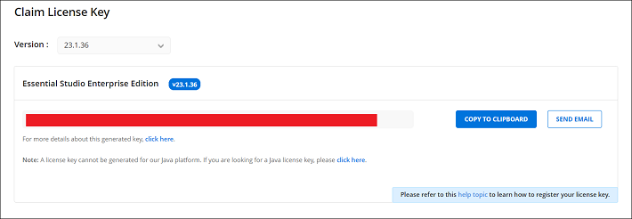
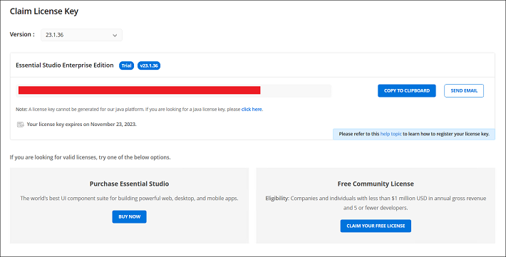
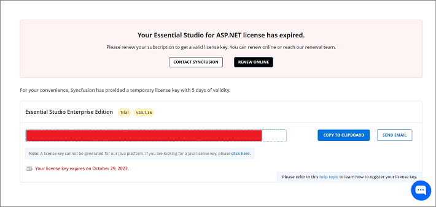
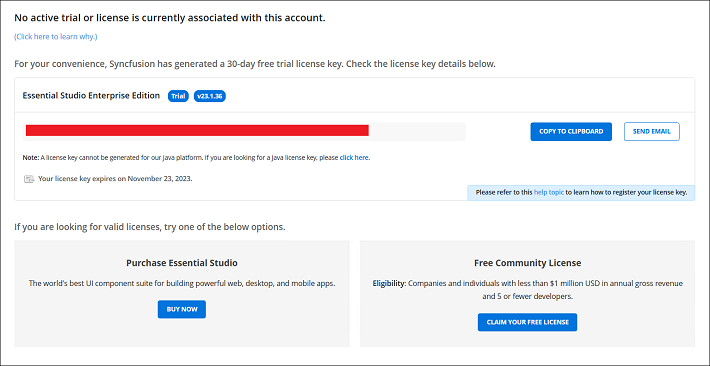

# Generate Syncfusion&reg; FileFormat License Key

License keys for Java can be generated from the [License & Downloads](https://syncfusion.com/account/downloads) or [Trial & Downloads](https://www.syncfusion.com/account/manage-trials/downloads) section of your Syncfusion account. 

I> * Syncfusion&reg; license keys are **version and platform-specific**. For example, you must generate separate keys for the front-end (JavaScript) and server-side (Java). Refer to this [KB](https://www.syncfusion.com/kb/8976/how-to-generate-license-key-for-licensed-products) to generate the license key for the required version and platform.
* Refer to this [KB](https://www.syncfusion.com/kb/8951/which-version-syncfusion-license-key-should-i-use-in-my-application) to learn which version of the Syncfusion&reg; license key should be used in the application.

## Claim License Key

Syncfusion&reg; License keys can also be generated from the **"Claim License Key"** page based on the trial or valid license associated with your Syncfusion&reg; account.

You can obtain the license key based on license availability in your Syncfusion&reg; account.

### Active License

If you have a Syncfusion&reg; account associated with a valid license, the license key will be generated from the "Claim License Key" page.

### Active Trial

If you have a Syncfusion&reg; account associated with a valid trial license, the license key will be generated from the "Claim License Key" page with an expiry date.

### Expired License

If you have a Syncfusion&reg; account with an expired license, your license subscription must be renewed in order to obtain a valid license key for the latest Essential Studio&reg; version. Meanwhile, a temporary license key with a 5-day validity period will be generated.

### No Trial, No License, or Expired Trial

If the Syncfusion&reg; account is not associated with a trial, license, or expired trial, you can try to claim either a trial or a valid license from the "Claim License" page.

## See Also

* [How to Register Syncfusion&reg; License Key in FileFormat Application?](https://help.syncfusion.com/java-file-formats/licensing/how-to-register-in-an-application)