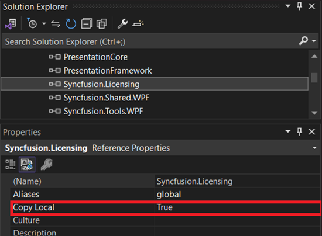
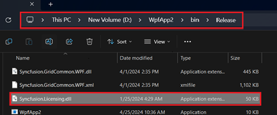

# Syncfusion&reg; Licensing Errors

A licensing error popup is displayed with various messages under different circumstances. Here are some ways to resolve different issues.

## Licensing Errors 

### License Key Not Registered/Trial Expired 

The following error message will be shown if a Syncfusion&reg; license key has not been registered in your application or if the trial key has expired after 30 days. 

**Error Message:** This application was built using a trial version of Syncfusion&reg; Essential Studio&reg;. You should include the valid license key to remove the license validation message permanently.

**Solution:**

* Generate a valid license key from here: [Licensed users](https://www.syncfusion.com/account/downloads) or [Trial users](https://www.syncfusion.com/account/manage-trials/downloads) for a specific version and platform. License keys can also be generated from the Claim License Key page by clicking the **"Claim License"** button from the Syncfusion&reg; licensing warning message. Refer to this [help topic](https://help.syncfusion.com/java-file-formats/licensing/how-to-generate#Claim-License-Key) for more details.

* In your application, register the generated license key. Please refer to this [help topic](https://help.syncfusion.com/java-file-formats/licensing/how-to-register-in-an-application) for information on registering the license key.

### Invalid Key

If the application is registered with an invalid key, another version of a license key, or another platform's license key, the following error message will pop up when launching the application. 

**Error Message:** The included Syncfusion&reg; license key is invalid.

**Solution:**

* Generate a valid license key from here: [Licensed users](https://www.syncfusion.com/account/downloads) or [Trial users](https://www.syncfusion.com/account/manage-trials/downloads) for a specific version and platform. License keys can also be generated from the Claim License Key page by clicking the **"Claim License"** button from the Syncfusion&reg; licensing warning message. Refer to this [help topic](https://help.syncfusion.com/java-file-formats/licensing/how-to-generate#Claim-License-Key) for more details.

* In your application, register the generated license key. Please refer to this [help topic](https://help.syncfusion.com/java-file-formats/licensing/how-to-register-in-an-application) for information on registering the license key.

## Licensing Errors from Version 16.2.0* to 20.3.0*

### License Key Not Registered 

The following error message will be shown if a Syncfusion&reg; license key has not been registered in your application. 

**Error Message:** This application was built using a trial version of Syncfusion&reg; Essential Studio&reg;. Please include a valid license to permanently remove this license validation message. You can also obtain a free 30-day evaluation license to temporarily remove this message during the evaluation period. Please refer to this [help topic](https://help.syncfusion.com/java-file-formats/licensing/licensing-errors#license-key-not-registered) for more information.

**Solution:**

* Generate a valid license key from here: [Licensed users](https://www.syncfusion.com/account/downloads) or [Trial users](https://www.syncfusion.com/account/manage-trials/downloads) for a specific version and platform.

* In your application, register the generated license key. Please refer to this [help topic](https://help.syncfusion.com/java-file-formats/licensing/how-to-register-in-an-application) for information on registering the license key.

### Invalid Key

If the application is registered with an invalid key, another version of a license key, or another platform's license key, the following error message will pop up when launching the application. 

**Error Message:** The included Syncfusion&reg; license key is invalid.

																																																																								  

**Solution:**

* Generate a valid license key from here: [Licensed users](https://www.syncfusion.com/account/downloads) or [Trial users](https://www.syncfusion.com/account/manage-trials/downloads) for a specific version and platform.

* In your application, register the generated license key. Please refer to this [help topic](https://help.syncfusion.com/java-file-formats/licensing/how-to-register-in-an-application) for information on registering the license key.

### Trial Expired

The following error message will be shown if the trial key has expired after 30 days.

**Error Message:** Your Syncfusion&reg; trial license has expired. Please refer to this [help topic](https://help.syncfusion.com/java-file-formats/licensing/licensing-errors#trial-expired) for more information.

**Solution:** Purchase from [here](https://www.syncfusion.com/sales/products) to get a valid Syncfusion&reg; license.

### Platform Mismatch

If the application is registered with another platform's license key, the following error message will pop up when launching the application.

**Error Message:** The included Syncfusion&reg; license is invalid (Platform mismatch). Please refer to this [help topic](https://help.syncfusion.com/java-file-formats/licensing/licensing-errors#platform-mismatch) for more information.

**Solution:**

* Generate a valid license key from here: [Licensed users](https://www.syncfusion.com/account/downloads) or [Trial users](https://www.syncfusion.com/account/manage-trials/downloads) for a specific version and platform.

* In your application, register the generated license key. Please refer to this [help topic](https://help.syncfusion.com/java-file-formats/licensing/how-to-register-in-an-application) for information on registering the license key.

### Version Mismatch

If the application is registered with another version's license key, the following error message will pop up when launching the application.

**Error Message:** The included Syncfusion&reg; license ({Registered Version}) is invalid for version {Required version}. Please refer to this [help topic](https://help.syncfusion.com/java-file-formats/licensing/licensing-errors#version-mismatch) for more information.

**Solution:**

* Generate a valid license key from here: [Licensed users](https://www.syncfusion.com/account/downloads) or [Trial users](https://www.syncfusion.com/account/manage-trials/downloads) for a specific version and platform. Kindly follow the [KB](https://www.syncfusion.com/kb/8976/how-to-generate-license-key-for-licensed-products) to generate a license key.

* In your application, register the generated license key. Please refer to this [help topic](https://help.syncfusion.com/java-file-formats/licensing/how-to-register-in-an-application) for information on registering the license key.

### Could Not Load Syncfusion.Licensing.dll Assembly Version...?

Please ensure that all Syncfusion&reg; NuGet packages, including [Syncfusion.Licensing](https://www.nuget.org/packages/Syncfusion.Licensing), were installed properly, and assembly references are upgraded to the required version. Also, verify that the csproj and packages.config/web.config file references have been updated to the required version.

To avoid runtime errors, set Copy Local to true. Copy Local determines whether a reference is copied to the project output path.

Set "CopyLocal" as True for Syncfusion.Licensing.dll along with all other Syncfusion&reg; assemblies and ensure that the Syncfusion.Licensing.dll assembly is also present in the output folder or deployment folder of the application.

Refer to this knowledge base article to set [Copy Local](https://www.syncfusion.com/kb/4808/how-to-resolve-server-error-could-not-load-or-assembly-when-publishing-an-application) as true.