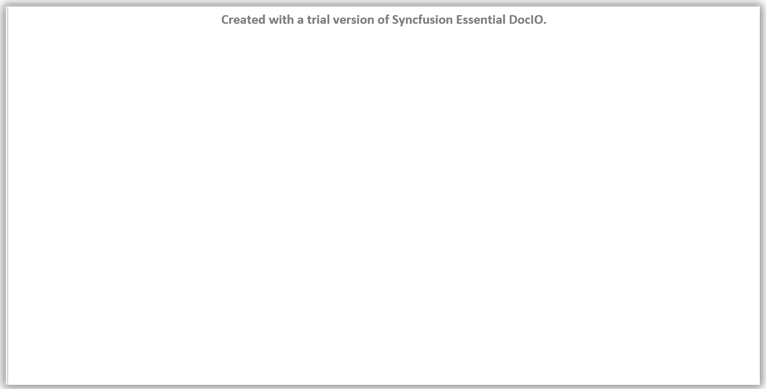

# Syncfusion Licensing in Java FileFormats

Starting from v19.1.0.x, if you reference Syncfusion Java packages from trial installer or from [maven repository](https://jars.syncfusion.com) you must also include the Java platforms license key in your projects for the corresponding version.

### Difference between unlock key and license key

Please note that this license key is different from the installer unlock key that you might have used in the past and needs to be separately generated from Syncfusion website. Refer [this](https://www.syncfusion.com/kb/8950/difference-between-the-unlock-key-and-licensing-key) KB article to know more about difference between the Syncfusion Unlock Key and the Syncfusion License Key.

Trial message will be displayed as watermark in the generated documents, if Java packages referred from trial installer or from [maven repository](https://jars.syncfusion.com)

**Example**

