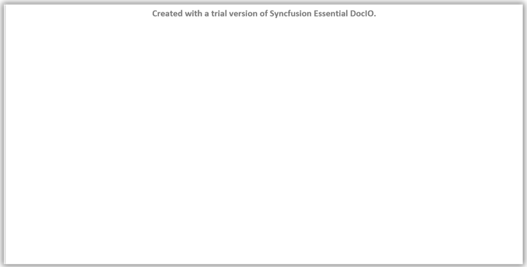

# Syncfusion Licensing Overview

Starting from v19.1.0.x, if you reference Syncfusion Java packages from trial installer or from [maven repository](https://jars.syncfusion.com) you must also include the Java platforms license key in your projects for the corresponding version.

## Difference between unlock key and license key

Please note that this license key is different from the installer unlock key that you might have used in the past and needs to be separately generated from Syncfusion website. Refer [this](https://www.syncfusion.com/kb/8950/difference-between-the-unlock-key-and-licensing-key) KB article to know more about difference between the Syncfusion Unlock Key and the Syncfusion License Key.

Trial message will be displayed as watermark in the generated documents, if Java packages referred from trial installer or from [maven repository](https://jars.syncfusion.com)

**Example**

## Registering license keys in server

| Source of Syncfusion assemblies | Details | License Key needs to be registered? | Where to get license key from |
| ------------- | ------------- | ------------- | ------------- |
| **NuGet package** | If the Syncfusion assemblies used in the build server are downloaded via Syncfusion NuGet packages, then there is no need to install any installation. The required Syncfusion NuGet packages are available from [nuget.org](http://nuget.org/).   However, if we use NuGet packages from [nuget.org](http://nuget.org/), we must register the Syncfusion license key in the application. | Yes | Any developer license can be used to [generate license keys](https://help.syncfusion.com/java-file-formats/licensing/how-to-generate) for build environments also |
| **Trial installer** | If we used trial Syncfusion assemblies in the build server, we should register the corresponding version and platform license key in the application to avoid the trial license warning. | Yes | Any developer trial license can be used to [generate license keys](https://help.syncfusion.com/java-file-formats/licensing/how-to-generate) for build environments also |
| **Licensed installer** |There is no need to register the licence keys if the Syncfusion assemblies used in the build server were obtained from a licenced installer.   You can [download](https://help.syncfusion.com/common/essential-studio/installation/web-installer/how-to-download#download-the-license-version) and [install](https://help.syncfusion.com/java-file-formats/installation/web-installer/how-to-install) the licensed version of our installer. | No | Not applicable |

You can [download](https://help.syncfusion.com/java-file-formats/installation/web-installer/how-to-download#download-the-license-version)) and [install](https://help.syncfusion.com/java-file-formats/installation/web-installer/how-to-install) the licensed version of our installer.

## See Also

* [How to Generate Syncfusion FileFormats License Key?](https://help.syncfusion.com/java-file-formats/licensing/how-to-generate)
* [How to Register Syncfusion License Key in FileFormats Application?](https://help.syncfusion.com/java-file-formats/licensing/how-to-register-in-an-application)
