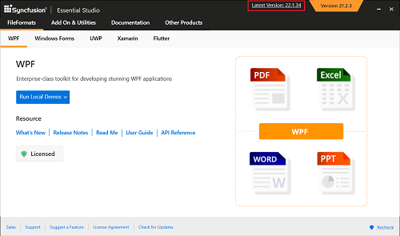

# Upgrading Syncfusion&reg; FileFormats

Syncfusion&reg; releases new volumes once every three months, with exciting new features. There is one Service Pack release for these volume releases. Service Pack releases are provided to address major bug fixes in the volume releases.

You can upgrade to our latest version from any installed Syncfusion&reg; version.

See our **Upgrade Guide** for [PDF](https://help.syncfusion.com/upgrade-guide/file-formats/PDF), [XlsIO](https://help.syncfusion.com/upgrade-guide/file-formats/xlsio), [Presentation](https://help.syncfusion.com/upgrade-guide/file-formats/presentation), and [DocIO](https://help.syncfusion.com/upgrade-guide/file-formats/docio) FileFormats controls to learn more about the “Breaking Changes, Bug Fixes, Features, and Known Issues” between your current version and the latest version you are trying to upgrade.

## Upgrading to the Latest Version

The most recent version of Syncfusion&reg; FileFormats can be downloaded and installed by clicking on the "Latest Version: {Version}" link at the top of the Syncfusion&reg; FileFormats Control Panel.

You can also upgrade to the latest version simply by downloading and installing the products you require from [this](https://www.syncfusion.com/downloads/latest-version) link. The existing installed versions do not need to be uninstalled.

It is not necessary to install the Volume release before installing the Service Pack release. As releases for Volume and Service Packs work independently, you can install the latest version with major bug fixes directly.

## Upgrade from Trial Version to Licensed Version

To upgrade from the trial version, there are two possible solutions:

* Uninstall the trial version and install the fully licensed build from the [License & Downloads](https://www.syncfusion.com/account/downloads) section of our website.
* If you are using Syncfusion&reg; controls from the [Maven repository](https://jars.syncfusion.com), replace the currently used trial license key with a paid license key that can be generated from the [License & Downloads](https://www.syncfusion.com/account/downloads) section of our website. Refer to [this](https://help.syncfusion.com/java-file-formats/licensing/how-to-register-in-an-application) topic for more information regarding registering the license in the application.

N> License registration is not required if you reference Syncfusion&reg; Java packages from a licensed installer. These licensing changes are applicable to all evaluators who refer to the Syncfusion&reg; Java packages from the evaluation installer and those who use Syncfusion&reg; controls from the [Maven repository](https://jars.syncfusion.com).

