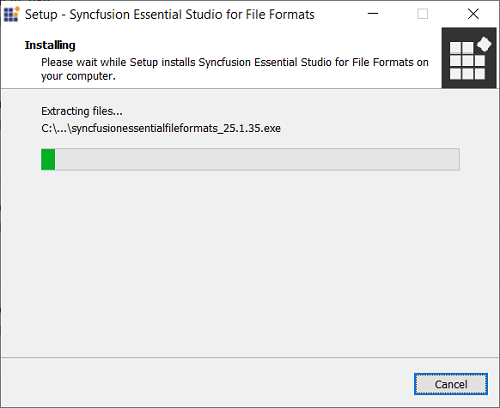
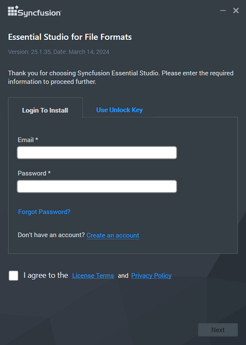
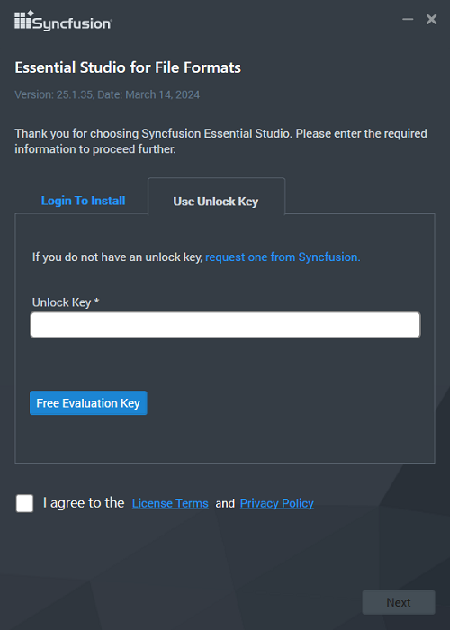
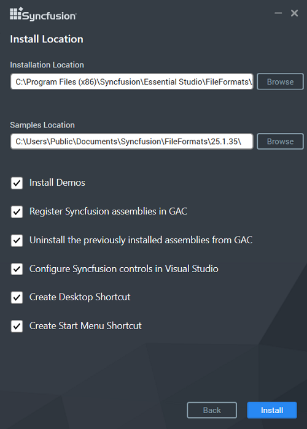
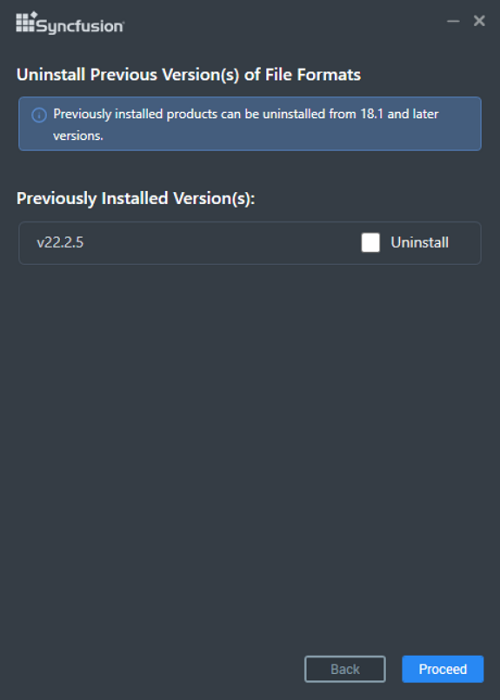
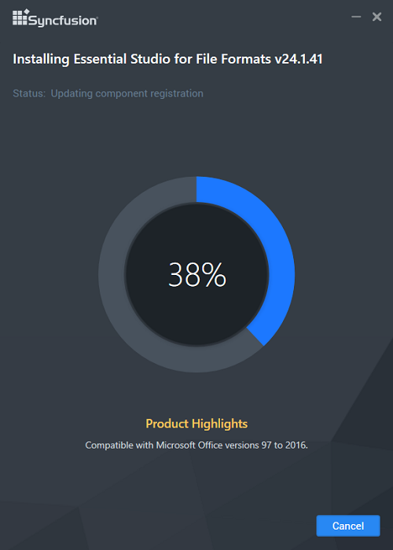
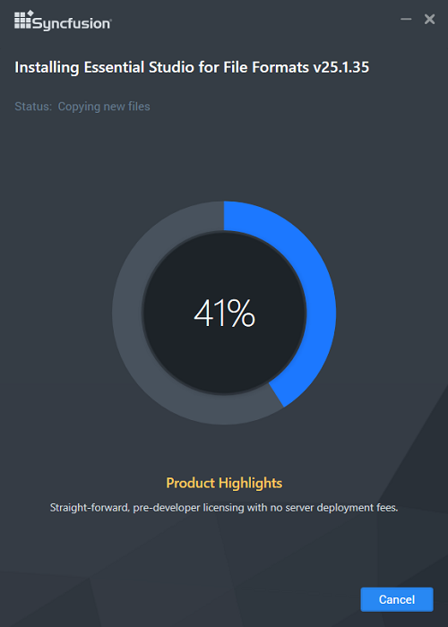
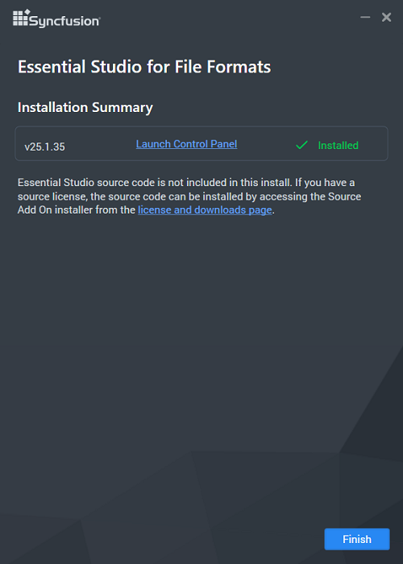

# Installing Syncfusion&reg; FileFormats Offline Installer

## Installing with UI   

The steps below show how to install the Essential Studio&reg; FileFormats installer.

1. Open the Syncfusion&reg; FileFormats offline installer file from the downloaded location by double-clicking it. The Installer Wizard automatically opens and extracts the package.

    

    N> The Installer Wizard extracts the syncfusionessentialfileformats_(version).exe dialog, which displays the package's unzip operation.

2. To unlock the Syncfusion&reg; offline installer, you have two options:

   
    * *Login to Install*
   
    * *Use Unlock Key*

   
   
    **Login to Install**  
   
    You must enter your Syncfusion&reg; email address and password. If you don't already have a Syncfusion&reg; account, you can sign up for one by clicking **"Create an account"**. If you have forgotten your password, click on **"Forgot Password"** to create a new one. Once you've entered your Syncfusion&reg; email and password, click Next.

    

    **Use Unlock Key**  
    Unlock keys are used to unlock the Syncfusion&reg; offline installer, and they are platform- and version-specific. You should use either a Syncfusion&reg; licensed or trial unlock key to unlock the Syncfusion&reg; FileFormats installer.

    The trial unlock key is only valid for 30 days, and the installer will not accept an expired trial key.

					  
   
																																																																																																   
   
																											
   
    To learn how to generate an unlock key for both trial and licensed products, see [this](https://www.syncfusion.com/kb/2326) Knowledge Base article.

    

3. After reading the License Terms and Privacy Policy, check the **"I agree to the License Terms and Privacy Policy"** checkbox. Click the Next button.

4. Change the install and sample locations here. You can also change the Additional Settings. Click Next\Install to install with the default settings.

																																					  

    

    **Additional Settings**
    
    * Select the **Install Demos** checkbox to install Syncfusion&reg; samples, or leave the checkbox unchecked if you do not want to install Syncfusion&reg; samples.
    * Select the **Register Syncfusion&reg; Assemblies in GAC** checkbox to install the latest Syncfusion&reg; assemblies in GAC, or clear this checkbox if you do not want to install the latest assemblies in GAC.
    * Select the **Configure Syncfusion&reg; controls in Visual Studio** checkbox to configure the Syncfusion&reg; controls in the Visual Studio toolbox, or clear this checkbox if you do not want to configure the Syncfusion&reg; controls in the Visual Studio toolbox during installation. Note that you must also select the Register Syncfusion&reg; assemblies in GAC checkbox when you select this checkbox.
    * Select the **Configure Syncfusion&reg; Extensions controls in Visual Studio** checkbox to configure the Syncfusion&reg; Extensions in Visual Studio, or clear this checkbox if you do not want to configure the Syncfusion&reg; Extensions in Visual Studio.
    * Check the **Create Desktop Shortcut** checkbox to add a desktop shortcut for the Syncfusion&reg; Control Panel.
    * Check the **Create Start Menu Shortcut** checkbox to add a shortcut to the Start menu for the Syncfusion&reg; Control Panel.

5. If any previous versions of the current product are installed, the Uninstall Previous Version(s) wizard will be opened. Select the **Uninstall** checkbox to uninstall the previous versions and then click the Proceed button.

    

    N> From the 2021 Volume 1 release, Syncfusion&reg; has added the option to uninstall previous versions from 18.1 while installing the new version.

    N> If any version is selected to uninstall, a confirmation screen will appear. If Continue is selected, the Progress screen will display the uninstall and install progress, respectively. If none of the versions are chosen to be uninstalled, only the installation progress will be displayed.

    **Confirmation Alert**  
    

    **Uninstall Progress**  
    

    **Install Progress**  
    

																  
 
 
																																																								 
 
 
    N> The Completed screen is displayed once the FileFormats product is installed. If any version is selected to uninstall, the Completed screen will display both install and uninstall statuses.
 
					   
 
																  
 
						
 
																  
 
					 
 
																

																																																												 
 
    
 
																																													  

7. After installing, click the **Launch Control Panel** link to open the Syncfusion&reg; Control Panel.

8. Click the Finish button. Your system has been installed with the Syncfusion&reg; Essential Studio&reg; FileFormats product.

    N> * You can find the required JARs in the FileFormats installed location.
    * **Location:** {ProgramFilesFolder}\Syncfusion\Essential Studio\{Platform}\{version}\JarFiles
    * **Example:** C:\Program Files (x86)\Syncfusion\Essential Studio\FileFormats\19.1.0.54\JarFiles

## Installing in Silent Mode

The Syncfusion&reg; Essential Studio&reg; FileFormats Installer supports installation and uninstallation via the command line.

### Command Line Installation

To install through the Command Line in Silent Mode, follow the steps below.

1. Run the Syncfusion&reg; FileFormats installer by double-clicking it. The Installer Wizard automatically opens and extracts the package.
2. The file syncfusionessentialfileformats_(version).exe file will be extracted into the Temp directory.
3. Run %temp%. The Temp folder will be opened. The syncfusionessentialfileformats_(version).exe file will be located in one of the folders.
4. Copy the extracted syncfusionessentialfileformats_(version).exe file to a local drive.
5. Exit the Wizard.
6. Run Command Prompt in administrator mode and enter the following arguments.

   
    **Arguments:** "installer file path\SyncfusionEssentialStudio(platform)_(version).exe" /Install silent /UNLOCKKEY:"(product unlock key)" [/log "{Log file path}"] [/InstallPath:{Location to install}] [/InstallSamples:{true/false}] [/InstallAssemblies:{true/false}] [/UninstallExistAssemblies:{true/false}] [/InstallToolbox:{true/false}]

    N> [..] – Arguments inside the square brackets are optional.

    **Example:** "D:\Temp\syncfusionessentialfileformats_x.x.x.x.exe" /Install silent /UNLOCKKEY:"product unlock key" /log "C:\Temp\EssentialStudio_Platform.log" /InstallPath:C:\Syncfusion\x.x.x.x /InstallSamples:true /InstallAssemblies:true /UninstallExistAssemblies:true /InstallToolbox:true

 
7. Essential Studio&reg; for FileFormats is installed.

    N> x.x.x.x should be replaced with the Essential Studio&reg; version, and the Product Unlock Key needs to be replaced with the Unlock Key for that version.
   

### Command Line Uninstallation

Syncfusion&reg; Essential Studio&reg; FileFormats can be uninstalled silently using the Command Line.

1. Run the Syncfusion&reg; FileFormats installer by double-clicking it. The Installer Wizard automatically opens and extracts the package.
2. The file syncfusionessentialfileformats_(version).exe file will be extracted into the Temp directory.
3. Run %temp%. The Temp folder will be opened. The syncfusionessentialfileformats_(version).exe file will be located in one of the folders.
4. Copy the extracted syncfusionessentialfileformats_(version).exe file to a local drive.
5. Exit the Wizard.
6. Run Command Prompt in administrator mode and enter the following arguments.
   
																																						  

    **Arguments:** "Copied installer file path\syncfusionessentialfileformats_(version).exe" /uninstall silent

    **Example:** "D:\Temp\syncfusionessentialfileformats_x.x.x.x.exe" /uninstall silent

7. Essential Studio&reg; for WPF is uninstalled.