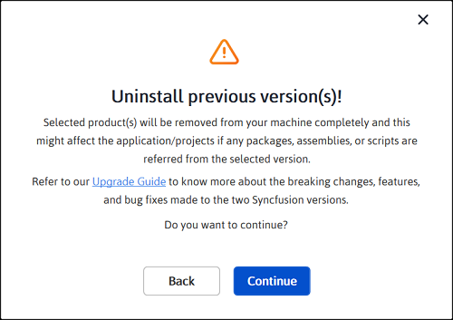

# Installing Syncfusion&reg; FileFormats Web Installer

## Overview

For the Essential Studio&reg; FileFormats product, Syncfusion&reg; offers a Web Installer. This installer alleviates the burden of downloading a larger installer. You can simply download and run the online installer, which will be smaller in size and will download and install the Essential Studio&reg; products you have chosen. You can get the most recent version of the Essential Studio&reg; Web Installer [here](https://www.syncfusion.com/downloads/latest-version).

 
## Installation

The steps below show how to install the Essential Studio&reg; FileFormats Web Installer.

1. Open the Syncfusion&reg; Essential Studio&reg; FileFormats Web Installer file from the downloaded location by double-clicking it. The Installer Wizard automatically opens and extracts the package.

    

    N> The installer wizard extracts the syncfusionessentialfileformatswebinstaller_{version}.exe dialog, which displays the package's unzip operation.

2. The Syncfusion&reg; FileFormats Web Installer's welcome wizard will be displayed. Click the Next button.

    

3. The Platform Selection Wizard will appear. From the **Available** tab, select the products to be installed. Select the **Install All** checkbox to install all products.

    <em>**Available**</em>

    

    If you have multiple products installed in the same version, they will be listed under the **Installed** tab. You can also select which products to uninstall from the same version. Click the Next button.

    <em>**Installed**</em>

    

    I> If the required software for the selected product isn't already installed, the **Additional Software Required** alert will appear. You can, however, continue the installation and install the necessary software later.

    **Required Software**

    

4. If previous version(s) for the selected products are installed, the Uninstall Previous Version Wizard will be displayed. You can see the list of previously installed versions for the products you've chosen here. To remove all versions, check the **Uninstall All** checkbox. Click the Next button.

    

    N> From the 2021 Volume 1 release, Syncfusion&reg; has provided the option to uninstall previous versions from 18.1 while installing the new version.

5. A pop-up screen will be displayed to get confirmation to uninstall selected previous versions.
																																						
	
																																			 

    

6. The Confirmation Wizard will appear with the list of products to be installed/uninstalled. You can view and modify the list of products that will be installed and uninstalled from this page.
																																											 
	
					   
 
																				  
 
																																																															   
 
					   
 
																					  
 
																																																							
 
					  
 
																		
  
 
																																																																										   

    
 
																																																									
 
 
																								   

    N> By clicking the **Download Size** and **Installation Size** links, you can determine the approximate size of the download and installation.
 
 
																																																  

7. The Configuration Wizard will appear. You can change the Download, Install, and Demos locations from here. You can also change additional settings on a product-by-product basis. Click Next to install with the default settings.
 
																																		  
 

    

																						  
 
    **Additional Settings**
 
																																																										  
																																																																																														   
																																																																																																																																																																		   
																																																																																																						  
																																				 
																																							  

    * Select the **Install Demos** checkbox to install Syncfusion&reg; samples, or leave the checkbox unchecked if you do not want to install Syncfusion&reg; samples.
    * Select the **Register Syncfusion&reg; Assemblies in GAC** checkbox to install the latest Syncfusion&reg; assemblies in GAC, or clear this checkbox if you do not want to install the latest assemblies in GAC.
    * Select the **Configure Syncfusion&reg; Controls in Visual Studio** checkbox to configure the Syncfusion&reg; controls in the Visual Studio toolbox, or clear this checkbox if you do not want to configure the Syncfusion&reg; controls in the Visual Studio toolbox during installation. Note that you must also select the Register Syncfusion&reg; Assemblies in GAC checkbox when you select this checkbox.
    * Select the **Configure Syncfusion&reg; Extensions Controls in Visual Studio** checkbox to configure the Syncfusion&reg; Extensions in Visual Studio or clear this checkbox if you do not want to configure the Syncfusion&reg; Extensions in Visual Studio.
    * Check the **Create Desktop Shortcut** checkbox to add a desktop shortcut for the Syncfusion&reg; Control Panel.
    * Check the **Create Start Menu Shortcut** checkbox to add a shortcut to the start menu for the Syncfusion&reg; Control Panel.

8. After reading the License Terms and Conditions, check the **I agree to the License Terms and Privacy Policy** checkbox. Click the Next button.

9. The Login Wizard will appear. You must enter your Syncfusion&reg; email address and password. If you do not already have a Syncfusion&reg; account, you can create one by clicking **Create an Account**. If you have forgotten your password, click **Forgot Password** to create a new one. Click the Install button.

    

																	  
 
    I> The products you have chosen will be installed based on your Syncfusion&reg; License (Trial or Licensed).

10. The download and installation/uninstallation progress will be displayed as shown below.

    

11. When the installation is finished, the **Summary Wizard** will appear. Here you can see the list of products that have been successfully installed and those that have failed. To close the Summary Wizard, click Finish.

    

    * To open the Syncfusion&reg; Control Panel, click **Launch Control Panel**.

12. After installation, there will be two Syncfusion&reg; control panel entries, as shown below. The Essential Studio&reg; entry will manage all Syncfusion&reg; products installed in the same version, while the Product entry will only uninstall the specific product setup.

    

    N> * You can find the required jars in the FileFormats installed location
      * **Location:** {ProgramFilesFolder}\Syncfusion\Essential Studio\{Platform}\{version}\JarFiles
      * **Example:** C:\Program Files (x86)\Syncfusion\Essential Studio\FileFormats\19.1.0.54\JarFiles

## Uninstallation

Syncfusion&reg; FileFormats Installer can be uninstalled in two ways:

   * Uninstall the FileFormats using the Syncfusion® FileFormats Web Installer.
   * Uninstall the FileFormats from the Windows Control Panel.

Follow either one of the options below to uninstall the Syncfusion® Essential Studio® FileFormats Installer.

**Option 1: Uninstall the FileFormats using the Syncfusion&reg; FileFormats Web Installer**
														 

Syncfusion&reg; provides the option to uninstall products of the same version directly from the Web Installer application. Select the products to be uninstalled from the list, and the Web Installer will uninstall them one by one.
  
																															

**Option 2: Uninstall the FileFormats from the Windows Control Panel**

 
																	
 
You can uninstall all the installed products by selecting the **Syncfusion&reg; Essential Studio&reg; {version}** entry (element 1 in the below screenshot) from the Windows Control Panel, or you can uninstall FileFormats alone by selecting the **Syncfusion&reg; Essential Studio&reg; for FileFormats {version}** entry (element 2 in the below screenshot) from the Windows Control Panel.

N> If the **Syncfusion&reg; Essential Studio&reg; for FileFormats {version}** entry is selected from the Windows Control Panel, the Syncfusion&reg; Essential Studio&reg; FileFormats alone will be removed, and the below default MSI uninstallation window will be displayed.

1. The Syncfusion® FileFormats Web Installer's welcome wizard will be displayed. Click the Next button.

    

2. The Platform Selection Wizard will appear. From the **Installed** tab, select the products to be uninstalled. To select all products, check the **Uninstall All** checkbox. Click the Next button.

    <em>**Installed**</em>

    

    You can also select the products to be installed from the **Available** tab. Click the Next button.

    <em>**Available**</em>

    

3. If any other products are selected for installation, the Uninstall Previous Version Wizard will be displayed with previous version(s) installed for the selected products. Here you can view the list of installed previous versions for the selected products. Select the **Uninstall All** checkbox to select all the versions. Click Next.

    

4. A pop-up screen will be displayed to get confirmation to uninstall selected previous versions.

    

5. The Confirmation Wizard will appear with the list of products to be installed/uninstalled. Here you can view and modify the list of products that will be installed/uninstalled.

    

    N> By clicking the **Download Size** and **Installation Size** links, you can determine the approximate size of the download and installation.
 
																		  

6. The Configuration Wizard will appear. You can change the Download, Install, and Demos locations from here. You can also change additional settings on a product-by-product basis. Click Next to install with the default settings.
	
					   
 
																				  
 
																								   
 
					   
 
																				   
 
																																																																																	 

    
 
																								   

7. After reading the License Terms and Conditions, check the **I agree to the License Terms and Privacy Policy** checkbox. Click the Next button.
 
																																													

8. The Login Wizard will appear. You must enter your Syncfusion® email address and password. If you do not already have a Syncfusion® account, you can create one by clicking **Create an Account**. If you have forgotten your password, click **Forgot Password** to create a new one. Click the Install button.
 
																																		  
 
																																																										 

    
 
																																				  

    I> The products you have chosen will be installed based on your Syncfusion® License (Trial or Licensed).

9. The download, installation, and uninstallation progress will be shown.
 
																																			  

    

10. When the installation is finished, the **Summary Wizard** will appear. Here you can see the list of products that have been successfully installed/uninstalled and those that have failed. To close the Summary Wizard, click Finish.

    

																			
 
    * To open the Syncfusion&reg; Control Panel, click **Launch Control Panel**.