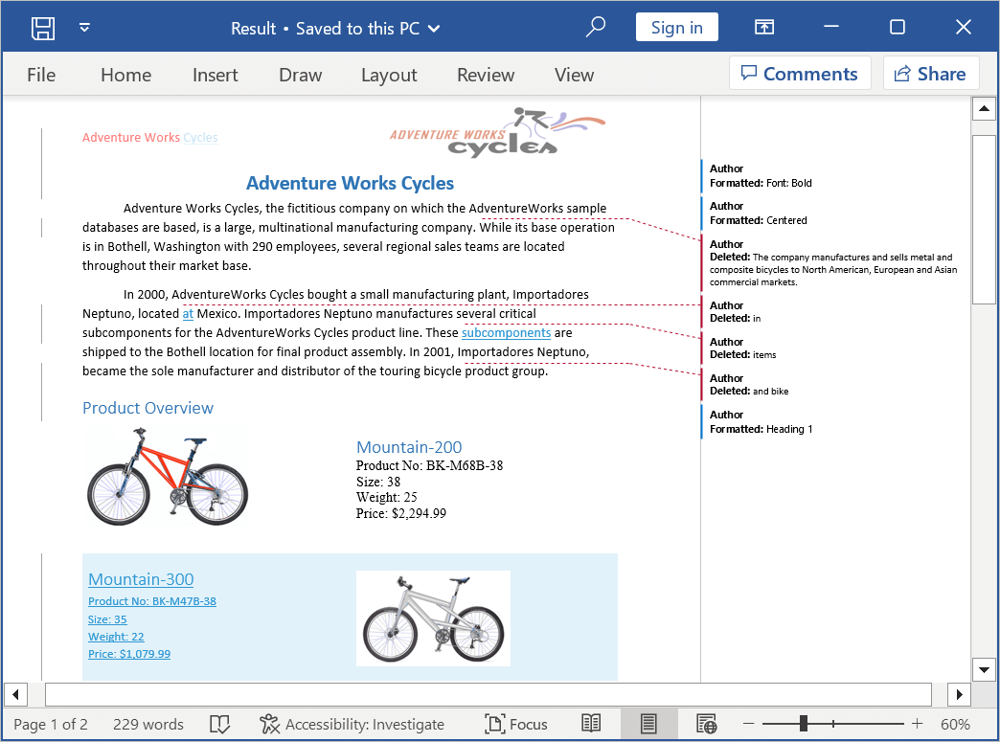
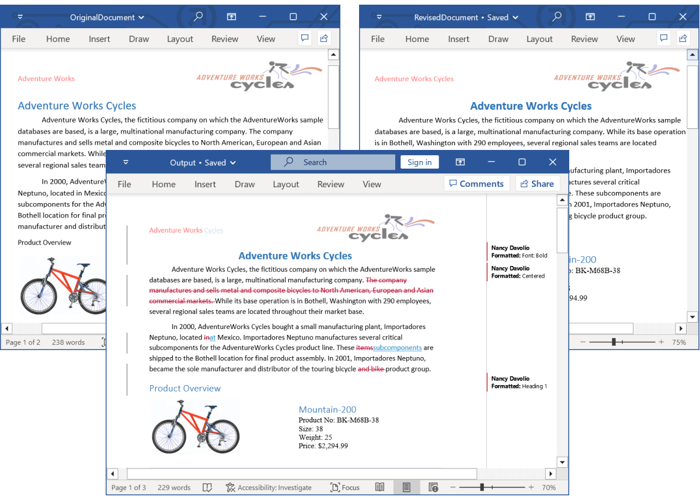
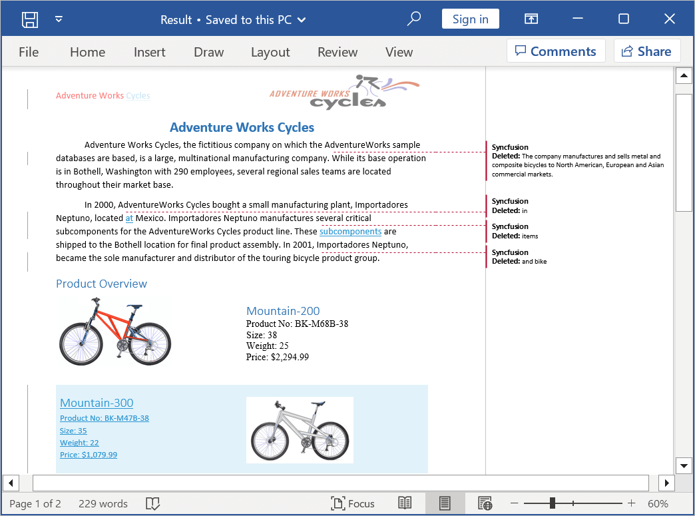

# Compare Word documents

Comparing two Word documents allows you to identify the changes between two versions of a document. The Java Word library (DocIO) enables you to compare two Word documents and highlight the following changes as tracked changes.

* Insertions
* Deletions
* Formatting

N> 1. DocIO performs word level comparison while comparing two Word documents. In this scenario, if a single character in a word is changed, the entire word will be highlighted as changed.
N> 2. Comparing two Word documents supported in DOCX format only.

## Compare two Word documents 

Compare the existing Word documents or documents created from scratch using the ``Compare`` method in ``WordDocument`` class.

The following code example illustrates how to compare two Word documents.


 
//Load the original document.
WordDocument originalDocument = new WordDocument("OriginalDocument.docx", FormatType.Docx);

//Load the revised document.
WordDocument revisedDocument = new WordDocument("RevisedDocument.docx", FormatType.Docx);

//Compare the original document with the revised document.
originalDocument.compare(revisedDocument);

//Save the word document.
originalDocument.save("Sample.docx");

//Close the word document.
originalDocument.close();



You can download a complete working sample from GitHub.

## Set Author and Date 

Compare the two Word documents by setting the author and date for revisions to identify the changes. In DocIO, the default setting for the “author” field is “Author”, and the default setting for the “dateTime” field is the current time.

The following code example shows how to set the author and date for revision while comparing two Word documents.



//Load the original document.
WordDocument originalDocument = new WordDocument("OriginalDocument.docx", FormatType.Docx);

//Load the revised document.
WordDocument revisedDocument = new WordDocument("RevisedDocument.docx", FormatType.Docx);

//Compare the original document with the revised document.
originalDocument.compare(revisedDocument, "Nancy Davolio", LocalDateTime.now().minusDays(1));

//Save the word document.
originalDocument.save("Sample.docx");

//Close the word document.
originalDocument.close();



You can download a complete working sample from GitHub.

## Comparison options

You can customize the Word comparison using our ``ComparisonOptions`` in the DocIO.

### Ignore format changes

In the Java Word library (DocIO), document comparison includes formatting changes by default. However, you can configure DocIO to ignore formatting differences using the ``setDetectFormatChanges`` API to concentrate solely on content modifications.

The following code example illustrates how to compare two Word documents by ignoring the format changes.



//Load the original document.
WordDocument originalDocument = new WordDocument("OriginalDocument.docx", FormatType.Docx);

//Load the revised document.
WordDocument revisedDocument = new WordDocument("RevisedDocument.docx", FormatType.Docx);

//Set the Comparison option detect format changes, whether to detect format changes while comparing two Word documents.
ComparisonOptions compareOptions = new ComparisonOptions();
compareOptions.setDetectFormatChanges(false);

//Compare the original document with the revised document.
originalDocument.compare(revisedDocument, "Nancy Davolio", LocalDateTime.now(), compareOptions);

//Save the word document.
originalDocument.save("Sample.docx");

//Close the word document.
originalDocument.close();



You can download a complete working sample from GitHub.
