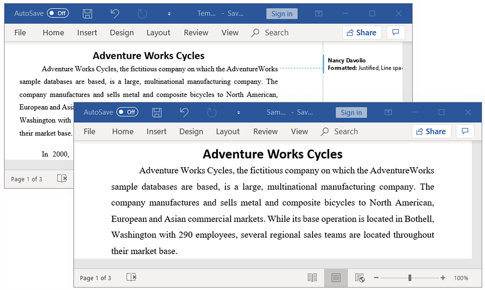
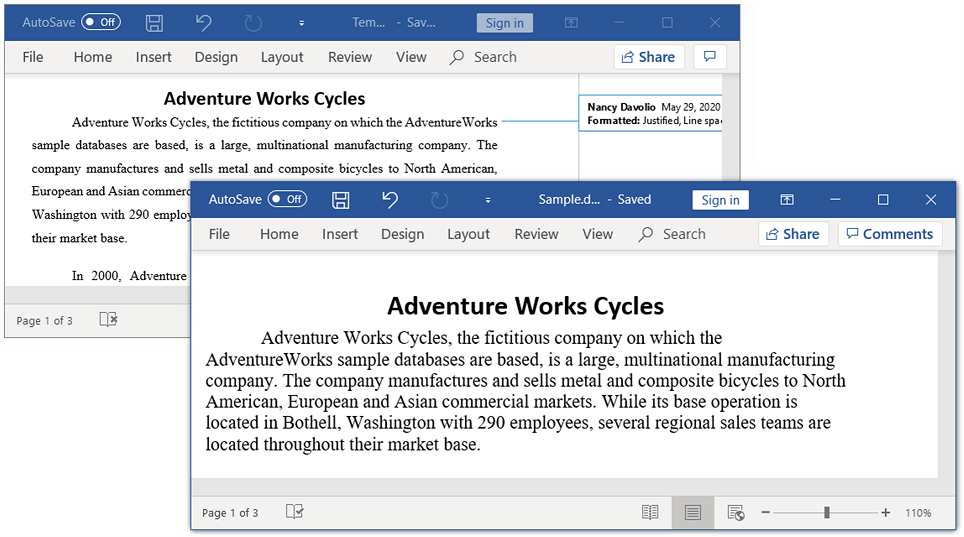

# Accepting or Rejecting Track Changes

It is used to keep track of the changes made to a Word document. It helps to maintain the record of author, name and time for every insertion, deletion, or modification in a document. This can be enabled by using the TrackChanges property of the Word document.

N> 
With this support, the changes made in the Word document by DocIO library cannot be tracked.

The following code example illustrates how to enable track changes of the document.

   


//Creates a new Word document.
WordDocument document = new WordDocument();
//Adds new section to the document.
IWSection section = document.addSection();
//Adds new paragraph to the section.
IWParagraph paragraph = section.addParagraph();
//Appends text to the paragraph.
IWTextRange text = paragraph.appendText("This sample illustrates how to track the changes made to the word document. ");
//Sets font name and size for text.
text.getCharacterFormat().setFontName("Times New Roman");
text.getCharacterFormat().setFontSize((float)14);
text=paragraph.appendText("This track changes is useful in shared environment.");
text.getCharacterFormat().setFontSize((float)12);
//Turns on the track changes option.
document.setTrackChanges(true);
//Saves and closes the document.
document.save("Sample.docx", FormatType.Docx);
document.close();


 

## Accept all changes

You can **accept all track changes in Word document** using `acceptAll` method.

The following code example shows how to accept all the tracked changes.

   


//Opens an existing Word document.
WordDocument document = new WordDocument("Template.docx", FormatType.Docx);
//Accepts all the tracked changes revisions.
if(document.getHasChanges())
     document.getRevisions().acceptAll();
//Saves and closes the document.
document.save("Sample.docx", FormatType.Docx);
document.close();
  



By executing the above code example, it generates output Word document as follows.

## Reject all changes

You can **reject all track changes in Word document** using `rejectAll` method.

The following code example shows how to reject all the tracked changes.

   


//Opens an existing Word document.
WordDocument document = new WordDocument("Template.docx", FormatType.Docx);
//Rejects all the tracked changes revisions.
if(document.getHasChanges())
	document.getRevisions().rejectAll();
//Saves and closes the document.
document.save("Sample.docx", FormatType.Docx);
document.close();
 



By executing the above code example, it generates output Word document as follows.

## Accept all changes by a particular reviewer

You can **accept all changes made by the author** in the Word document using `accept` method.

The following code example shows how to accept the tracked changes made by the author.

   


//Opens an existing Word document.
WordDocument document = new WordDocument("Template.docx", FormatType.Docx);
//Iterates into all the revisions in Word document.
for (int i = document.getRevisions().getCount() - 1; i >= 0; i--) 
{
	//Checks the author of current revision and accepts it.
	if(document.getRevisions().get(i).getAuthor().equals("Nancy Davolio"))
		document.getRevisions().get(i).accept();
	//Resets to last item when accept the moving related revisions.
	if (i > document.getRevisions().getCount() - 1)
		i = document.getRevisions().getCount();
}
//Saves and closes the document.
document.save("Sample.docx", FormatType.Docx);
document.close();
 



## Reject all changes by particular reviewer

You can **reject all changes made by the author** in the Word document using `reject` method.

The following code example shows how to reject the tracked changes made by the author.

   


//Opens an existing Word document.
WordDocument document = new WordDocument("Template.docx", FormatType.Docx);
//Iterates into all the revisions in Word document.
for (int i = document.getRevisions().getCount() - 1; i >= 0; i--) 
{
	//Checks the author of current revision and rejects it.
	if(document.getRevisions().get(i).getAuthor().equals("Nancy Davolio"))
		document.getRevisions().get(i).reject();
	//Resets to last item when reject the moving related revisions.
	if (i > document.getRevisions().getCount() - 1)
		i = document.getRevisions().getCount();
}
//Saves and closes the document.
document.save("Sample.docx", FormatType.Docx);
document.close();
 



## Revision information

You can get the **revision information of track changes** in the Word document like author name, date, and type of revision.

The following code example shows how to get the details about the revision information of track changes.

   


//Opens an existing Word document.
WordDocument document = new WordDocument("Template.docx", FormatType.Docx);
//Accesses the first revision in the word document.
Revision revision = document.getRevisions().get(0);
//Gets the name of the user who made the specified tracked change.
String author = revision.getAuthor();
// Gets the date and time that the tracked change was made.
LocalDateTime dateTime = revision.getDate();
// Gets the type of the track changes revision.
RevisionType revisionType = revision.getRevisionType();
//Closes the document.
document.close();
 



Frequently Asked Questions

* [How to check whether a Word document contains tracked changes or not?](https://help.syncfusion.com/java-file-formats/word-library/faq#how-to-check-whether-a-word-document-contains-tracked-changes-or-not)
* [How to accept or reject track changes of specific type in the Word document?](https://help.syncfusion.com/java-file-formats/word-library/faq#how-to-accept-or-reject-track-changes-of-specific-type-in-the-word-document)
* [How to enable track changes for Word document?](https://help.syncfusion.com/java-file-formats/word-library/faq#how-to-enable-track-changes-for-word-document)