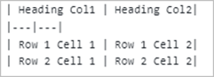
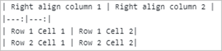
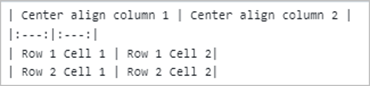

# Markdown to Word Conversion

Markdown is a lightweight markup language that adds formatting elements to plain text documents. The Java Word library supports the conversion of Markdown to Word document and vice versa, which mostly follows the CommonMark specification and GitHub-flavored syntax.

## Convert Markdown to Word document

Convert an existing markdown file to a Word document (DOCX and RTF) using the Java Word library.

The following code example shows how to convert Markdown to Word document.



//Open an existing Markdown file.
WordDocument document = new WordDocument("Input.md", FormatType.Markdown);
//Save as a Word document.
document.save("MarkdownToWord.docx", FormatType.Docx);
//Close the document.
document.close();




T> You can also save the markdown file as [HTML](https://help.syncfusion.com/java-file-formats/word-library/html).

## Customize image data

The Java Word library provides a ImageNodeVisited event, which customizes image data while importing a Markdown file. Implement the logic to customize the image data by using this ImageNodeVisited event.

The following code example shows how to load image data based on the image source path when importing the Markdown files.



//Create a Word document instance.
WordDocument document = new WordDocument();
//Customize the image while importing Markdown using event.
document.getMdImportSettings().ImageNodeVisited.add("mdImportSettings_ImageNodeVisited", new MdImageNodeVisitedEventHandler() 
{ListSupport<MdImageNodeVisitedEventHandler> delegateList = new ListSupport<MdImageNodeVisitedEventHandler>(MdImageNodeVisitedEventHandler.class);
// Represents event handling for MdImageNodeVisitedEventHandlerCollection.
public void invoke(Object sender, MdImageNodeVisitedEventArgs args) throws Exception
{
    mdImportSettings_ImageNodeVisited(sender, args);
}
// Represents the method that handles ImageNodeVisited event.
public void dynamicInvoke(Object... args) throws Exception
{
    mdImportSettings_ImageNodeVisited((Object) args[0], (MdImageNodeVisitedEventArgs) args[1]);
}
// Represents the method that handles ImageNodeVisited event to add collection item.
public void add(MdImageNodeVisitedEventHandler delegate) throws Exception
{
    if (delegate != null)
        delegateList.add(delegate);
}
// Represents the method that handles ImageNodeVisited event to remove collection item.
public void remove(MdImageNodeVisitedEventHandler delegate) throws Exception
{
    if (delegate != null)
        delegateList.remove(delegate);
}
});
//Open the Markdown file.
document.Open("Input.md");
//Save as a Word document.
document.Save("Sample.docx");




The following code examples show the event handler to customize the image based on the source path.



private static void mdImportSettings_ImageNodeVisited(Object sender,MdImageNodeVisitedEventArgs args)throws Exception
{
    //Set the image stream based on the image name from the input Markdown.
    if(args.getUri().equals("Image_1.png"))
        args.setImageStream(new FileStreamSupport("Image_1.png",FileMode.Open));
    else
        if(args.getUri().equals("Image_2.png"))
            args.setImageStream(new FileStreamSupport("Image_2.png",FileMode.Open));
}




N> Hook the event handler before opening a Word document as per the above code example.

## Supported Markdown Syntax

<table style="width: 85.7072%;">
<tbody>
<tr>
<td style="width: 16%;">
<p><strong>Element</strong></p>
</td>
<td style="width: 26%;">
<p><strong>Syntax</strong></p>
</td>
<td style="width: 41.7072%;">
<p><strong>Description</strong></p>
</td>
</tr>
<tr>
<td style="width: 16%;">
<p>Bold</p>
</td>
<td style="width: 26%;">
<p>Sample content for **bold text**.</p>
</td>
<td style="width: 41.7072%;">
<p>For bold, add ** to front and back of the text.</p>
</td>
</tr>
<tr>
<td style="width: 16%;">
<p>Italic</p>
</td>
<td style="width: 26%;">
<p>Sample content for *Italic text*.</p>
</td>
<td style="width: 41.7072%;">
<p>For Italic, add * to front and back of the text.</p>
</td>
</tr>
<tr>
<td style="width: 16%;">
<p>Bold and Italics</p>
</td>
<td style="width: 26%;">
<p>Sample content for ***bold and Italic text***.</p>
</td>
<td style="width: 41.7072%;">
<p>For bold and Italics, add *** to the front and back of the text.</p>
</td>
</tr>
<tr>
<td style="width: 16%;">
<p>Strikethrough</p>
</td>
<td style="width: 26%;">
<p>Sample content for ~~strike through text~~.</p>
</td>
<td style="width: 41.7072%;">
<p>For strike through, add ~~ to front and back of the text.</p>
</td>
</tr>
<tr>
<td style="width: 16%;">
<p>Subscript</p>
</td>
<td style="width: 26%;">
<p>&lt;sub&gt;Subscript text&lt;/sub&gt;</p>
</td>
<td style="width: 41.7072%;">
<p>For subscript, add &lt;sub&gt; to the front and &lt;/sub&gt; to the back of the text.</p>
</td>
</tr>
<tr>
<td style="width: 16%;">
<p>Superscript</p>
</td>
<td style="width: 26%;">
<p>&lt;sup&gt;Superscript text&lt;/sup&gt;</p>
</td>
<td style="width: 41.7072%;">
<p>For superscript, add &lt;sup&gt; to the front and &lt;/sup&gt; to the back of the text.</p>
</td>
</tr>
<tr>
<td style="width: 16%;">
<p>Heading 1</p>
</td>
<td style="width: 26%;">
<p>#Heading 1 content</p>
</td>
<td style="width: 41.7072%;">
<p>For heading 1, add # to start of the line.</p>
</td>
</tr>
<tr>
<td style="width: 16%;">
<p>Heading 2</p>
</td>
<td style="width: 26%;">
<p>##Heading 2 content</p>
</td>
<td style="width: 41.7072%;">
<p>For heading 2, add ## to start of the line.</p>
</td>
</tr>
<tr>
<td style="width: 16%;">
<p>Heading 3</p>
</td>
<td style="width: 26%;">
<p>###Heading 3 content</p>
</td>
<td style="width: 41.7072%;">
<p>For heading 3, add ### to start of the line.</p>
</td>
</tr>
<tr>
<td style="width: 16%;">
<p>Heading 4</p>
</td>
<td style="width: 26%;">
<p>####Heading 4 content</p>
</td>
<td style="width: 41.7072%;">
<p>For heading 4, add #### to start of the line.</p>
</td>
</tr>
<tr>
<td style="width: 16%;">
<p>Heading 5</p>
</td>
<td style="width: 26%;">
<p>#####Heading 5 content</p>
</td>
<td style="width: 41.7072%;">
<p>For heading 5, add ##### to start of the line.</p>
</td>
</tr>
<tr>
<td style="width: 16%;">
<p>Heading 6</p>
</td>
<td style="width: 26%;">
<p>######Heading 6 content</p>
</td>
<td style="width: 41.7072%;">
<p>For heading 6, add ###### to start of the line.</p>
</td>
</tr>
<tr>
<td style="width: 16%;">
<p>Block quotes</p>
</td>
<td style="width: 26%;">
<p>&gt;Block quotes text</p>
</td>
<td style="width: 41.7072%;">
<p>For block quotes, add&gt;to start of the line.</p>
</td>
</tr>
<tr>
<td style="width: 16%;">
<p>Code span</p>
</td>
<td style="width: 26%;">
<p>`Code span text`</p>
</td>
<td style="width: 41.7072%;">
<p>For code span, add ` to front and back of the text.</p>
</td>
</tr>
<tr>
<td style="width: 16%;">
<p>Indented code block</p>
</td>
<td style="width: 26%;">
<p>4 spaces</p>
</td>
<td style="width: 41.7072%;">
<p>For indented code block, add 4 spaces at the beginning of line.</p>
</td>
</tr>
<tr>
<td style="width: 16%;">
<p>Fenced code block</p>
</td>
<td style="width: 26%;">
<p>```<br /> Multi line code text<br /> Multi line code text<br /> ```</p>
</td>
<td style="width: 41.7072%;">
<p>For fenced code block, add ``` in the new line before and after the content.</p>
</td>
</tr>
<tr>
<td style="width: 16%;">
<p>Ordered List</p>
</td>
<td style="width: 26%;">
<p>1. First<br /> 2. Second</p>
</td>
<td style="width: 41.7072%;">
<p>For ordered list, preceding the text with 1. (number with dot and one space)</p>
</td>
</tr>
<tr>
<td style="width: 16%;">
<p>Unordered List</p>
</td>
<td style="width: 26%;">
<p>- First<br /> - second</p>
</td>
<td style="width: 41.7072%;">
<p>For unordered list, preceding the text with &ndash; (hyphen and space).</p>
</td>
</tr>
<tr>
<td style="width: 16%;">
<p>Links</p>
</td>
<td style="width: 26%;">
<p><strong>Link text without title text</strong> :<br /> [Link text](URL)<br /> <strong>Link text with title text</strong> :<br /> [Link text](URL , &ldquo;title text&rdquo;)</p>
</td>
<td style="width: 41.7072%;">
<p>For hyperlink, enclose the link text within the brackets [ ], and then enclose the URL as first parameter and title as second parameter within the parentheses().<br /> <strong>Note:</strong>The title text is optional.</p>
</td>
</tr>
<tr>
<td style="width: 16%;">
<p>Table</p>
</td>
<td style="width: 26%;"></td>
<td style="width: 41.7072%;">
<p>Create a table using the pipes and underscores as given in the syntax to create 2 x 2 table.</p>
<p></p>
<p>You can also set column alignments using the syntax below, default it is left aligned.</p>
<p>Right alignment:<br/><br /> <br /> Center alignment:<br/></p>
</td>
</tr>
<tr>
<td style="width: 16%;">
<p>Horizontal Line</p>
</td>
<td style="width: 26%;">
<p>--- (three hyphen characters)</p>
</td>
<td style="width: 41.7072%;">
<p>For horizontal line, add --- (three hyphens) in a new line.</p>
</td>
</tr>
<tr>
<td style="width: 16%;">
<p>Image</p>
</td>
<td style="width: 26%;">
<p></p>
</td>
<td style="width: 41.7072%;">
<p>For image, enclose an alternative text within the brackets [], and then link of the image source within parentheses ().</p>
<p>If URL path is base64string, then it will be preserved properly in Word document. Otherwise, you can also {{'[set image from stream while opening Markdown file.](https://help.syncfusion.com/java-file-formats/word-library/convert-markdown-to-word-document-in-java#customize-image-data)'| markdownify }}</p>
</td>
</tr>
<tr>
<td style="width: 16%;">
<p>Escape Character</p>
</td>
<td style="width: 26%;">
<p>\(any syntax)</p>
</td>
<td style="width: 41.7072%;">
<p>Escape any markdown syntax by adding \ as prefix to the syntax.<br /> Example:<br /> \**non-bold text**</p>
</td>
</tr>
</tbody>
</table>
