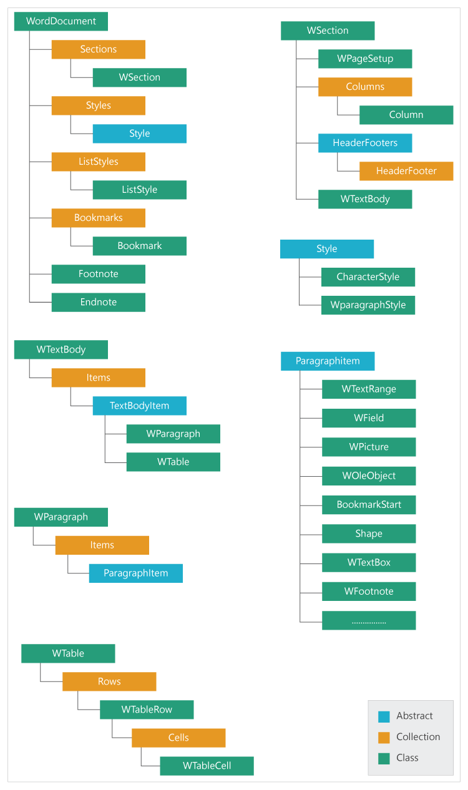

# Document Object Model representation

When an existing document is opened or a new document is created, the Java Word library creates a **Document Object Model** (DOM) of the document in main memory. This object model can be used to manipulate the document as needed.

