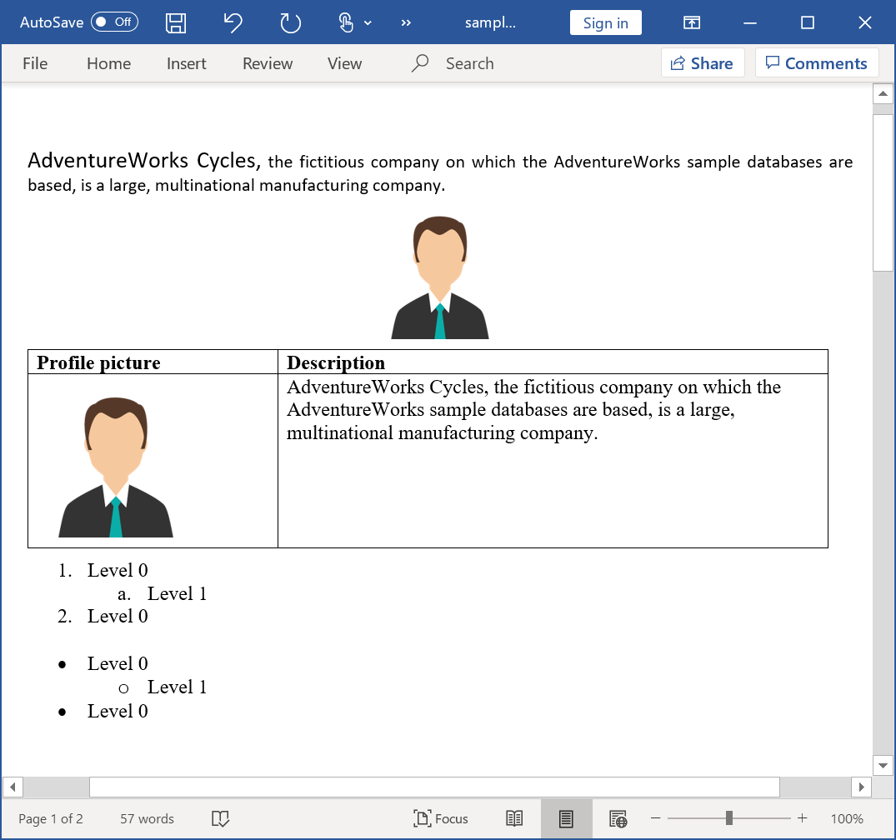
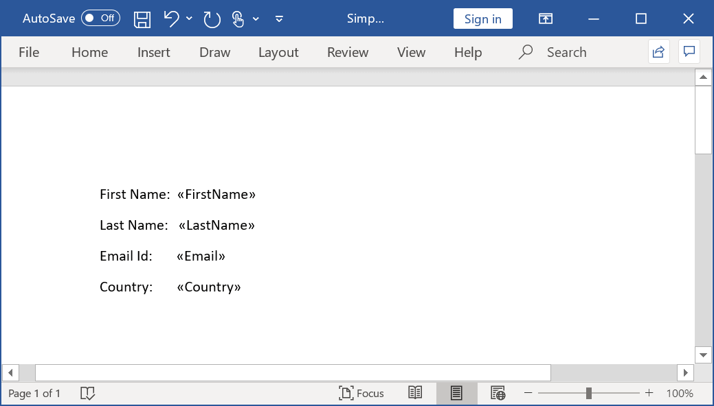
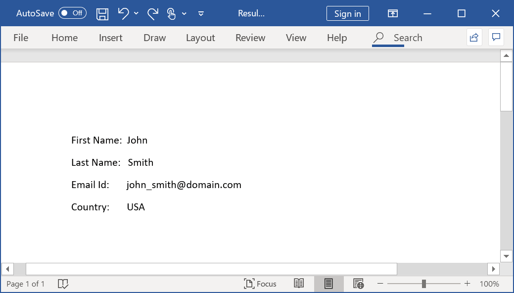
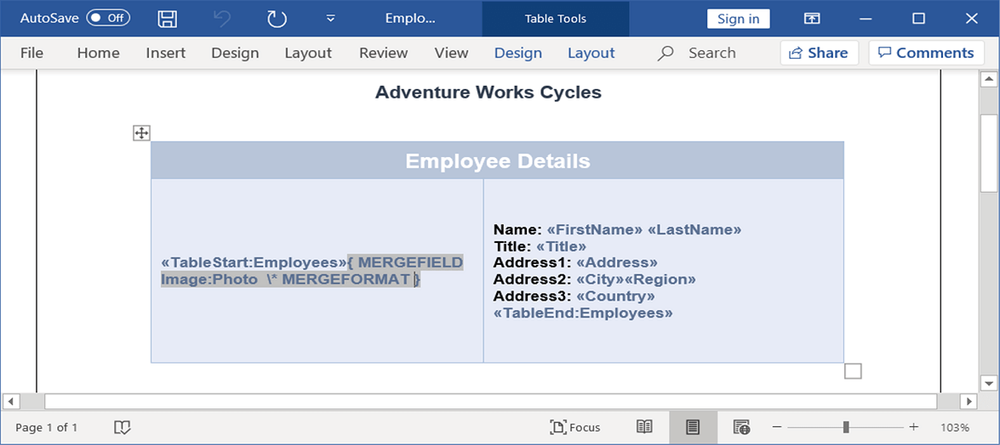

# Getting Started of Word library (DocIO)

In this page, you can see how to create a simple Word document by using Syncfusion Java Word library APIs. For creating and manipulating a Word document, the following jar files are required to be referenced in your Java application.

<table>
<thead>  
<tr>
<th>Jar files  </th>
<th>Short description  </th>
</tr>
</thead>
<tbody>  
<tr>
<td>
syncfusion-docio  </td><td>
This jar contains the core features needed for creating, reading, manipulating a Word document.  </td></tr>
<tr>
<td>
syncfusion-javahelper  </td><td>
This jar contains common functionalities required for file format libraries.  </td></tr>
</tbody>
</table>

Import the following package in your Java application.

  



import com.syncfusion.docio.*;

import com.syncfusion.Javahelper.*;





## Creating a new Word document with few lines of code

The following code example explains how to create a new Word document with a few lines of the code.

  


//Creates an instance of WordDocument Instance (Empty Word Document).
WordDocument document = new WordDocument();
//Add a section and paragraph in the empty document.
document.ensureMinimal();
//Append text to the last paragraph of the document.
document.getLastParagraph().appendText("Hello World");
//Save and close the Word document.
document.save("Result.docx");
document.close();




## Creating a new Word document from scratch with basic elements

An entire Word document is represented by an instance of the `WordDocument` and it is the root element of DocIO’s DOM. The Word document contains a collection of sections. A Word document must contain at least one section.

A section represents a group of paragraphs, tables, and more, that have a specific set of properties used to define the pages, a number of columns, headers, and footers, and more, that decides how the text appears. A section should contain at least one paragraph in this body.

The following code example explains how to add a section into a `WordDocument` instance.

  


//Create an instance of WordDocument Instance (Empty Word Document).
WordDocument document = new WordDocument();
//Add a new section into the Word document.
IWSection section = document.addSection();
//Specifies the page margins. 
section.getPageSetup().getMargins().setAll(50);


  

All the textual contents in a Word document are represented by the paragraphs. Within the paragraph, the textual contents are grouped into one or more child elements such as text range, field, and more. Each text range represents a region of text with a common set of rich text formatting.

The following code example explains how to add a paragraph into a Word document.

 


//Add a new simple paragraph into the section.
IWParagraph firstParagraph = section.addParagraph();
//Set the paragraph's horizontal alignment as justify.
firstParagraph.getParagraphFormat().setHorizontalAlignment(HorizontalAlignment.Justify);
//Add a text range into the paragraph.
IWTextRange firstTextRange = firstParagraph.appendText("AdventureWorks Cycles,");
//set the font formatting of the text range.
firstTextRange.getCharacterFormat().setBoldBidi(true);
firstTextRange.getCharacterFormat().setFontName("Calibri");
firstTextRange.getCharacterFormat().setFontSize(14) ;
//Add another text range into the paragraph.
IWTextRange secondTextRange = firstParagraph.appendText(" the fictitious company on which the AdventureWorks sample databases are based, is a large, multinational manufacturing company.");
//set the font formatting of the text range.
secondTextRange.getCharacterFormat().setFontName("Calibri");
secondTextRange.getCharacterFormat().setFontSize(11);


  

The following code example shows how to add an image into the Word document. 

  


//Add another paragraph and aligns it as a center.
IWParagraph paragraph = section.addParagraph();
paragraph.getParagraphFormat().setHorizontalAlignment(HorizontalAlignment.Center);
//Set after spacing for paragraph.
paragraph.getParagraphFormat().setAfterSpacing(6);
//Add a picture into the paragraph.
IWPicture picture = paragraph.appendPicture(new FileInputStream("DummyProfilePicture.jpg"));
//Specify the size of the picture.
picture.setHeight(86);
picture.setWidth(81);


  

A table is another important element in the Word that contains a set of paragraphs arranged in rows and columns. You can create a simple as well as a complex table by using the Essential DocIO’s API. The following code example creates a simple table and adds content to it. Each table cell must contain at least one paragraph.

 


//Add a table into the Word document.
IWTable table = section.addTable();
//Create the specified number of rows and columns.
table.resetCells(2,2);
//Access the instance of the cell (first row, first cell).
WTableCell firstCell = table.getRows().get(0).getCells().get(0);
//Specifies the width of the cell.
firstCell.setWidth(150);
//Add a paragraph into the cell; a cell must have atleast 1 paragraph.
paragraph=firstCell.addParagraph();		
IWTextRange textRange = paragraph.appendText("Profile picture");
textRange.getCharacterFormat().setBold(true);
//Access the instance of cell (first row, second cell).
WTableCell secondCell = table.getRows().get(0).getCells().get(1);
secondCell.setWidth(330);
paragraph=secondCell.addParagraph();
//Add text to the paragraph. 
textRange=paragraph.appendText("Description");
textRange.getCharacterFormat().setBold(true);
firstCell=table.getRows().get(1).getCells().get(0);
firstCell.setWidth(150);
//Add image to  the paragraph.
paragraph=firstCell.addParagraph();
//Set after spacing for paragraph.
paragraph.getParagraphFormat().setAfterSpacing(6);
IWPicture profilePicture = paragraph.appendPicture(new FileInputStream("DummyProfilePicture.jpg"));
//Set the height and width for the image.
profilePicture.setHeight(98);
profilePicture.setWidth(95);
//Access the instance of cell (second row, second cell) and adds text.
secondCell=table.getRows().get(1).getCells().get(1);
secondCell.setWidth(330);
paragraph=secondCell.addParagraph();
textRange=paragraph.appendText("AdventureWorks Cycles, the fictitious company on which the AdventureWorks sample databases are based, is a large, multinational manufacturing company.");


  

Essential DocIO allows you to create simple and multi-level lists. The following code sample explains how to create a numbered and bulleted list.

 


//Write the default numbered list.
paragraph = section.addParagraph();
//Set before spacing for paragraph.
paragraph.getParagraphFormat().setBeforeSpacing(6);
paragraph.appendText("Level 0");
//Apply the default numbered list formats.
paragraph.getListFormat().applyDefNumberedStyle();
//Applies list formatting.
paragraph.getListFormat().getCurrentListLevel().getParagraphFormat().setLeftIndent(36);
paragraph.getListFormat().getCurrentListLevel().getParagraphFormat().setFirstLineIndent(-18);
paragraph.getListFormat().getCurrentListLevel().setNumberAlignment(ListNumberAlignment.Left);
paragraph = section.addParagraph();
paragraph.appendText("Level 1");
//Specify the list format to continue from the last list.
paragraph.getListFormat().continueListNumbering();
//Increment the list level.
paragraph.getListFormat().increaseIndentLevel();
//Applies list formatting.
paragraph.getListFormat().getCurrentListLevel().getParagraphFormat().setLeftIndent(72);
paragraph.getListFormat().getCurrentListLevel().getParagraphFormat().setFirstLineIndent(-18);
paragraph.getListFormat().getCurrentListLevel().setNumberAlignment(ListNumberAlignment.Left);
paragraph = section.addParagraph();
paragraph.appendText("Level 0");
//Decrement the list level.
paragraph.getListFormat().continueListNumbering();
paragraph.getListFormat().decreaseIndentLevel();
//Applies list formatting.
paragraph.getListFormat().getCurrentListLevel().getParagraphFormat().setLeftIndent(36);
paragraph.getListFormat().getCurrentListLevel().getParagraphFormat().setFirstLineIndent(-18);
paragraph.getListFormat().getCurrentListLevel().setNumberAlignment(ListNumberAlignment.Left);
//Write the default bulleted list.
section.addParagraph();
paragraph = section.addParagraph();
paragraph.appendText("Level 0");
//Apply the default bulleted list formats.
paragraph.getListFormat().applyDefBulletStyle();
//Applies list formatting.
paragraph.getListFormat().getCurrentListLevel().getParagraphFormat().setLeftIndent(36);
paragraph.getListFormat().getCurrentListLevel().getParagraphFormat().setFirstLineIndent(-18);
paragraph.getListFormat().getCurrentListLevel().setNumberAlignment(ListNumberAlignment.Left);
paragraph = section.addParagraph();
paragraph.appendText("Level 1");
//Specify the list format to continue from the last list.
paragraph.getListFormat().continueListNumbering();
//Increment the list level.
paragraph.getListFormat().increaseIndentLevel();
//Applies list formatting.
paragraph.getListFormat().getCurrentListLevel().getParagraphFormat().setLeftIndent(72);
paragraph.getListFormat().getCurrentListLevel().getParagraphFormat().setFirstLineIndent(-18);
paragraph.getListFormat().getCurrentListLevel().setNumberAlignment(ListNumberAlignment.Left);
paragraph = section.addParagraph();
paragraph.appendText("Level 0");
//Specify the list format to continue from the last list.
paragraph.getListFormat().continueListNumbering();
//Decrement the list level.
paragraph.getListFormat().decreaseIndentLevel();
//Applies list formatting.
paragraph.getListFormat().getCurrentListLevel().getParagraphFormat().setLeftIndent(36);
paragraph.getListFormat().getCurrentListLevel().getParagraphFormat().setFirstLineIndent(-18);
paragraph.getListFormat().getCurrentListLevel().setNumberAlignment(ListNumberAlignment.Left);
section.addParagraph();


  

Finally, save the document in the file system and close its instance.
 


//Save the document in the given name and format.
document.save(outputFileName,FormatType.Docx);
//Release the resources occupied by the WordDocument instance.
document.close();


  

The resultant Word document looks as follows.

## Performing Mail merge

Essential DocIO allows you to generate documents by filling data in the template document from the data source. Mail merge operation automatically maps the column name in the data source and names of the merge fields in the template Word document and fills the data.

The following data sources are supported by the Essential DocIO for performing the Mail merge.

* String Arrays
* DataSet
* DataTable

Also, you can perform more than one Mail merge operations over the same template to generate documents as per your requirement.

Follow the given steps to perform a simple Mail merge in a Word document.

Let’s consider that you have a template Word document with the merge fields as shown.

The `MailMerge` class provides various overloads for the `execute` method to perform a Mail merge from the various data source. The Mail merge operation replaces the matching merge fields with the respective data.

The following code example shows how to perform a simple Mail merge by using a string array.

   


//Load the template document with the required merge fields.
WordDocument document = new WordDocument("..\\SimpleMailMergeTemplate.docx");
//Initialize the string array with field names.
String[] fieldNames = new String[] {"FirstName", "LastName", "Email", "Country"};
//Initialize the string array with field values.
String[] fieldValues = new String[] {"John", "Smith", "john_smith@domain.com", "USA"};
//Executes the Mail merge operation that replaces the matching field names with field values respectively.
document.getMailMerge().execute(fieldNames, fieldValues);
//Save and close the WordDocument instance.
document.save("Result.docx");
document.close();


 

The resultant Word document looks as follows.

### Simple Mail merge with Group

You can perform a Mail merge with the group to append multiple records from the data source into a single document. The group is a part of the document enclosed by two special merge fields named «TableStart:TableName» and «TableEnd:TableName»

* «TableStart:TableName»: Denotes the start of the group.
* «TableEnd:TableName»: Denotes the end of the group.

The region between these two merge fields gets repeated for every record from the data source.

For example – let’s consider that you have a template document as shown.

Here in this template, the employees are the group name and the exact same name should be used while performing the Mail merge through code. There are two special merge fields “TableStart:Employees” and “TableEnd:Employees” to denote the start and end of the Mail merge group.

To merge an image in the replace of a merge field, you need to add a prefix (“Image:”)the merge field name.

For example, the merge field name should be like “<<Image:Photo>>”(<<Image:MergeFieldName>>)

The following code example shows how to perform a Mail merge with objects.

  


//Loads an existing Word document into DocIO instance.
WordDocument document = new WordDocument("EmployeesReportDemo.docx");
//Gets the employee details as IEnumerable collection.
ListSupport<Employee> employeeList = getEmployees();
//Uses the mail merge events handler for image fields.
document.getMailMerge().MergeImageField.add("mergeField_EmployeeImage", new MergeImageFieldEventHandler() {
ListSupport<MergeImageFieldEventHandler> delegateList = new ListSupport<MergeImageFieldEventHandler>(
MergeImageFieldEventHandler.class);
//Represents event handling for MergeFieldEventHandlerCollection.
public void invoke(Object sender, MergeImageFieldEventArgs args) throws Exception 
{
	mergeField_EmployeeImage(sender, args);
}
//Represents the method that handles MergeField event.
public void dynamicInvoke(Object... args) throws Exception 
{
	mergeField_EmployeeImage((Object) args[0], (MergeImageFieldEventArgs) args[1]);
}
//Represents the method that handles MergeField event to add collection item.
public void add(MergeImageFieldEventHandler delegate) throws Exception 
{
	if (delegate != null)
		delegateList.add(delegate);
}
//Represents the method that handles MergeField event to remove collection item.
public void remove(MergeImageFieldEventHandler delegate) throws Exception 
{
	if (delegate != null)
		delegateList.remove(delegate);
}
});
//Creates an instance of MailMergeDataTable by specifying MailMerge group name and IEnumerable collection.
MailMergeDataTable dataSource = new MailMergeDataTable("Employees",employeeList);
//Executes the mail merge for group.
document.getMailMerge().executeGroup(dataSource);
//Saves and closes the WordDocument instance.
document.save("Sample.docx");
document.close();


  

The following code example shows getEmployees method which is used to get data for mail merge.

  


public ListSupport<Employee> getEmployees()throws Exception
{
	ListSupport<Employee> employees = new ListSupport<Employee>(Employee.class);
	employees.add(new Employee("Nancy","Smith","Sales Representative","505 - 20th Ave. E. Apt. 2A,","Seattle","WA","USA","Nancy.png"));
	employees.add(new Employee("Andrew","Fuller","Vice President, Sales","908 W. Capital Way","Tacoma","WA","USA","Andrew.png"));
	return employees;
}




The following code example shows how to bind the image from file system during Mail merge process by using MergeImageFieldEventHandler.

  


private void mergeField_EmployeeImage(Object sender, MergeImageFieldEventArgs args) throws Exception 
{
	//Binds image from file system during mail merge.
	if ((args.getFieldName()).equals("Photo")) 
	{
		String ProductFileName = args.getFieldValue().toString();
		//Gets the image from file system.
		FileStreamSupport imageStream = new FileStreamSupport(ProductFileName, FileMode.Open, FileAccess.Read);
		ByteArrayInputStream stream = new ByteArrayInputStream(imageStream.toArray());
		args.setImageStream(stream);
	}
}





The following code example provides supporting class for the above code.
  


public class Employee 
{
	private String _firstName;
	private String _lastName;
	private String _address;
	private String _city;
	private String _region;
	private String _country;
	private String _title;
	private String _photo;
	public String getFirstName()throws Exception
	{
		return _firstName;
	}
	public String setFirstName(String value)throws Exception
	{
		_firstName=value;
		return value;
	}
	public String getLastName()throws Exception
	{
		return _lastName;
	}
	public String setLastName(String value)throws Exception
	{
		_lastName=value;
		return value;
	}
	public String getAddress()throws Exception
	{
		return _address;
	}
	public String setAddress(String value)throws Exception
	{
		_address=value;
		return value;
	}
	public String getCity()throws Exception
	{
		return _city;
	}
	public String setCity(String value)throws Exception
	{
		_city=value;
		return value;
	}
	public String getRegion()throws Exception
	{
		return _region;
	}
	public String setRegion(String value)throws Exception
	{
		_region=value;
		return value;
	}
	public String getCountry()throws Exception{
		return _country;
	}
	public String setCountry(String value)throws Exception
	{
		_country=value;
		return value;
	}
	public String getTitle()throws Exception
	{
		return _title;
	}
	public String setTitle(String value)throws Exception
	{
		_title=value;
		return value;
	}
	public String getPhoto()throws Exception
	{
		return _photo;
	}
	public String setPhoto(String image)throws Exception
	{
		_photo=image;
	return image;
	}
	public Employee(String firstName,String lastName,String title,String address,String city,String region,String country,String photoFilePath)throws Exception
	{
		setFirstName(firstName);
		setLastName(lastName);
		setTitle(title);
		setAddress(address);
		setCity(city);
		setRegion(region);
		setCountry(country);
		setPhoto((photoFilePath));
	}
}




The resultant document looks as follows.

