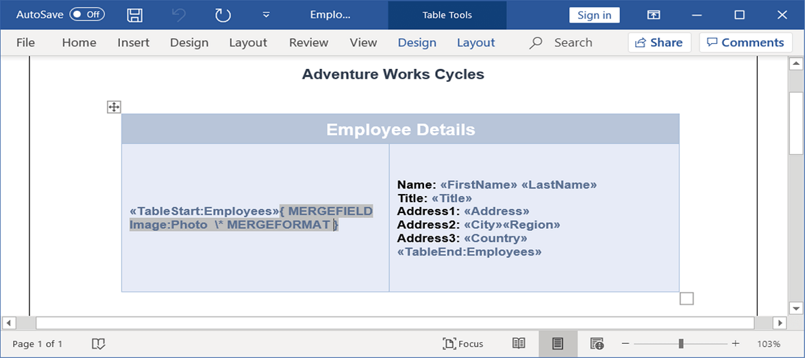
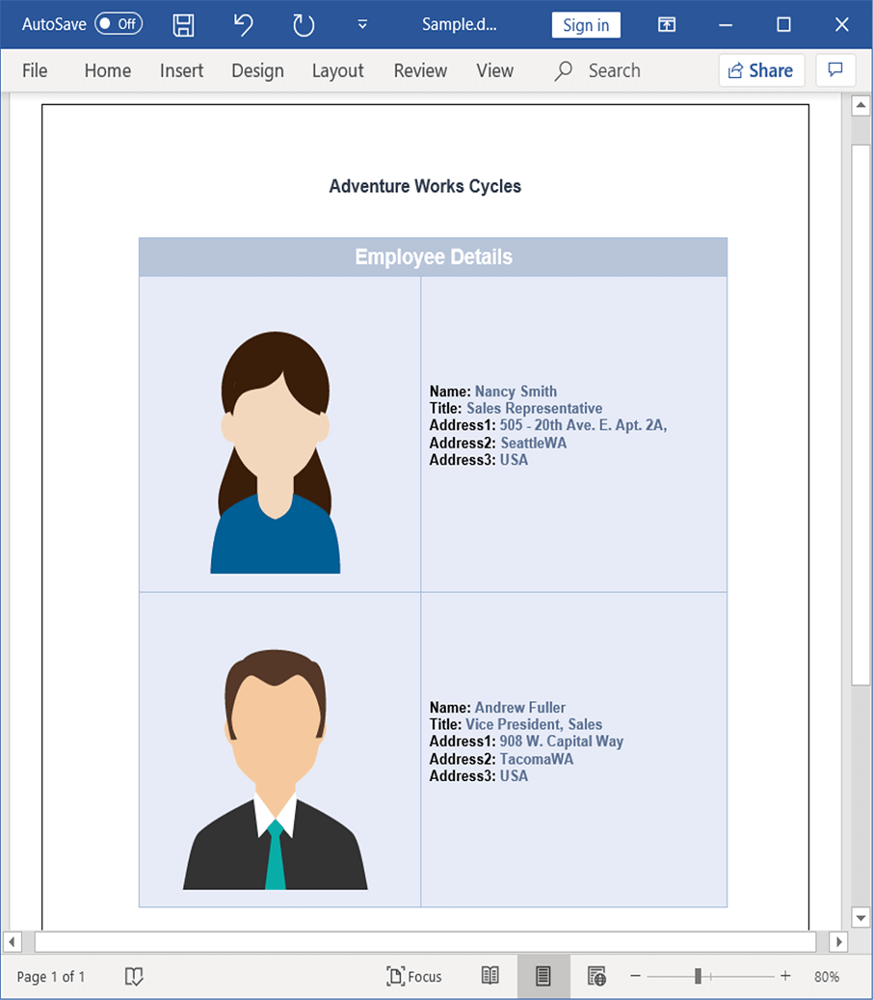

# Mail merge for a group

You can perform Mail merge and append multiple records from data source within a specified region to a template document. The region between start and end groups merge fields. It gets repeated for every record from the data source.

## Create template for group mail merge

The region where the Mail merge operations are to be performed must be marked by two merge fields with the following names.

  * «TableStart:TableName» and «BeginGroup:GroupName» - For the entry point of the region.
  
  * «TableEnd:TableName» and «EndGroup:GroupName» - For the end point of the region.
  
  1.*TableStart* and *TableEnd* region is preferred for performing Mail merge inside the table cell.  
  2.*BeginGroup* and *EndGroup* region is preferred for performing Mail merge inside the document body contents.
  
For example, consider that you have a template document as shown.

In this template, Employees is the group name and the same name should be used while performing Mail merge through code. There are two special merge fields “TableStart:Employees” and “TableEnd:Employees” to denote the start and end of the Mail merge group.

## Mail merge with Java objects

You can perform Mail merge with Java objects in a template document. The following code snippet shows how to perform Mail merge with business objects.

 


//Loads an existing Word document into DocIO instance.
WordDocument document = new WordDocument("EmployeesReportDemo.docx");
//Gets the employee details as IEnumerable collection.
ListSupport<Employee> employeeList = getEmployees();
//Uses the mail merge events handler for image fields.
document.getMailMerge().MergeImageField.add("mergeField_EmployeeImage", new MergeImageFieldEventHandler() {
ListSupport<MergeImageFieldEventHandler> delegateList = new ListSupport<MergeImageFieldEventHandler>(
MergeImageFieldEventHandler.class);
//Represents event handling for MergeFieldEventHandlerCollection.
public void invoke(Object sender, MergeImageFieldEventArgs args) throws Exception 
{
	mergeField_EmployeeImage(sender, args);
}
//Represents the method that handles MergeField event.
public void dynamicInvoke(Object... args) throws Exception 
{
	mergeField_EmployeeImage((Object) args[0], (MergeImageFieldEventArgs) args[1]);
}
//Represents the method that handles MergeField event to add collection item.
public void add(MergeImageFieldEventHandler delegate) throws Exception 
{
	if (delegate != null)
		delegateList.add(delegate);
}
//Represents the method that handles MergeField event to remove collection item.
public void remove(MergeImageFieldEventHandler delegate) throws Exception 
{
	if (delegate != null)
		delegateList.remove(delegate);
}
});
//Creates an instance of MailMergeDataTable by specifying MailMerge group name and IEnumerable collection.
MailMergeDataTable dataSource = new MailMergeDataTable("Employees",employeeList);
//Executes the mail merge for group.
document.getMailMerge().executeGroup(dataSource);
//Saves and closes the WordDocument instance.
document.save("Sample.docx");
document.close();


  

The following code example shows getEmployees method which is used to get data for mail merge.

  


public ListSupport<Employee> getEmployees()throws Exception
{
	ListSupport<Employee> employees = new ListSupport<Employee>(Employee.class);
	employees.add(new Employee("Nancy","Smith","Sales Representative","505 - 20th Ave. E. Apt. 2A,","Seattle","WA","USA","Nancy.png"));
	employees.add(new Employee("Andrew","Fuller","Vice President, Sales","908 W. Capital Way","Tacoma","WA","USA","Andrew.png"));
	return employees;
}



  

The following code example shows how to bind the image from file system during Mail merge process by using MergeImageFieldEventHandler.

  


private void mergeField_EmployeeImage(Object sender, MergeImageFieldEventArgs args) throws Exception 
{
	//Binds image from file system during mail merge.
	if ((args.getFieldName()).equals("Photo")) 
	{
		String ProductFileName = args.getFieldValue().toString();
		//Gets the image from file system.
		FileStreamSupport imageStream = new FileStreamSupport(ProductFileName, FileMode.Open, FileAccess.Read);
		ByteArrayInputStream stream = new ByteArrayInputStream(imageStream.toArray());
		args.setImageStream(stream);
	}
}





The following code example shows the Employee class.

  

public class Employee 
{
	private String _firstName;
	private String _lastName;
	private String _address;
	private String _city;
	private String _region;
	private String _country;
	private String _title;
	private String _photo;
	public String getFirstName()throws Exception
	{
		return _firstName;
	}
	public String setFirstName(String value)throws Exception
	{
		_firstName=value;
		return value;
	}
	public String getLastName()throws Exception
	{
		return _lastName;
	}
	public String setLastName(String value)throws Exception
	{
		_lastName=value;
		return value;
	}
	public String getAddress()throws Exception
	{
		return _address;
	}
	public String setAddress(String value)throws Exception
	{
		_address=value;
		return value;
	}
	public String getCity()throws Exception
	{
		return _city;
	}
	public String setCity(String value)throws Exception
	{
		_city=value;
		return value;
	}
	public String getRegion()throws Exception
	{
		return _region;
	}
	public String setRegion(String value)throws Exception
	{
		_region=value;
		return value;
	}
	public String getCountry()throws Exception{
		return _country;
	}
	public String setCountry(String value)throws Exception
	{
		_country=value;
		return value;
	}
	public String getTitle()throws Exception
	{
		return _title;
	}
	public String setTitle(String value)throws Exception
	{
		_title=value;
		return value;
	}
	public String getPhoto()throws Exception
	{
		return _photo;
	}
	public String setPhoto(String image)throws Exception
	{
		_photo=image;
		return image;
	}
	public Employee(String firstName,String lastName,String title,String address,String city,String region,String country,String photoFilePath)throws Exception
	{
		setFirstName(firstName);
		setLastName(lastName);
		setTitle(title);
		setAddress(address);
		setCity(city);
		setRegion(region);
		setCountry(country);
		setPhoto((photoFilePath));
	}
}



The resultant document looks as follows.

