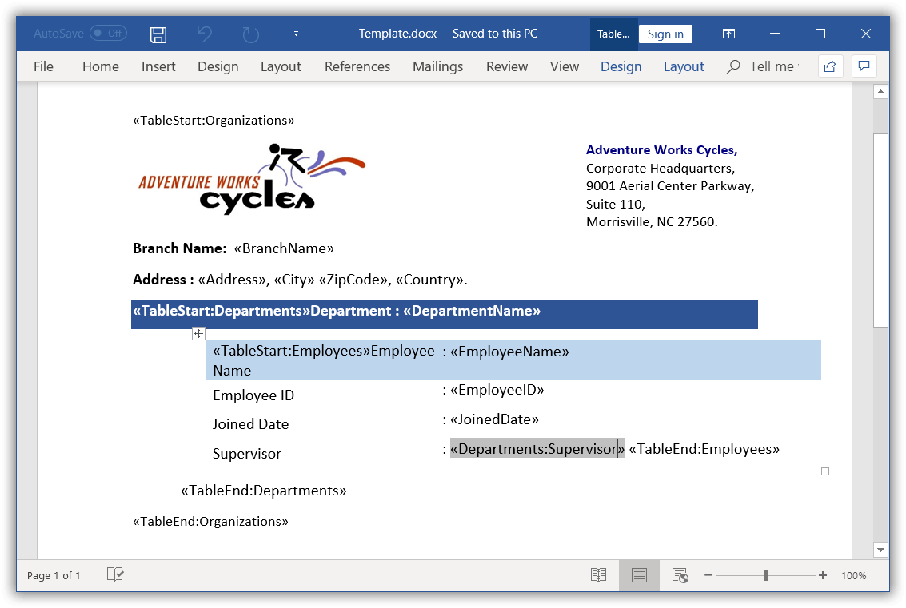
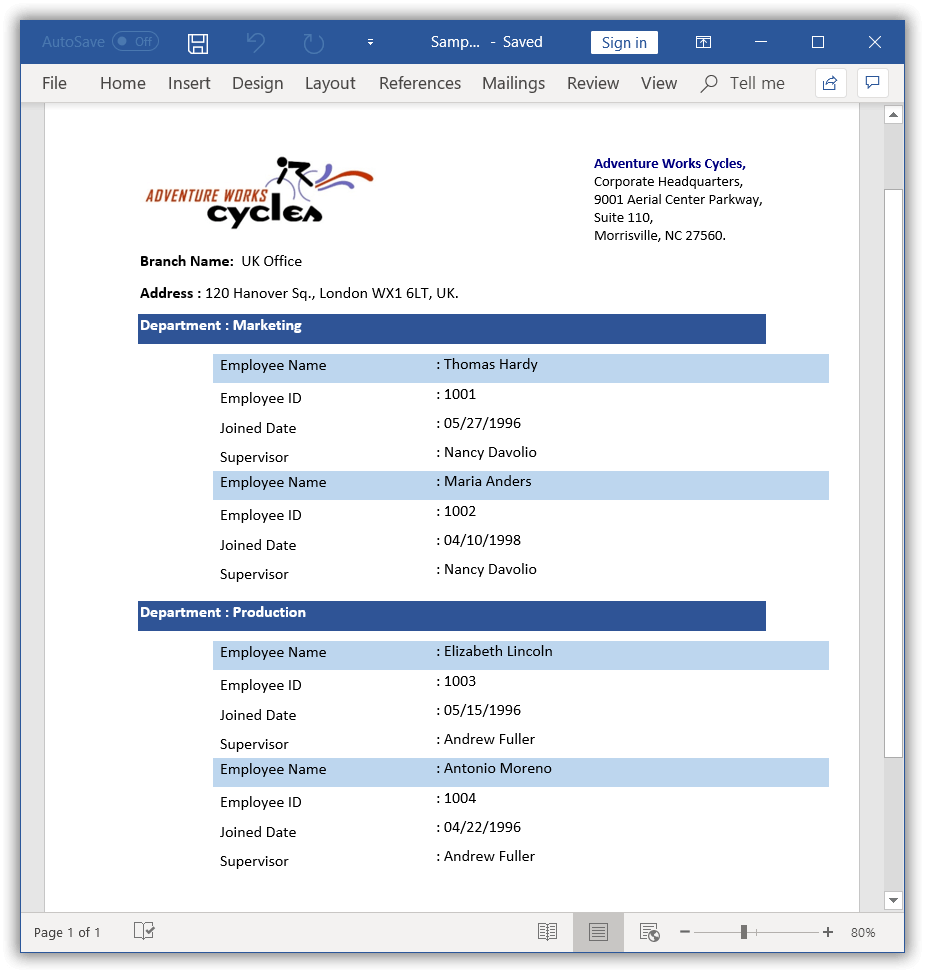

# Nested Mail merge for group

You can perform nested Mail merge with relational or hierarchical data source and independent data tables in a template document. 

## Mail merge with implicit relational data

You can perform **nested Mail merge with implicit relational data** objects without any explicit relational commands by using the `executeNestedGroup` overload method.

### Map the field of ancestor group

You can also merge any field in the nested group by **mapping the field or column of its ancestor group or table** in the data source. To achieve this, you need to add a corresponding group name or table name as a prefix to the merge field name along with “:” separator.

For example:
  * The merge field name should be like “TableName:Id” (<<TableName:MergeFieldName>>)
  * The merge field name should be like “Image:TableName:Photo” (<<Image:TableName:MergeFieldName>>)
  
For example, consider that you have a template document as follow.

In the above template, Organizations is the owner group and it has two child groups Departments and Employees. The Supervisor merge field of Departments group is used in Employees group.

The following code example shows how to perform nested Mail merge with the implicit relational data objects.



//Opens the template document.
WordDocument document = new WordDocument("Template.docx", FormatType.Docx);
//Gets the organization details as “IEnumerable” collection.
ListSupport<Organization> organizationList = getOrganizations();
//Creates an instance of “MailMergeDataTable” by specifying mail merge group name and “IEnumerable” collection.
MailMergeDataTable dataTable = new MailMergeDataTable("Organizations", organizationList);
//Performs Mail merge.
document.getMailMerge().executeNestedGroup(dataTable);
//Saves the Word document.
document.save("Sample.docx", FormatType.Docx);
//Closes the document.
document.close();




The following code example shows getOrganizations method which is used to get data for mail merge.



public static ListSupport<Organization> getOrganizations() throws Exception
{
	//Creates Employee details.
	ListSupport<EmployeeDetails> employees = new ListSupport<EmployeeDetails>();
	employees.add(new EmployeeDetails("Thomas Hardy", "1001", "05/27/1996"));
	employees.add(new EmployeeDetails("Maria Anders", "1002", "04/10/1998")); 
	//Creates Departments details.
	ListSupport<DepartmentDetails> departments = new ListSupport<DepartmentDetails>();
	departments.add(new DepartmentDetails("Marketing", "Nancy Davolio",  employees));
	employees = new ListSupport<EmployeeDetails>();
	employees.add(new EmployeeDetails("Elizabeth Lincoln", "1003", "05/15/1996"));
	employees.add(new EmployeeDetails("Antonio Moreno", "1004", "04/22/1996"));
	departments.add(new DepartmentDetails("Production", "Andrew Fuller", employees));
	//Creates organization details.
	ListSupport<Organization> organizations = new ListSupport<Organization>();
	organizations.add(new Organization("UK Office", "120 Hanover Sq.", "London", "WX1 6LT", "UK", departments));
	return organizations;
}



The following code example shows Organization, DepartmentDetails, and EmployeeDetails classes.

  

public class Organization
{
	private String _branchName;
	private String _address;
	private String _city;
	private String _zipCode;
	private String _country;
	private ListSupport<DepartmentDetails> _departments;
	public String getBranchName()throws Exception
	{
		return _branchName;
	}
	public String setBranchName(String value)throws Exception
	{
		_branchName=value;
		return value;
	}
	public String getAddress()throws Exception
	{
		return _address;
	}
	public String setAddress(String value)throws Exception
	{
		_address=value;
		return value;
	}
	public String getCity()throws Exception
	{
		return _city;
	}
	public String setCity(String value)throws Exception
	{
		_city=value;
		return value;
	}
	public String getZipCode()throws Exception
	{
		return _zipCode;
	}
	public String setZipCode(String value)throws Exception
	{
		_zipCode=value;
		return value;
	}
	public String getCountry()throws Exception
	{
		return _country;
	}
	public String setCountry(String value)throws Exception
	{
		_country=value;
		return value;
	}
	public ListSupport<DepartmentDetails> getDepartments()throws Exception
	{
		return _departments;
	}
	public ListSupport<DepartmentDetails> setDepartments(ListSupport<DepartmentDetails> value)throws Exception
	{
		_departments=value;
		return value;
	}
	public Organization(String branchName,String address,String city,String zipcode,String country,ListSupport<DepartmentDetails> departments)throws Exception
	{
		setBranchName(branchName);
		setAddress(address);
		setCity(city);
		setZipCode(zipcode);
		setCountry(country);
		setDepartments(departments);
	}
}

public class DepartmentDetails
{
	private String _departmentName;
	private String _supervisor;
	private ListSupport<EmployeeDetails> _employees;
	public String getDepartmentName()throws Exception
	{
		return _departmentName;
	}
	public String setDepartmentName(String value)throws Exception
	{
		_departmentName=value;
		return value;
	}
	public String getSupervisor()throws Exception
	{
		return _supervisor;
	}
	public String setSupervisor(String value)throws Exception
	{
		_supervisor=value;
		return value;
	}
	public ListSupport<EmployeeDetails> getEmployees()throws Exception
	{
		return _employees;
	}
	public ListSupport<EmployeeDetails> setEmployees(ListSupport<EmployeeDetails> value)throws Exception
	{
		_employees=value;
		return value;
	}
	public DepartmentDetails(String departmentName,String supervisor,ListSupport<EmployeeDetails> employees)throws Exception
	{
		setDepartmentName(departmentName);
		setSupervisor(supervisor);
		setEmployees(employees);
	}
}

public class EmployeeDetails
{
	private String _employeeName;
	private String _employeeID;
	private String _joinedDate;
	public String getEmployeeName()throws Exception
	{
		return _employeeName;
	}
	public String setEmployeeName(String value)throws Exception
	{
		_employeeName=value;
		return value;
	}
	public String getEmployeeID()throws Exception
	{
		return _employeeID;
	}
	public String setEmployeeID(String value)throws Exception
	{
		_employeeID=value;
		return value;
	}
	public String getJoinedDate()throws Exception
	{
		return _joinedDate;
	}
	public String setJoinedDate(String value)throws Exception
	{
		_joinedDate=value;
		return value;
	}
	public EmployeeDetails(String employeeName,String employeeID,String joinedDate)throws Exception
	{
		setEmployeeName(employeeName);
		setEmployeeID(employeeID);
		setJoinedDate(joinedDate);
	}
}



By executing the above code example, it generates the resultant Word document as follows.
 
