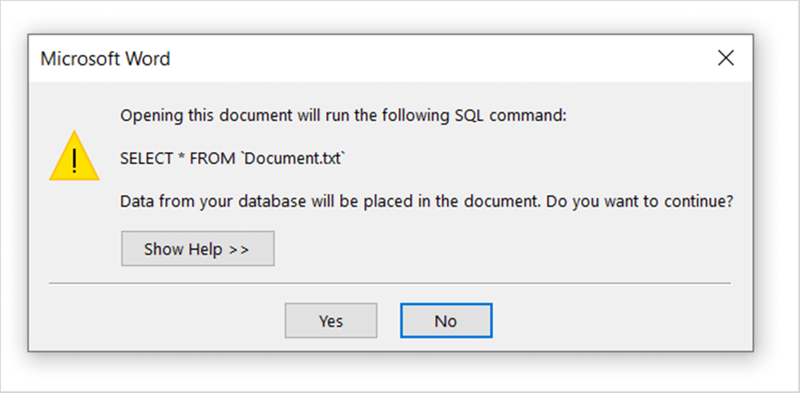

# Perform Mail merge options

The `MailMerge` class allows you to customize the Mail merge process with the following options.

## Field Mapping

The `MailMerge` class can automatically **maps the merge field names with data source column names** during Mail merge process. You can also customize the field mapping when the merge field names in the template document varies with the column names in the data source by using `MappedFields` collection.

The following code example shows how to add mapping when a merge field name in a document and column name in data source have different names.

  


//Opens the template document.
WordDocument document = new WordDocument("Template.docx", FormatType.Docx);
//Creates data source.
String[] fieldNames = new String[] { "Employee_Id_InDataSource", "Name_InDataSource",
"Phone_InDataSource", "City_InDataSource" };
String[] fieldValues = new String[] { "101", "John", "+122-2000466", "Houston" };
//Mapping the required merge field names with data source column names.
document.getMailMerge().getMappedFields().add("Employee_Id_InDocument", "Employee_Id_InDataSource");
document.getMailMerge().getMappedFields().add("Name_InDocument", "Name_InDataSource");
document.getMailMerge().getMappedFields().add("Phone_InDocument", "Phone_InDataSource");
document.getMailMerge().getMappedFields().add("City_InDocument", "City_InDataSource");
//Performs the mail merge.
document.getMailMerge().execute(fieldNames, fieldValues);
//Saves the Word document.
document.save("Samples.docx", FormatType.Docx);
//Closes the Word document.
document.close();


 

## Retrieve the merge field names

You can retrieve the merge field names and also merge field group names in the Word document.

The following code example shows how to retrieve the merge field names in the Word document.

  


//Gets the merge field names from the document.
String[] fieldNames = document.getMailMerge().getMergeFieldNames();


  

## Remove empty paragraphs

You can remove the empty paragraphs when the paragraph has only a merge field item, without any data during Mail merge process.

The following code example shows how to remove the empty paragraphs during Mail merge process.

 


//Opens the template document.
WordDocument document = new WordDocument("Template.docx", FormatType.Docx);
//Removes paragraph that contains only empty fields.
document.getMailMerge().setRemoveEmptyParagraphs(true);
//Specifies the field names and field values.
String[] fieldNames = new String[] { "EmployeeName", "EmployeeId", "City" };
String[] fieldValues = new String[] { "John", "101", "London" };
//Performs the mail merge.
document.getMailMerge().execute(fieldNames, fieldValues);
//Saves the Word document.
document.save("Sample.docx", FormatType.Docx);
//Closes the Word document.
document.close();


  

N>If any white space or line break exists in the merge field's parent paragraph, then it will not be considered as empty paragraph and not removed during mail merge process.

## Remove empty merge fields

Essential DocIO removes or keeps the unmerged merge fields in the output document based on the `ClearFields` property on each mail merge execution.

When a merge field is considered as unmerged during mail merge process?

1. The merge field doesn't have mapping field in data source.

2. The merge field has mapping field in data source, but the data is null or string.Empty.

Mail merge operation automatically removes the unmerged merge fields since the default value of `ClearFields` property is true.

T> 1.Set `ClearFields` property to false before the mail merge execution statement if your requirement is to keep the unmerged merge fields in the output document.
T> 2.Modify the `ClearFields` property before each mail merge execution statement while performing multiple mail merge executions if your requirement is to remove the unmerged merge fields in one mail merge execution and keep the unmerged merge fields in another mail merge execution.
T> 3.Order the mail merge executions with the `ClearFields` property false as first to avoid removal merge fields that are required for next mail merge execution in the same document.

The following code example shows how to keep the unmerged merge fields in the generated Word document.
 
  


//Opens the template document.
WordDocument document = new WordDocument("Template.docx", FormatType.Docx);
//Sets “ClearFields” to true to remove empty mail merge fields from document.
document.getMailMerge().setClearFields(false);
//Specifies the field names and field values.
String[] fieldNames = new String[] { "EmployeeId", "Phone", "City" };
String[] fieldValues = new String[] { "1001", "+91-9999999999", "London" };
//Performs the mail merge.
document.getMailMerge().execute(fieldNames, fieldValues);
//Saves the Word document.
document.save("Removeemptymergefields.docx", FormatType.Docx);
//Closes the Word document.
document.close();

 

## Remove empty group

You can remove the empty merge field groups which contains unmerged merge fields after executing mail merge for a group in a Word document.

The following code example shows how to remove empty merge field group during mail merge process in a Word document.

  


//Opens the template document. 
WordDocument document = new WordDocument("Template.docx", FormatType.Docx);
//Gets the employee details as “IEnumerable” collection.
ListSupport<Employees> employeeList = getEmployees();
//Creates an instance of “MailMergeDataTable” by specifying mail merge group name and “IEnumerable” collection.
MailMergeDataTable dataTable = new MailMergeDataTable("Employees", employeeList);
//Enable the flag to remove empty group which contain empty merge fields.
document.getMailMerge().setRemoveEmptyGroup(true);
//Performs Mail merge.
document.getMailMerge().executeNestedGroup(dataTable);
//Saves the Word document.
document.save("Sample.docx", FormatType.Docx);
//Closes the Word document.
document.close();




The following code example shows getEmployees method which is used to get data for mail merge.

  


public  ListSupport<Employees> getEmployees() throws Exception
{
	/Gets the OrderDetails as “IEnumerable” collection.
	ListSupport<OrderDetails> orders = new ListSupport<OrderDetails>();
	orders.add(new OrderDetails("10835", LocalDateTime.of(2015, 1, 5,0,0,0),  LocalDateTime.of(2015, 1, 12,0,0,0), LocalDateTime.of(2015, 1, 21,0,0,0)));
	//Gets the CustomerDetails as “IEnumerable” collection.
	ListSupport<CustomerDetails> customerDetails = new ListSupport<CustomerDetails>();
	customerDetails.add(new CustomerDetails("Maria Anders", "Maria Anders", "Berlin", "Germany", orders));
	customerDetails.add(new CustomerDetails("Andy", "Bernard", "Berlin", "Germany", null));
	//Gets the Employees details as “IEnumerable” collection.
	ListSupport<Employees> employees = new ListSupport<Employees>();
	employees.add(new Employees("Nancy", "Smith", "1", "505 - 20th Ave. E. Apt. 2A,", "Seattle", "USA", customerDetails));
	return employees;
}

public class Employees
{
	private String _firstName;
	private String _lastName;
	private String _employeeID;
	private String _address;
	private String _city;
	private String _country;
	private ListSupport<CustomerDetails> _customers;
	public String getFirstName()throws Exception
	{
		return _firstName;
	}
	public String setFirstName(String value)throws Exception
	{
		_firstName=value;
		return value;
	}
	public String getLastName()throws Exception
	{
		return _lastName;
	}
	public String setLastName(String value)throws Exception
	{
		_lastName=value;
		return value;
	}
	public String getEmployeeID()throws Exception
	{
		return _employeeID;
	}
	public String setEmployeeID(String value)throws Exception
	{
		_employeeID=value;
		return value;
	}
	public String getAddress()throws Exception
	{
		return _address;
	}
	public String setAddress(String value)throws Exception
	{
		_address=value;
		return value;
	}
	public String getCity()throws Exception
	{
		return _city;
	}
	public String setCity(String value)throws Exception
	{
		_city=value;
		return value;
	}
	public String getCountry()throws Exception
	{
		return _country;
	}
	public String setCountry(String value)throws Exception
	{
		_country=value;
		return value;
	}
	public ListSupport<CustomerDetails> getCustomers()throws Exception
	{
		return _customers;
	}
	public ListSupport<CustomerDetails> setCustomers(ListSupport<CustomerDetails> value)throws Exception
	{
		_customers=value;
		return value;
	}
	public Employees(String firstName,String lastName,String employeeId,String address,String city,String country,ListSupport<CustomerDetails> customers)throws Exception
	{
		setFirstName(firstName);
		setLastName(lastName);
		setAddress(address);
		setEmployeeID(employeeId);
		setCity(city);
		setCountry(country);
		setCustomers(customers);
	}
}

public class CustomerDetails
{
	private String _contactName;
	private String _companyName;
	private String _city;
	private String _country;
	private ListSupport<OrderDetails> _orders;
	public String getContactName()throws Exception
	{
		return _contactName;
	}
	public String setContactName(String value)throws Exception
	{
		_contactName=value;
		return value;
	}
	public String getCompanyName()throws Exception
	{
		return _companyName;
	}
	public String setCompanyName(String value)throws Exception
	{
		_companyName=value;
		return value;
	}
	public String getCity()throws Exception
	{
		return _city;
	}
	public String setCity(String value)throws Exception
	{
		_city=value;
		return value;
	}
	public String getCountry()throws Exception
	{
		return _country;
	}
	public String setCountry(String value)throws Exception
	{
		_country=value;
		return value;
	}
	public ListSupport<OrderDetails> getOrders()throws Exception
	{
		return _orders;
	}
	public ListSupport<OrderDetails> setOrders(ListSupport<OrderDetails> value)throws Exception
	{
		_orders=value;
		return value;
	}
	public CustomerDetails(String contactName,String companyName,String city,String country,ListSupport<OrderDetails> orders)throws Exception
	{
		setContactName(contactName);
		setCompanyName(companyName);
		setCity(city);
		setCountry(country);
		setOrders(orders);
	}
}

public class OrderDetails
{
	private String _orderID;
	private LocalDateTime _orderDate;
	private LocalDateTime _shippedDate;
	private LocalDateTime _requiredDate;
	public String getOrderID()throws Exception
	{
		return _orderID;
	}
	public String setOrderID(String value)throws Exception
	{
		_orderID=value;
		return value;
	}
	public LocalDateTime getOrderDate()throws Exception
	{
		return _orderDate;
	}
	ublic LocalDateTime setOrderDate(LocalDateTime value)throws Exception
	{
		_orderDate=value;
		return value;
	}
	public LocalDateTime getShippedDate()throws Exception
	{
		return _shippedDate;
	}
	public LocalDateTime setShippedDate(LocalDateTime value)throws Exception
	{
		_shippedDate=value;
		return value;
	}
	public LocalDateTime getRequiredDate()throws Exception
	{
		return _requiredDate;
	}
	public LocalDateTime setRequiredDate(LocalDateTime value)throws Exception
	{
		_requiredDate=value;
		return value;
	}
	public OrderDetails(String orderId,LocalDateTime orderDate,LocalDateTime shippedDate,LocalDateTime requiredDate)throws Exception
	{
		setOrderID(orderId);
		setOrderDate(orderDate);
		setShippedDate(shippedDate);
		setRequiredDate(requiredDate);
	}
}




## Restart numbering in lists

You can restart the list numbering for each records while performing mail merge for a group in Word document.

The following code example shows how to restart the list numbering in a Word documents while performing mail merge.

  


//Loads an existing Word document.
WordDocument document = new WordDocument("Template.docx", FormatType.Docx);
//Sets ImportOptions to restart the list numbering.
document.setImportOptions(ImportOptions.ListRestartNumbering);
//Creates the employee details as “IEnumerable” collection.
ListSupport<Employee> employeeList = new ListSupport<Employee>();
employeeList.add(new Employee("101", "Nancy Davolio", "Seattle, WA, USA"));
employeeList.add(new Employee("102", "Andrew Fuller", "Tacoma, WA, USA"));
employeeList.add(new Employee("103", "Janet Leverling", "Kirkland, WA, USA"));
//Creates an instance of “MailMergeDataTable” by specifying mail merge group name and “IEnumerable” collection.
MailMergeDataTable dataTable = new MailMergeDataTable("Employee", employeeList);
//Performs mail merge.
document.getMailMerge().executeGroup(dataTable);
//Saves the Word document.
document.save("Sample.docx", FormatType.Docx);
//Closes the document.
document.close();



The following code example shows Employee class.

  

public class Employee
{
	private String _employeeName ;
	private String _location ;
	private String _employeeID;
	public String getEmployeeName()throws Exception
	{
		return _employeeName;
	}
	public String setEmployeeName(String value)throws Exception
	{
		_employeeName=value;
		return value;
	}
	public String getLocation()throws Exception
	{
		return _location;
	}
	public String setLocation(String value)throws Exception
	{
		_location=value;
		return value;
	}
	public String getEmployeeID()throws Exception
	{
		return _employeeID;
	}
	public String setEmployeeID(String value)throws Exception
	{
		_employeeID=value;
		return value;
	}
	//Represents a constructor to create value for merge fields.
	public Employee(String employeeId,String employeeName,String location)throws Exception
	{
		setEmployeeName(employeeName);
		setLocation(location);
		setEmployeeID(employeeId);
	}
}



## Insert as new row

You can add each record as new row inside table when the row group contains only one cell, which means, the merge fields denoting **group start and end present inside the same cell.**

The following code example shows how to insert each record as new row in single cell table during mail merge process. 

  


//Opens the template document.
WordDocument document = new WordDocument("Template.docx", FormatType.Docx);
//Creates a data table.
DataTableSupport table = new DataTableSupport("CompatibleVersions");
table.getColumns().add("WordVersion");
//Creates a new data row.
DataRowSupport row = table.newRow();
row.set("WordVersion", "Microsoft Word 97-2003");
table.getRows().add(row);
row = table.newRow();
row.set("WordVersion", "Microsoft Word 2007");
table.getRows().add(row);
row = table.newRow();
row.set("WordVersion", "Microsoft Word 2010");
table.getRows().add(row);
row = table.newRow();
row.set("WordVersion", "Microsoft Word 2013");
table.getRows().add(row);
row = table.newRow();
row.set("WordVersion", "Microsoft Word 2019");
table.getRows().add(row);
//Enable the flag to insert a new row for every group in a table.
document.getMailMerge().setInsertAsNewRow(true);
//Execute mail merge.
document.getMailMerge().executeGroup(table);
//Saves the Word document.
document.save("Sample.docx", FormatType.Docx);
//Closes the Word document.
document.close();




## Skip to merge image

You can skip to merge particular image while performing mail merge in Word document.

The following code example shows how to skip merging particular image during mail merge process.

  



//Opens the template document.
WordDocument document = new WordDocument("Template.docx", FormatType.Docx);
//Uses the mail merge events to perform the conditional formatting during runtime.
document.getMailMerge().MergeImageField.add("mergeEmployeePhoto", new MergeImageFieldEventHandler() {
ListSupport<MergeImageFieldEventHandler> delegateList = new ListSupport<MergeImageFieldEventHandler>(
MergeImageFieldEventHandler.class);
//Represents event handling for MergeImageFieldHandlerCollection.
public void invoke(Object sender, MergeImageFieldEventArgs args) throws Exception
{
	mergeEmployeePhoto(sender, args);
}
//Represents the method that handles MergeImageField event.
public void dynamicInvoke(Object... args) throws Exception
{
	mergeEmployeePhoto((Object) args[0], (MergeImageFieldEventArgs) args[1]);
}
//Represents the method that handles MergeImageField event to add collection item.
public void add(MergeImageFieldEventHandler delegate) throws Exception
{
	if (delegate != null)
		delegateList.add(delegate);
}
//Represents the method that handles MergeImageField event to remove collection item.
public void remove(MergeImageFieldEventHandler delegate) throws Exception
{
	if (delegate != null)
		delegateList.remove(delegate);
}
});
//Executes Mail Merge with groups.
String[] fieldNames = new String[] { "Nancy", "Andrew", "Steven" };
String[] fieldValues = new String[] { " Nancy.png", " Andrew.png", " Steven.png" };
//Execute mail merge.
document.getMailMerge().execute(fieldNames, fieldValues);
//Saves the Word document.
document.save("Sample.docx", FormatType.Docx);
//Closes the Word document.
document.close();





The following code example shows how to skip merging particular image during mail merge process using MergeImageFieldEventHandler.

  



private void mergeEmployeePhoto(Object sender, MergeImageFieldEventArgs args) throws Exception
{
	//Skip to merge particular image.
	if ((args.getFieldName()).equals("Andrew"))
		args.setSkip(true);
	//Sets image.
	String ProductFileName = args.getFieldValue().toString();
	//Gets the image from file system.
	FileStreamSupport imageStream = new FileStreamSupport(ProductFileName, FileMode.Open, FileAccess.Read);
	ByteArrayInputStream stream = new ByteArrayInputStream(imageStream.toArray());
	args.setImageStream(stream);
	//Gets the picture, to be merged for image merge field.
	WPicture picture = args.getPicture();
	//Resizes the picture.
	picture.setHeight(100);
	picture.setWidth(100);
}  





## Remove mail merge settings

To **restore a Word mail merge main document to a normal Word document** using Microsoft Word application, you have to process the steps suggested in this [article](https://support.microsoft.com/en-in/help/275995/how-to-restore-a-mail-merge-main-document-to-a-normal-word-document-in) manually. You can achieve this programmatically in just 2 lines of code using Syncfusion Word library.

For example, consider that you have a template Word document linked with the data source for mail merge process. When opening the document using Microsoft Word application, it prompts a window as shown. You can remove the mail merge settings (unlink the data source) to open it as a normal Word document without this pop-up.

The following code example shows how to remove the mail merge settings from the Word document.

  

//Opens the template document.
WordDocument document = new WordDocument("Template.docx", FormatType.Docx);
//Check and removes the mail merge settings.
if (document.getMailMerge().getSettings().getHasData())
document.getMailMerge().getSettings().removeData();
//Saves the Word document.
document.save("Sample.docx", FormatType.Docx);
//Closes the Word document.
document.close();



