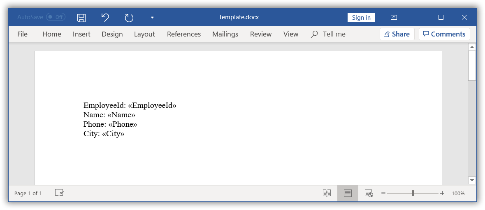
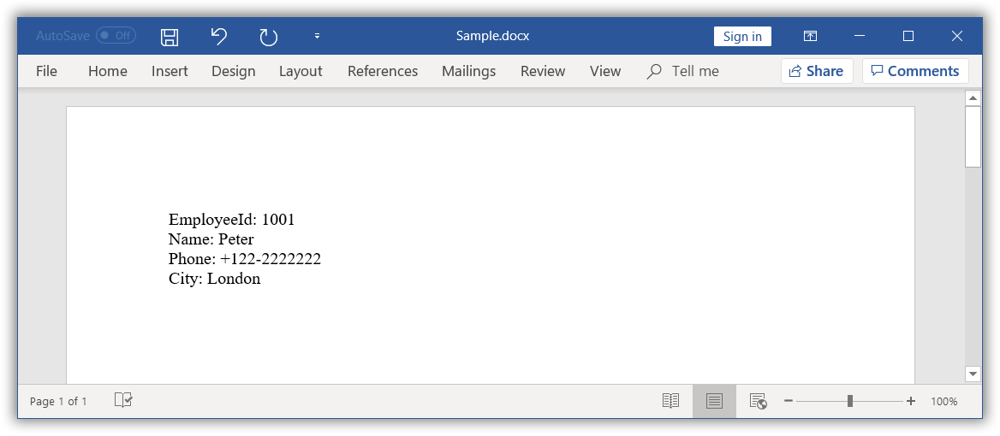

# Perform simple Mail merge

You can create a Word document template using Microsoft Word application or by adding merge fields in the Word document programmatically. For further information, click [here](https://help.syncfusion.com/java-file-formats/word-library/working-with-mail-merge#create-word-document-template).

## Mail merge with string arrays

The `MailMerge` class provides various overloads for `execute` method to perform Mail merge from various data sources. The Mail merge operation replaces the matching merge fields with the respective data.

### Create Word document template
The following code example shows how to create a Word template document with merge fields.

  


//Creates an instance of a WordDocument. 
WordDocument document = new WordDocument();
//Adds one section and one paragraph to the document.
document.ensureMinimal();
//Sets page margins to the last section of the document.
document.getLastSection().getPageSetup().getMargins().setAll(72);
//Appends text to the last paragraph.
document.getLastParagraph().appendText("EmployeeId: ");
//Appends merge field to the last paragraph.
document.getLastParagraph().appendField("EmployeeId", FieldType.FieldMergeField);
document.getLastParagraph().appendText("\nName: ");
document.getLastParagraph().appendField("Name", FieldType.FieldMergeField);
document.getLastParagraph().appendText("\nPhone: ");
document.getLastParagraph().appendField("Phone", FieldType.FieldMergeField);
document.getLastParagraph().appendText("\nCity: ");
document.getLastParagraph().appendField("City", FieldType.FieldMergeField);
//Saves the Word document.
document.save("Template.docx", FormatType.Docx);
//Closes the Word document.
document.close();

  

The generated template document looks as follows.

### Execute mail merge

The following code example shows how to perform a simple Mail merge in the generated template document with string array as data source.

  


//Opens the template document.
FileInputStream fileStreamPath = new FileInputStream("Template.docx");
WordDocument document = new WordDocument(fileStreamPath, FormatType.Docx);
String[] fieldNames = new String[] { "EmployeeId", "Name", "Phone", "City" };
String[] fieldValues = new String[] { "1001", "Peter", "+122-2222222", "London" };
//Performs the mail merge.
document.getMailMerge().execute(fieldNames, fieldValues);
//Saves the Word document.
document.save("Sample.docx", FormatType.Docx);
//Closes the Word document.
document.close();

  

The resultant document looks as follows.

