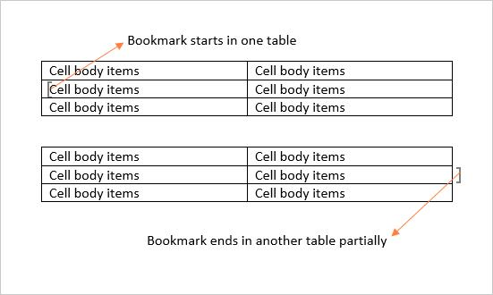
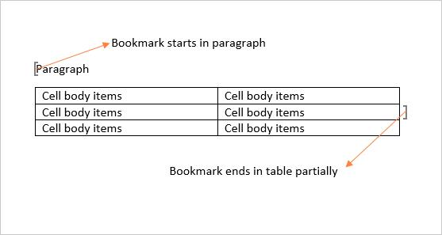

# Working with Bookmarks

A bookmark identifies a location or a selection of text within a document that you can name and identify for future reference.

In Essential DocIO, bookmark is represented by Bookmark instance that is a pair of BookmarkStart and BookmarkEnd. BookmarkStart represents start point of a bookmark and BookmarkEnd represents end point of a bookmark. Every Word document contains a collection of bookmarks that are accessible through the Bookmarks property of WordDocument class.

## Adding a bookmark

The following code example shows how to add a bookmark in Word document.

 


//Create an instance of WordDocument class (Empty Word Document).
WordDocument document = new WordDocument();
//Add a new section into the Word Document.
IWSection section = document.addSection();
//Add a new paragraph into Word document and appends text into paragraph.
IWParagraph paragraph = section.addParagraph();
paragraph.appendText("Northwind Database");
paragraph.getParagraphFormat().setHorizontalAlignment(HorizontalAlignment.Center); 
//Add a paragraph into section.
paragraph = section.addParagraph();
//Add a new bookmark start into paragraph with name "Northwind".
paragraph.appendBookmarkStart("Northwind");
//Add a text between the bookmark start and end into paragraph.
paragraph.appendText("The Northwind sample database (Northwind.mdb) is included with all versions of Access. It provides data you can experiment with and database objects that demonstrate features you might want to implement in your own databases.");
//Add a new bookmark end into paragraph with name " Northwind ".
paragraph.appendBookmarkEnd("Northwind");
//Add a text after the bookmark end.
paragraph.appendText(" Using Northwind, you can become familiar with how a relational database is structured and how the database objects work together to help you enter, store, manipulate, and print your data.");
//Save the document in the given name and format.
document.save("Bookmarks.docx", FormatType.Docx);
//Release the resources occupied by WordDocument instance.
document.close(); 


  

## Obtaining a bookmark instance

The following code example shows how to retrieve an instance of bookmark from a Word document.

  


//Load an existing Word document into DocIO instance.
WordDocument document = new WordDocument("Bookmarks.docx", FormatType.Docx);
//Get the bookmark instance by using FindByName method of BookmarkCollection with bookmark name.
Bookmark bookmark = document.getBookmarks().findByName("Northwind");
//Access the bookmark start’s owner paragraph by using bookmark and changes its back color.
bookmark.getBookmarkStart().getOwnerParagraph().getParagraphFormat().setBackColor(ColorSupport.getAliceBlue());
//Save and close the Word document.
document.save("Result.docx", FormatType.Docx);
document.close();


  

## Removing a Bookmark from Word document

The following code example shows how to remove a bookmark from Word document.

  


//Load an existing Word document into DocIO instance.
WordDocument document = new WordDocument("Bookmarks.docx", FormatType.Docx);
//Get the bookmark instance by using FindByName method of BookmarkCollection with bookmark name.
Bookmark bookmark = document.getBookmarks().findByName("Northwind");
//Remove the bookmark named "Northwind" from Word document.
document.getBookmarks().remove(bookmark);
//Save and close the Word document.
document.save("Result.docx", FormatType.Docx);
document.close();


  

## Retrieving contents within a bookmark 

BookmarkNavigator is used for navigating to a bookmark in a Word document. You can retrieve, replace and delete the content of a specified bookmark by using BookmarkNavigator.

You can get the content between bookmark start and bookmark end of the specified bookmark in two ways: 

1. You can use `getBookmarkContent` method for retrieving content as collection of body items when the bookmark start and bookmark end are preserved in a single section.
2. You can use `getContent` method for retrieving content as collection of sections when the bookmark start and bookmark end are preserved in different sections. 

The following code example shows how to retrieve the specified bookmark content by using `getBookmarkContent` method in a Word document.

   


//Open an input Word template.
WordDocument document = new WordDocument("Bookmarks.docx", FormatType.Docx);
//Create the bookmark navigator instance to access the bookmark.
BookmarksNavigator bookmarkNavigator = new BookmarksNavigator(document);
//Move the virtual cursor to the location before the end of the bookmark "Northwind".
bookmarkNavigator.moveToBookmark("Northwind");
//Get the bookmark content.
TextBodyPart part = bookmarkNavigator.getBookmarkContent();
//Add the retrieved content into another new section.
document.addSection();
for (int i = 0; i < part.getBodyItems().getCount(); i++)
	document.getLastSection().getBody().getChildEntities().add(part.getBodyItems().get(i));
//Save and close the Word document.
document.save("Result.docx", FormatType.Docx);
document.close();


 

The following code example shows how to retrieve the specified bookmark content by using `getContent` method in a Word document.

  


//Load the template document with bookmark "Northwind" whose start and end are preserved in different section.
WordDocument document = new WordDocument("Template.docx", FormatType.Docx);
//Create the bookmark navigator instance to access the bookmark.
BookmarksNavigator bookmarkNavigator = new BookmarksNavigator(document);
//Move the virtual cursor to the location before the end of the bookmark "Northwind".
bookmarkNavigator.moveToBookmark("Northwind");
//Get the bookmark content as WordDocumentPart.
WordDocumentPart wordDocumentPart = bookmarkNavigator.getContent();
//Save the WordDocumentPart as separate Word document.
WordDocument newDocument = wordDocumentPart.getAsWordDocument();
//Close the WordDocumentPart instance.
wordDocumentPart.close();
//Close the template Word document.
document.close();
newDocument.save("Result.docx", FormatType.Docx);
//Release the resources hold by WordDocument instance.
newDocument.close();


  

## Retrieving bookmark contents within a table 

You can select the column range for bookmarks inside the tables in Word documents by using `FirstColumn` and `LastColumn` properties.

N> 1. `FirstColumn` and `LastColumn` properties are valid to select table cells, only when the respective bookmark end and start is present within the same row or next rows of the same table.
N> 2. `FirstColumn` property denotes the top left corner cell and `LastColumn` property denotes the bottom right corner cell of rectangular selection region since you can only select the content as a rectangular selection by using bookmarks within the table.
N> 3. `FirstColumn` property selects from the first cell of the respective row when this property value is negative (or) greater than the cells of a row (or) greater than the `LastColumn` value.
N> 4. `LastColumn` property selects till last cell of the respective row when this property value is negative (or) greater than the cells of a row (or) less than the `FirstColumn` value.

The following code example shows how to retrieve the bookmark content of a specified column range from a table in a Word document.




//Create a new Word document.
WordDocument document = new WordDocument();
//Add a section and a paragraph in the document.
document.ensureMinimal();
//Insert a new table with bookmark.
IWTable table = CreateTable(document);
//Create the bookmark navigator instance to access the bookmark.
BookmarksNavigator bookmarkNavigator = new BookmarksNavigator(document);
//Move the virtual cursor to the location before the end of the bookmark "BkmkInTable".
bookmarkNavigator.moveToBookmark("BkmkInTable");
//Set the column index where the bookmark starts within the table.
bookmarkNavigator.getCurrentBookmark().setFirstColumn((short) 1);
//Set the column index where the bookmark ends within the table.
bookmarkNavigator.getCurrentBookmark().setLastColumn((short)4);
//Get the bookmark content.
TextBodyPart part = bookmarkNavigator.getBookmarkContent();
//Add new section.
document.addSection();
//Add the retrieved content into another new section.
for (int i = 0; i < part.getBodyItems().getCount(); i++)
	document.getLastSection().getBody().getChildEntities().add(part.getBodyItems().get(i));
//Save and close the Word document.
document.save("Sample.docx", FormatType.Docx);
document.close();




The following code example shows how to create table with bookmark.

 


public IWTable CreateTable(WordDocument document) throws Exception
{
	//Add a new table into Word document.
	IWTable table = document.getLastSection().addTable();
	//Specify the total number of rows & columns.
	table.resetCells(5, 5);
	//Access the instance of the cells and adds the content into cells.
	table.get(0, 0).addParagraph().appendText("Supplier ID");
	table.get(0, 1).addParagraph().appendText("Company Name");
	IWParagraph paragraph = table.getRows().get(0).getCells().get(2).addParagraph();
	//Append a bookmark start in third cell of first row.
	paragraph.appendBookmarkStart("BkmkInTable");
	paragraph.appendText("Contact Name");
	table.get(0, 3).addParagraph().appendText("Address");
	table.get(0, 4).addParagraph().appendText("City");
	table.get(1, 0).addParagraph().appendText("1");
	table.get(1, 1).addParagraph().appendText("Exotic Liquids");
	table.get(1, 2).addParagraph().appendText("Charlotte Cooper");
	table.get(1, 3).addParagraph().appendText("49 Gilbert St.");
	table.get(1, 4).addParagraph().appendText("London");
	table.get(2, 0).addParagraph().appendText("2");
	table.get(2, 1).addParagraph().appendText("New Orleans Cajun Delights");
	table.get(2, 2).addParagraph().appendText("Shelley Burke");
	table.get(2, 3).addParagraph().appendText("P.O. Box 78934");
	table.get(2, 4).addParagraph().appendText("New Orleans");
	table.get(3, 0).addParagraph().appendText("3");
	table.get(3, 1).addParagraph().appendText("Grandma Kelly's Homestead");
	table.get(3, 2).addParagraph().appendText("Regina Murphy");
	table.get(3, 3).addParagraph().appendText("707 Oxford Rd.");
	table.get(3, 4).addParagraph().appendText("Ann Arbor");
	table.get(4, 0).addParagraph().appendText("4");
	table.get(4, 1).addParagraph().appendText("Tokyo Traders");
	paragraph = table.getRows().get(4).getCells().get(2).addParagraph();
	//Append a bookmark end in third cell of last row.
	paragraph.appendBookmarkEnd("BkmkInTable");
	paragraph.appendText("Yoshi Nagase");
	table.get(4, 3).addParagraph().appendText("9-8 Sekimai Musashino - shi");
	table.get(4, 4).addParagraph().appendText("Tokyo");
	return table;
}




## Inserting content into a bookmark

You can insert table, paragraph, simple text and paragraph item at the start or end location of the current bookmark by using bookmark navigator.

The following code example shows how to insert a simple text by using BookmarkNavigator.

 


//Load the template document with bookmark "Northwind".
WordDocument document = new WordDocument("Bookmarks.docx", FormatType.Docx);
//Create the bookmark navigator instance to access the bookmark.
BookmarksNavigator bookmarkNavigator = new BookmarksNavigator(document);
//Move the virtual cursor to the location before the end of the bookmark "Northwind".
bookmarkNavigator.moveToBookmark("Northwind");
//Insert a new text before the bookmark end of the bookmark.
bookmarkNavigator.insertText(" Northwind Database is a set of tables containing data fitted into predefined categories.");
//Save and close the Word document.
document.save("Result.docx", FormatType.Docx);
document.close();


  

The following code example shows how to insert a paragraph item by using BookmarkNavigator.

    


//Load the template document with bookmark "Northwind".
WordDocument document = new WordDocument("Bookmarks.docx", FormatType.Docx);
//Create the bookmark navigator instance to access the bookmark.
BookmarksNavigator bookmarkNavigator = new BookmarksNavigator(document);
//Move the virtual cursor to the location before the end of the bookmark "Northwind"
bookmarkNavigator.moveToBookmark("Northwind", false, true);
//Insert a new picture after the bookmark end.
WPicture picture = (WPicture) bookmarkNavigator.insertParagraphItem(ParagraphItemType.Picture);
FileInputStream file = new FileInputStream("Northwind.png");
byte[] byarr = new byte[(int) file.getChannel().size()];
file.read(byarr);
picture.loadImage(byarr);
//Set the  height and width for the image.
picture.setWidthScale(50);
picture.setHeightScale(50);
//Save and close the Word document.
document.save("Result.docx", FormatType.Docx);
document.close();




The following code example shows how to insert a paragraph by using BookmarkNavigator.

  


//Load the template document with bookmark "Northwind".
WordDocument document = new WordDocument("Bookmarks.docx", FormatType.Docx);
//Load the template document with bookmark "Northwind".
WordDocument document = new WordDocument("Bookmarks.docx", FormatType.Docx);
//Create the bookmark navigator instance to access the bookmark.
BookmarksNavigator bookmarkNavigator = new BookmarksNavigator(document);
//Move the virtual cursor to the location before the end of the bookmark "Northwind".
bookmarkNavigator.moveToBookmark("Northwind", false, true);
//Insert a new paragraph before the bookmark start.
IWParagraph paragraph = new WParagraph(document);
paragraph.appendText("Northwind Database is a set of tables containing data fitted into predefined categories.");
bookmarkNavigator.insertParagraph(paragraph);
//Save and close the Word document.
document.save("Result.docx", FormatType.Docx);
document.close();


  

The following code example shows how to insert a table by using BookmarkNavigator.

  


WordDocument document = new WordDocument("Bookmarks.docx", FormatType.Docx);
//Create the bookmark navigator instance to access the bookmark.
BookmarksNavigator bookmarkNavigator = new BookmarksNavigator(document);
//Move the virtual cursor to the location before the end of the bookmark "Northwind".
bookmarkNavigator.moveToBookmark("Northwind", false, false);
//Insert a new paragraph before the bookmark end.
IWParagraph paragraph = new WParagraph(document);
paragraph.appendText("Northwind Database Contains the following tables:");
bookmarkNavigator.insertParagraph(paragraph);
//Insert a new table before the bookmark end.
WTable table = new WTable(document);
table.resetCells(3, 2);
table.get(0, 0).addParagraph().appendText("Suppliers");
table.get(0, 1).addParagraph().appendText("2");
table.get(1, 0).addParagraph().appendText("Customers");
table.get(1, 1).addParagraph().appendText("1");
table.get(2, 0).addParagraph().appendText("Employees");
table.get(2, 1).addParagraph().appendText("3");
bookmarkNavigator.insertTable(table);
//Save and close the Word document.
document.save("Result.docx", FormatType.Docx);
document.close();


  

The following code example shows how to insert a TextBodyPart by using BookmarkNavigator.

  


//Load the template document with bookmark "Northwind".
WordDocument document = new WordDocument("Bookmarks.docx", FormatType.Docx);
//Create the bookmark navigator instance to access the bookmark.
BookmarksNavigator bookmarkNavigator = new BookmarksNavigator(document);
//Move the virtual cursor to the location before the end of the bookmark "Northwind".
bookmarkNavigator.moveToBookmark("Northwind");
//Get the bookmark content.
TextBodyPart textBodyPart = bookmarkNavigator.getBookmarkContent();
document.addSection();
IWParagraph paragraph = document.getLastSection().addParagraph();
paragraph.appendText("Northwind Database is a set of tables containing data fitted into predefined categories.");
//Add the new bookmark into Word document.
paragraph.appendBookmarkStart("bookmark_empty");
paragraph.appendBookmarkEnd("bookmark_empty");
//Move the virtual cursor to the location after the start of the bookmark "bookmark_empty".
bookmarkNavigator.moveToBookmark("bookmark_empty", true, true);
//Insert the text body part after the bookmark start.
bookmarkNavigator.insertTextBodyPart(textBodyPart);
//Save and close the Word document.
document.save("Result.docx", FormatType.Docx);
document.close();


  

## Deleting content from a bookmark

You can delete the contents between bookmark start and end of the specified bookmark in a Word document.

The following code example shows how to remove the contents of a specified bookmark from Word document.

  


//Load an existing Word document into DocIO instance.
WordDocument document = new WordDocument("Bookmarks.docx", FormatType.Docx);
//Create the bookmark navigator instance to access the bookmark.
BookmarksNavigator bookmarkNavigator = new BookmarksNavigator(document);
//Move the virtual cursor to the location before the end of the bookmark "Northwind".
bookmarkNavigator.moveToBookmark("Northwind");
//Delete bookmark content without deleting the format in the target document.
bookmarkNavigator.deleteBookmarkContent(false);
//Save and close the Word document.
document.save("Result.docx", FormatType.Docx);
document.close();


  

## Replacing content in a bookmark

You can replace the contents of an existing bookmark with simple text, TextBodyPart, WordDocumentPart.

N> 
You cannot replace the multi section contents into a bookmark within table in Word documents. Use "for loop" instead of "foreach loop" to iterate through document elements when replacing the bookmark contents to avoid “collection modified exception”, as there is a chance for modification in the document elements on replacing the bookmark contents.

As per Microsoft Word behavior, you cannot replace the bookmark contents when the bookmark start and end is not in a same table as following cases:

Case 1

Case 2

The following code example shows how to replace a specified bookmark content by using `replaceBookmarkContent` method in Word document.

  


//Load an existing Word document into DocIO instance.
WordDocument document = new WordDocument("Bookmarks.docx", FormatType.Docx);
//Create the bookmark navigator instance to access the bookmark.
BookmarksNavigator bookmarkNavigator = new BookmarksNavigator(document);
//Move the virtual cursor to the location before the end of the bookmark "Northwind".
bookmarkNavigator.moveToBookmark("Northwind");
//Get the bookmark content.
TextBodyPart textBodyPart = bookmarkNavigator.getBookmarkContent();
document.addSection();
IWParagraph paragraph = document.getLastSection().addParagraph();
paragraph.appendText("Northwind Database is a set of tables containing data fitted into predefined categories.");
//Add the new bookmark into Word document.
paragraph.appendBookmarkStart("bookmark_empty");
paragraph.appendBookmarkEnd("bookmark_empty");
//Move the virtual cursor to the location before the end of the bookmark "bookmark_empty".
bookmarkNavigator.moveToBookmark("bookmark_empty");
//Replace the bookmark content with text body part.
bookmarkNavigator.replaceBookmarkContent(textBodyPart);
//Save and close the Word document.
document.save("Result .docx", FormatType.Docx);
document.close();


  

The following code example shows how to replace a specified bookmark content by using `replaceContent` method in Word document.

 


//Loads the template document with bookmark "Northwind" whose start and end are preserved in different section.
WordDocument templateDocument = new WordDocument("Template.docx", FormatType.Docx);
//Creates the bookmark navigator instance to access the bookmark.
BookmarksNavigator bookmarkNavigator = new BookmarksNavigator(templateDocument);
//Moves the virtual cursor to the location before the end of the bookmark "Northwind".
bookmarkNavigator.moveToBookmark("Northwind");
//Gets the bookmark content as WordDocumentPart.
WordDocumentPart wordDocumentPart = bookmarkNavigator.getContent();
//Loads the Word document with bookmark NorthwindDB.
WordDocument document = new WordDocument("Bookmarks.docx", FormatType.Docx);
//Creates the bookmark navigator instance to access the bookmark.
bookmarkNavigator = new BookmarksNavigator(document);
//Moves the virtual cursor to the location before the end of the bookmark "NorthwindDB".
bookmarkNavigator.moveToBookmark("NorthwindDB");
//Replaces the bookmark content with word body part.
bookmarkNavigator.replaceContent(wordDocumentPart);
//Close the WordDocumentPart instance.
wordDocumentPart.close();
//Closes the template document.
templateDocument.close();
document.save("Result.docx", FormatType.Docx);
document.close();


