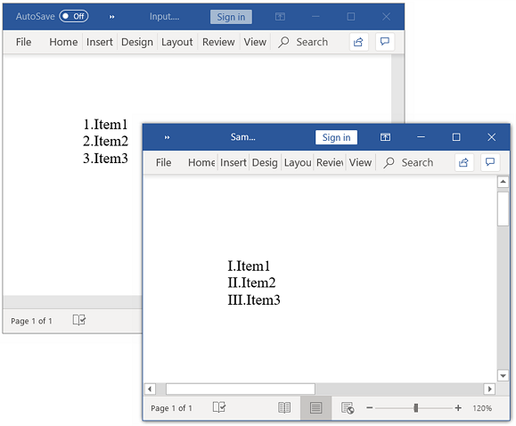
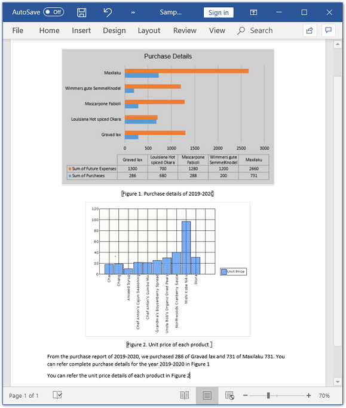
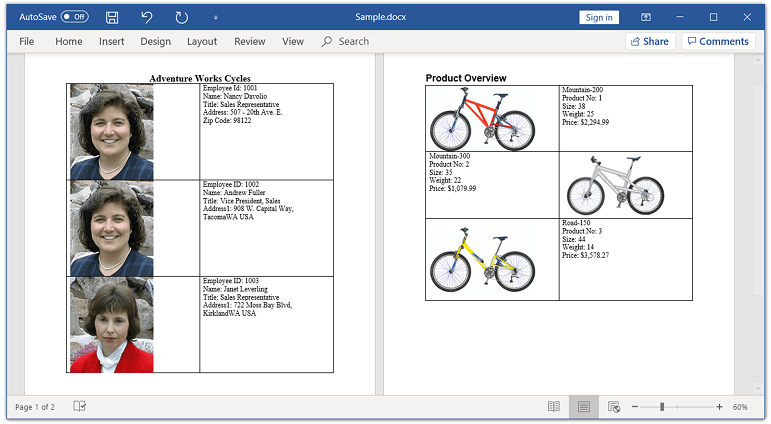
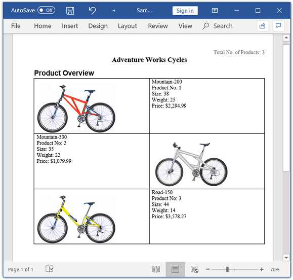
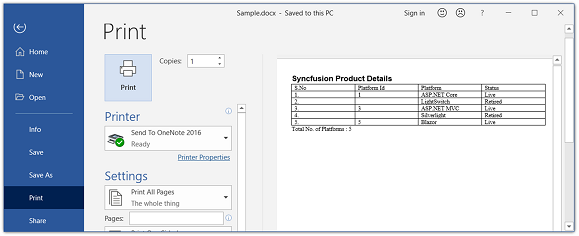

# Working with document Fields

Fields in a Word document are placeholders for data that might change on field update. Fields are represented by the `WField` and `WFieldMark` instances in DocIO. A field in a Word document contains field codes, field separator, field result, and field end.

To learn various types of Microsoft Word supported fields and their syntax,refer to the [MSDN article](https://support.office.com/en-US/article/Field-codes-in-Word-1ad6d91a-55a7-4a8d-b535-cf7888659a51#)

The entire field code is included in Document Object Model(DOM). Hence, adding a field will automatically include the following elements in DOM:

1. `WField`: Represents the starting of a Field.

2. `ParagraphItem`: Represents the Field code.

3. `WFieldMark`: Represents the Field separator.

4. `ParagraphItem`: Represents the Field result.

5. `WFieldMark`: Represents the end of a Field.

## Adding fields

You can add a field to a Word document by using the `appendField` method of `WParagraph` class.

The following code example explains how to add a field to the Word document.

 


//Creates an instance of WordDocument class (Empty Word Document).
WordDocument document = new WordDocument();
//Adds a new section to the Word Document.
IWSection section = document.addSection();
//Adds a new paragraph to Word document and appends text into paragraph.
IWParagraph paragraph = section.addParagraph();
paragraph.appendText("Today's Date: ");
//Adds the new Date field to Word document with field name and its type.
WField field = (WField)paragraph.appendField("Date",FieldType.FieldDate);
//Field code used to describe how to display the date.
field.setFieldCode(StringSupport.concat("DATE  \\@","\"MMMM d, yyyy\"" ));
//Saves the document in the given name and format.
document.save("Sample.docx", FormatType.Docx);
//Releases the resources occupied by WordDocument instance.
document.close();


  

## Formatting fields

You can format the field instances added to the Word document by iterating the items from field start to end.

The following code example explains how to format the field in Word document.




//Creates an instance of a WordDocument.
WordDocument document = new WordDocument();
//Adds one section and one paragraph to the document.
document.ensureMinimal();
//Adds the new Page field to Word document with field name and its type.
IWField field = document.getLastParagraph().appendField("Page", FieldType.FieldPage);
IEntity entity = field;
//Iterates to sibling items until Field End.
while (entity.getNextSibling() != null) 
{
	if (entity instanceof WTextRange)
		//Sets character format for text ranges.
		((WTextRange) entity).getCharacterFormat().setFontSize((float) 6);
	else if ((entity instanceof WFieldMark) 
	        && ((WFieldMark) entity).getType().getEnumValue() == FieldMarkType.FieldEnd.getEnumValue())
		break;
	//Gets next sibling item.
	entity = entity.getNextSibling();
}
// Saves and closes the Word document instance.
document.save("Template.docx", FormatType.Docx);
document.close();



   
## Updating fields

Field updating engine calculates the resultant value based on the field code information and updates the field result with a new value. You can update the following fields by using DocIO:

* = (formula field)
* DATE
* TIME
* DOCVARIABLE 
* DOCPROPERTY
* COMPARE
* IF
* NEXTIF
* MERGEREC
* MERGESEQ
* SECTION
* NUMPAGES
* TITLE
* Cross-Reference
* SEQ

The following code example explains how to update the fields present in Word document.

 


//Loads an existing Word document into DocIO instance.
WordDocument document = new WordDocument("Input.docx", FormatType.Docx);
//Updates the fields present in a document.
document.updateDocumentFields();
//Saves and closes the Word document instance.
document.save("Result.docx", FormatType.Docx);
document.close();


  

## IF field

IF field compares two values and updates the field result with true text, when comparison succeeds otherwise false text.

To learn more about IF field and its syntax in Microsoft Word, refer to the [MSDN article](https://support.office.com/en-au/article/Field-codes-IF-field-9f79e82f-e53b-4ff5-9d2c-ae3b22b7eb5e#)

The following code example explains how to add an If field to a Word document.

  


//Creates an instance of a WordDocument.
WordDocument document = new WordDocument();
IWSection section = document.addSection();
IWParagraph paragraph = section.addParagraph();
paragraph.appendText("If field which uses string of characters in expression");
paragraph=section.addParagraph();
//Creates the new instance of IF field.
WIfField field = (WIfField)paragraph.appendField("If", FieldType.FieldIf);
//Specifies the expression, true and false statement in field code.
field.setFieldCode("IF \"True\" = \"True\" \"The given statement is Correct\" \"The given statement is Wrong\"");
paragraph = section.addParagraph();
paragraph.appendText("If field which uses numbers in expression");
paragraph = section.addParagraph();
//Creates the new instance of IF field
field = (WIfField)paragraph.appendField("If", FieldType.FieldIf);
//Specifies the expression, true and false statement in field code.
field.setFieldCode("IF 100 >= 1000 \"The given statement is Correct\" \"The given statement is Wrong\"");
//Updates the document fields.
document.updateDocumentFields();
// Saves and closes the Word document instance.
document.save("Sample.docx", FormatType.Docx);
document.close();


 
  
## Document variables

The DocVariable field displays the value of a specified document variable in the Word document. The document variables can be added or modified using the `Variables` property of `WordDocument` class.

The following code example explains how to add a DocVariable field to a Word document.

  


//Creates an instance of a WordDocument.
WordDocument document = new WordDocument();
IWSection section = document.addSection();
IWParagraph paragraph = section.addParagraph();
paragraph.appendText("First Name of the customer: ");
//Adds the DocVariable field with Variable name and its type.
paragraph.appendField("FirstName",FieldType.FieldDocVariable);
paragraph = section.addParagraph();
paragraph.appendText("Last Name of the customer: ");
//Adds the DocVariable field with Variable name and its type.
paragraph.appendField("LastName", FieldType.FieldDocVariable);
//Adds the value for variable in WordDocument.Variable collection.
document.getVariables().add("FirstName", "Jeff");
document.getVariables().add("LastName", "Smith");
//Updates the document fields.
document.updateDocumentFields();
// Saves and closes the Word document instance.
document.save("Sample.docx", FormatType.Docx);
document.close();



  
## Cross reference

A cross-reference refers to an item that appears in another location in a document. You can create cross-reference to bookmarks in a document by using the `appendCrossReference` method of `WParagraph` class.

N>  The Essential DocIO supports creating and updating the cross-reference fields only for bookmarks in a document.

The following code example explains how to append cross reference for bookmark in a Word document.

  


//Creates an instance of a WordDocument.
WordDocument document = new WordDocument();
IWSection section = document.addSection();
IWParagraph paragraph = section.addParagraph();
//Adds text, bookmark start and end in the paragraph.
paragraph.appendBookmarkStart("Title");
paragraph.appendText("Northwind Database");
paragraph.appendBookmarkEnd("Title");
paragraph = section.addParagraph();
paragraph.appendText("The Northwind sample database (Northwind.mdb) is included with all versions of Access. It provides data you can experiment with and database objects that demonstrate features you might want to implement in your own databases.");
section = document.addSection();
section.addParagraph();
paragraph = (WParagraph)section.addParagraph();
//Gets the collection of bookmark start in the word document.
ListSupport<Entity> items = document.getCrossReferenceItems(ReferenceType.Bookmark);
paragraph.appendText("Bookmark Cross Reference starts here ");
//Appends the cross reference for bookmark “Title” with ContentText as reference kind.
paragraph.appendCrossReference(ReferenceType.Bookmark, ReferenceKind.ContentText, items.get(0), true, false, false, "");
//Updates the document Fields.
document.updateDocumentFields();
// Saves and closes the Word document instance.
document.save("Sample.docx", FormatType.Docx);
document.close();


  

## Unlink fields

You can replace the field with its most recent result in the Word document by unlinking the field using the `unlink` API. When you unlink a field, its current result is converted to text or a graphic and can no longer be updated automatically.

The following code example shows how to unlink the fields in Word document.

  


//Creates an instance of WordDocument class.
WordDocument document = new WordDocument();
//Adds a new section into the Word Document.
IWSection section = document.addSection();
//Adds a new paragraph into Word document and appends text into paragraph.
IWParagraph paragraph = section.addParagraph();
paragraph.appendText("Today's Date: ");
//Adds the new Date field in Word document with field name and its type.
WField field = (WField)paragraph.appendField("Date", FieldType.FieldDate);
//Updates the field.
field.update();
//Unlink the field.
field.unlink();
//Saves the document in the given name and format.
document.save("Sample.docx", FormatType.Docx);
//Releases the resources occupied by WordDocument instance.
document.close();




N>  XE (Index Entry) fields cannot be unlinked.

## Sequence Field
You can use the Sequence (SEQ) field to automatically numbers the chapters, tables, figures, and other items in a Word document. When you add, delete, or move an item in Word document (along with SEQ fields), you can update the remaining SEQ fields with a new sequence.

You can format the SEQ field using below switches.

\c --  Repeats the closest preceding sequence number.
\h --  Hides the field result unless a general-formatting-switch is also present.
\n --  Inserts the next sequence number for the specified items. This is the default switch.
\r  -- Resets the sequence number to the number following “r”.
\s -- Resets the sequence number at the heading level following the "s".

### Apply Number format
You can apply the number format for the sequence field using `NumberFormat` property. 

The following code example shows how to apply the number format for sequence field.

  


//Creates a new document.
WordDocument document = createDocument();
//Accesses sequence field in the document.
WSeqField field = (WSeqField)((WParagraph)document.getLastSection().getBody().getChildEntities().get(0)).getChildEntities().get(0);
//Applies the number format for sequence field.
field.setNumberFormat(CaptionNumberingFormat.Roman);
//Accesses sequence field in the document.
field = (WSeqField)((WParagraph)document.getLastSection().getBody().getChildEntities().get(1)).getChildEntities().get(0);
//Applies the number format for sequence field.
field.setNumberFormat(CaptionNumberingFormat.Roman);
//Accesses sequence field in the document.
field = (WSeqField)((WParagraph)document.getLastSection().getBody().getChildEntities().get(2)).getChildEntities().get(0);
//Applies the number format for sequence field.
field.setNumberFormat(CaptionNumberingFormat.Roman);
//Updates the document fields.
document.updateDocumentFields();
//Saves and closes the Word document.
document.save("Sample.docx");
document.close();




The following code example provides supporting methods for the above code.

  


private WordDocument createDocument() throws Exception
{
	//Creates a new document.
	WordDocument document = new WordDocument();
	//Adds a new section to the document.
	IWSection section = document.addSection();
	//Sets margin of the section.
	section.getPageSetup().getMargins().setAll((float)72);
	//Adds a paragraph to the section.
	IWParagraph paragraph = section.addParagraph();
	paragraph.appendField("List",FieldType.FieldSequence);
	paragraph.appendText(".Item1");
	//Adds a paragraph to the section.
	paragraph = section.addParagraph();
	paragraph.appendField("List",FieldType.FieldSequence);
	paragraph.appendText(".Item2");
	//Adds a paragraph to the section.
	paragraph = section.addParagraph();
	paragraph.appendField("List",FieldType.FieldSequence);
	paragraph.appendText(".Item3");
	return document;
}




By executing the above code example, it generates output Word document as follows.

### Refer Bookmark
You can refer the sequence field elsewhere in the document by including bookmark name through `BookmarkName` property. The referred sequence field may be present anywhere in the Word document, but not beyond the respective bookmark end.

For example, you can refer the image caption numbers in sentence by including the bookmark name in sequence field.

The following code example shows how to refer the bookmark in sequence field.

  


//Opens an existing word document.
WordDocument document = new WordDocument("Template.docx");
//Accesses sequence field in the document.
WParagraph paragraph = (WParagraph)document.getLastSection().getBody().getChildEntities().get(4);
WSeqField seqField = (WSeqField)paragraph.getChildEntities().get(12);
//Adds bookmark reference to the sequence field.
seqField.setBookmarkName("BkmkPurchase");
//Accesses sequence field in the document.
paragraph = (WParagraph)document.getLastSection().getParagraphs().get(5);
seqField=(WSeqField)paragraph.getChildEntities().get(1);
//Adds bookmark reference to the sequence field.
seqField.setBookmarkName("BkkmUnitPrice");
//Updates the document fields.
document.updateDocumentFields();
//Saves and closes the Word document.
document.save("Sample.docx", FormatType.Docx);
document.close();




By executing the above code example, it generates output Word document as follows.

### Reset numbering 
You can reset the numbering for sequence field (\r) using `ResetNumber` property and reset the numbering based on heading level (\s) in the Word document using `ResetHeadingLevel` property. 

The following code example shows how to reset the numbering for sequence field.

  


//Creates a Word document.
WordDocument document = createDocument();
//Accesses sequence field in the document.
IWTable table = (WTable)document.getLastSection().getBody().getChildEntities().get(1);
WSeqField field = ((WSeqField)((WParagraph)table.get(0,1).getChildEntities().get(0)).getChildEntities().get(1));
//Resets the number for sequence field.
field.setResetNumber(1001);
//Accesses sequence field in the document.
field = ((WSeqField)((WParagraph)table.get(1,1).getChildEntities().get(0)).getChildEntities().get(1));
//Resets the number for sequence field.
field.setResetNumber(1002);
//Accesses sequence field in the document.
field = ((WSeqField)((WParagraph)table.get(2,1).getChildEntities().get(0)).getChildEntities().get(1));
//Resets the number for sequence field.
field.setResetNumber(1003);
table = (WTable)document.getLastSection().getBody().getChildEntities().get(3);
field = ((WSeqField)((WParagraph)table.get(0,1).getChildEntities().get(1)).getChildEntities().get(1));
//Resets the heading level for sequence field.
field.setResetHeadingLevel(1);
//Updates the document fields.
document.updateDocumentFields();
//Saves and closes the Word document. 
document.save("Sample.docx");
document.close();




The following code example provides supporting methods for the above code.

  


private WordDocument createDocument() throws Exception
{
	//Creates a new word document.
	WordDocument document = new WordDocument();
	//Adds new section to the document.
	IWSection section = document.addSection();
	//Sets margin of the section.
	section.getPageSetup().getMargins().setAll((float)72);
	//Adds new paragraph to the section.
	IWParagraph paragraph = (WParagraph)section.addParagraph();
	//Adds text range.
	IWTextRange textRange = paragraph.appendText("Adventure Works Cycles");
	textRange.getCharacterFormat().setFontSize((float)16);
	textRange.getCharacterFormat().setBold(true);
	paragraph.getParagraphFormat().setHorizontalAlignment(HorizontalAlignment.Center);
	//Adds a new table into Word document.
	IWTable table = section.addTable();
	//Specifies the total number of rows & columns.
	table.resetCells(3,2);
	//First row.
	table.get(0,0).addParagraph().appendPicture(new FileInputStream("Nancy.png"));
	paragraph = table.get(0,1).addParagraph();
	paragraph.appendText("Employee Id: ");
	paragraph.appendField("Id",FieldType.FieldSequence);
	table.get(0,1).addParagraph().appendText("Name: Nancy Davolio");
	table.get(0,1).addParagraph().appendText("Title: Sales Representative");
	table.get(0,1).addParagraph().appendText("Address: 507 - 20th Ave. E.");
	table.get(0,1).addParagraph().appendText("Zip Code: 98122");
	//Second row.
	table.get(1,0).addParagraph().appendPicture(new FileInputStream("Andrews.png"));
	paragraph = table.get(1,1).addParagraph();
	paragraph.appendText("Employee ID: ");
	paragraph.appendField("Id",FieldType.FieldSequence);
	table.get(1,1).addParagraph().appendText("Name: Andrew Fuller");
	table.get(1,1).addParagraph().appendText("Title: Vice President, Sales");
	table.get(1,1).addParagraph().appendText("Address1: 908 W. Capital Way, ");
	table.get(1,1).addParagraph().appendText("TacomaWA USA");
	//Third row.
	table.get(2,0).addParagraph().appendPicture(new FileInputStream("Janet.png"));
	paragraph = table.get(2,1).addParagraph();
	paragraph.appendText("Employee ID: ");
	paragraph.appendField("Id",FieldType.FieldSequence);
	table.get(2,1).addParagraph().appendText("Name: Janet Leverling");
	table.get(2,1).addParagraph().appendText("Title: Sales Representative");
	table.get(2,1).addParagraph().appendText("Address1: 722 Moss Bay Blvd,  ");
	table.get(2,1).addParagraph().appendText("KirklandWA USA");
	//Adds new Paragraph to the section.
	paragraph = section.addParagraph();
	paragraph.appendBreak(BreakType.PageBreak);
	//Adds text range.
	paragraph.appendText("Product Overview");
	paragraph.applyStyle(BuiltinStyle.Heading1);
	paragraph.getParagraphFormat().setHorizontalAlignment(HorizontalAlignment.Justify);
	//Adds a new table into Word document
	table = section.addTable();
	//Specifies the total number of rows & columns
	table.resetCells(3,2);
	//Accesses the instance of the cell  and adds the content into cell.
	//First row.
	table.get(0,0).addParagraph().appendPicture(new FileInputStream("Mountain-200.png"));
	table.get(0,1).addParagraph().appendText("Mountain-200");
	paragraph = table.get(0,1).addParagraph();
	paragraph.appendText("Product No: ");
	paragraph.appendField("Id",FieldType.FieldSequence);
	table.get(0,1).addParagraph().appendText("Size: 38");
	table.get(0,1).addParagraph().appendText("Weight: 25");
	table.get(0,1).addParagraph().appendText("Price: $2,294.99");
	//Second row.
	table.get(1,0).addParagraph().appendText("Mountain-300");
	paragraph = table.get(1,0).addParagraph();
	paragraph.appendText("Product No: ");
	paragraph.appendField("Id",FieldType.FieldSequence);
	table.get(1,0).addParagraph().appendText("Size: 35");
	table.get(1,0).addParagraph().appendText("Weight: 22");
	table.get(1,0).addParagraph().appendText("Price: $1,079.99");
	table.get(1,1).addParagraph().appendPicture(new FileInputStream("Mountain-300.png"));
	table.get(2,0).addParagraph().appendPicture(new FileInputStream("Road-550.png"));
	table.get(2,1).addParagraph().appendText("Road-150");
	//Third row.
	paragraph = table.get(2,1).addParagraph();
	paragraph.appendText("Product No: ");
	paragraph.appendField("Id",FieldType.FieldSequence);
	table.get(2,1).addParagraph().appendText("Size: 44");
	table.get(2,1).addParagraph().appendText("Weight: 14");
	table.get(2,1).addParagraph().appendText("Price: $3,578.27");
	return document;
}




By executing the above code example, it generates output Word document as follows.

### Repeat nearest number 
You can insert the closest preceding sequence number (\c) using `RepeatNearestNumber` property.

For example, if you need to display total number of products in a page, you can repeat the closest preceding sequence number which referred for products.

The following code example shows how to repeat the closest preceding sequence number in the Word document.

  


//Creates a Word document.
WordDocument document = createDocument();
//Accesses sequence field in the document.
WSeqField field =  (WSeqField)((WParagraph)document.getLastSection().getHeadersFooters().getHeader().getChildEntities().get(0)).getChildEntities().get(1);
//Enables a flag to repeat the nearest number for sequence field.
field.setRepeatNearestNumber(true);
//Updates the document fields.
document.updateDocumentFields();
//Saves and closes the Word document.
document.save("Sample.docx", FormatType.Docx);
document.close();




The following code example provides supporting methods for the above code.

  


private WordDocument createDocument()throws Exception
{
	//Creates a new document.
	WordDocument document = new WordDocument();
	//Adds a new section to the document
	IWSection section = document.addSection();
	//Inserts the default page header.
	IWParagraph paragraph = section.getHeadersFooters().getOddHeader().addParagraph();
	paragraph.getParagraphFormat().setHorizontalAlignment(HorizontalAlignment.Right);
	paragraph.appendText("Total No. of Products: ");
	paragraph.appendField("Product count",FieldType.FieldSequence);
	//Adds a paragraph to the section.
	paragraph = section.addParagraph();
	IWTextRange textRange = paragraph.appendText("Adventure Works Cycles");
	paragraph.getParagraphFormat().setHorizontalAlignment(HorizontalAlignment.Center);
	textRange.getCharacterFormat().setFontSize((float)16);
	textRange.getCharacterFormat().setBold(true);
	//Adds a paragraph to the section.
	section.addParagraph().appendText("Product Overview");
	document.getLastParagraph().applyStyle(BuiltinStyle.Heading1);
	//Adds a new table into Word document
	IWTable table = section.addTable();
	//Specifies the total number of rows & columns.
	table.resetCells(3,2);
	//Accesses the instance of the cell  and adds the content into cell
	//First row.
	table.get(0,0).addParagraph().appendPicture(new FileInputStream("Mountain-200.png"));
	table.get(0,1).addParagraph().appendText("Mountain-200");
	paragraph=table.get(0,1).addParagraph();
	paragraph.appendText("Product No: ");
	paragraph.appendField("Product count",FieldType.FieldSequence);
	table.get(0,1).addParagraph().appendText("Size: 38");
	table.get(0,1).addParagraph().appendText("Weight: 25");
	table.get(0,1).addParagraph().appendText("Price: $2,294.99");
	//Second row.
	table.get(1,0).addParagraph().appendText("Mountain-300");
	paragraph=table.get(1,0).addParagraph();
	paragraph.appendText("Product No: ");
	paragraph.appendField("Product count",FieldType.FieldSequence);
	table.get(1,0).addParagraph().appendText("Size: 35");
	table.get(1,0).addParagraph().appendText("Weight: 22");
	table.get(1,0).addParagraph().appendText("Price: $1,079.99");
	table.get(1,1).addParagraph().appendPicture(new FileInputStream("Mountain-300.png"));
	//Third row.
	table.get(2,0).addParagraph().appendPicture(new FileInputStream("Road-550.png"));
	table.get(2,1).addParagraph().appendText("Road-150");
	paragraph=table.get(2,1).addParagraph();
	paragraph.appendText("Product No: ");
	paragraph.appendField("Product count",FieldType.FieldSequence);
	table.get(2,1).addParagraph().appendText("Size: 44");
	table.get(2,1).addParagraph().appendText("Weight: 14");
	table.get(2,1).addParagraph().appendText("Price: $3,578.27");
	return document;
}




By executing the above code example, it generates output Word document as follows.

### Hide
You can hide the field result of the sequence field using `HideResult` property.

For example, if you need to consider the sequence numbering for list of products, but not need to print the numbering for retired products, then you can hide those sequence fields alone.

The following code example shows how to hide the field result of sequence field.

  


//Creates a Word document.
WordDocument document = createDocument();
//Accesses sequence field in the document.
WTable table = (WTable)document.getLastSection().getBody().getChildEntities().get(1);
WSeqField field = ((WSeqField)((WParagraph)table.get(2,1).getChildEntities().get(0)).getChildEntities().get(0));
//Enables a flag to to hide the sequence field result.
field.setHideResult(true);
//Accesses sequence field in the document.
field=((WSeqField)((WParagraph)table.get(4,1).getChildEntities().get(0)).getChildEntities().get(0));
//Enables a flag to hide the sequence field result.
field.setHideResult(true);
//Updates the document fields.
document.updateDocumentFields();
//Saves and closes the Word document.
document.save("Sample.docx", FormatType.Docx);
document.close();




The following code example provides supporting methods for the above code.

  


private WordDocument createDocument() throws Exception
{
	//Creates a new Word document.
	WordDocument document = new WordDocument();
	//Adds a new section to the document.
	IWSection section = document.addSection();
	//Adds a paragraph to the section.
	IWParagraph paragraph = section.addParagraph();
	paragraph.appendText("Syncfusion Product Details");
	paragraph.applyStyle(BuiltinStyle.Heading1);
	//Adds a new table .
	IWTable table = section.addTable();
	//Specifies the total number of rows & columns
	table.resetCells(6,4);
	//Accesses the instance of the cell and add the content into cell.
	//First row.
	table.get(0,0).addParagraph().appendText("S.No");
	table.get(0,1).addParagraph().appendText("Platform Id");
	table.get(0,2).addParagraph().appendText("Platform");
	table.get(0,3).addParagraph().appendText("Status ");
	table.get(1,0).addParagraph().appendText("1.");
	//Second row.
	table.get(1,1).addParagraph().appendField("PlatformCount",FieldType.FieldSequence);
	table.get(1,2).addParagraph().appendText("ASP.NET Core");
	table.get(1,3).addParagraph().appendText("Live");
	//Third row.
	table.get(2,0).addParagraph().appendText("2.");
	table.get(2,1).addParagraph().appendField("PlatformCount",FieldType.FieldSequence);
	table.get(2,2).addParagraph().appendText("LightSwitch");
	table.get(2,3).addParagraph().appendText("Retired");
	//Fourth row.
	table.get(3,0).addParagraph().appendText("3.");
	table.get(3,1).addParagraph().appendField("PlatformCount",FieldType.FieldSequence);
	table.get(3,2).addParagraph().appendText("ASP.NET MVC");
	table.get(3,3).addParagraph().appendText("Live");
	//Fifth row.
	table.get(4,0).addParagraph().appendText("4.");
	table.get(4,1).addParagraph().appendField("PlatformCount",FieldType.FieldSequence);
	table.get(4,2).addParagraph().appendText("Silverlight ");
	table.get(4,3).addParagraph().appendText("Retired");
	//Sixth row.
	table.get(5,0).addParagraph().appendText("5.");
	table.get(5,1).addParagraph().appendField("PlatformCount",FieldType.FieldSequence);
	table.get(5,2).addParagraph().appendText("Blazor");
	table.get(5,3).addParagraph().appendText("Live");
	section.addParagraph().appendText("Total No. of Platforms : 5");
	return document;
}




By executing the above code example, it generates output Word document as follows.

### Next Sequence number
You can insert the next sequence number for the specified items using `InsertNextNumber` property. This is the default.

The following code example shows how to insert the next sequence number for the specified item.

  


//Opens an existing word document.
WordDocument document = new WordDocument("Template.docx");
//Accesses sequence field in the document.
WParagraph paragraph = (WParagraph)document.getLastSection().getBody().getChildEntities().get(4);
WSeqField field = (WSeqField)paragraph.getChildEntities().get(12);
//Enables a flag to insert next number for sequence field.
field.setInsertNextNumber(true);
//Updates the document fields.
document.updateDocumentFields();
//Saves and closes the Word document.
document.save("Sample.docx", FormatType.Docx);
document.close();


