# Create Equation Using LaTeX
The Java Word library allows you to create mathematical equations in a Word document using **LaTeX**.

## Accent

Add **accent** equations to a Word document using LaTeX through the **appendMath** API.

The following code example illustrates how to create an accent equation using LaTeX in a Word document.

  



//Creates a new Word document.
WordDocument document = new WordDocument();
//Adds one section and one paragraph to the document.
document.ensureMinimal();
//Append an accent equation using LaTeX.
document.getLastParagraph().appendMath("\\dot{a}");
//Saves the Word document.
document.save("Sample.docx", FormatType.Docx);
//Closes the document.
document.close();



  

The following table demonstrates the LaTeX equivalent to professional format accent equations.

<table>
<thead>
<tr>
<th width="20%">S.No</th>
<th width="40%">Professional</th>
<th width="40%">LaTeX</th>
</tr>
</thead>
<tr>
<td>1.</td>
<td>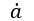</td>
<td>\dot{a}</td>
</tr>
<tr>
<td>2.</td>
<td>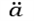</td>
<td>\ddot{a}</td>
</tr>
<tr>
<td>3.</td>
<td>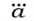</td>
<td>\dddot{a}</td>
</tr>
<tr>
<td>4.</td>
<td>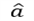</td>
<td>\hat{a}</td>
</tr>
<tr>
<td>5.</td>
<td></td>
<td>\check{a}</td>
</tr>
<tr>
<td>6.</td>
<td>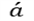</td>
<td>\acute{a}</td>
</tr>
<tr>
<td>7.</td>
<td>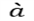</td>
<td>\grave{a}</td>
</tr>
<tr>
<td>8.</td>
<td>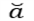</td>
<td>\breve{a}</td>
</tr>
<tr>
<td>9.</td>
<td>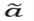</td>
<td>\widetilde{a}</td>
</tr>
<tr>
<td>10.</td>
<td>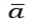</td>
<td>\bar{a}</td>
</tr>
<tr>
<td>11.</td>
<td>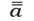</td>
<td>\bar{\bar{a}}</td>
</tr>
<tr>
<td>12.</td>
<td>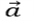</td>
<td>\vec{a}</td>
</tr>
<tr>
<td>13.</td>
<td>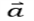</td>
<td>\hvec{a}</td>
</tr>
<tr>
<td>14.</td>
<td></td>
<td>\widehat{AAA}</td>
</tr>
</table>

## Bar

Add **bar** equations to a Word document using LaTeX through the **appendMath** API.

The following code example illustrates how to create a bar equation using LaTeX in a Word document.

  



//Creates a new Word document.
WordDocument document = new WordDocument();
//Adds one section and one paragraph to the document.
document.ensureMinimal();
//Append a bar equation using LaTeX.
document.getLastParagraph().appendMath("\\overline{a}");
//Saves the Word document.
document.save("Sample.docx", FormatType.Docx);
//Closes the document.
document.close();



 

The following table demonstrates the LaTeX equivalent to professional format bar equations.

<table>
<thead>
<tr>
<th width="20%">S.No</th>
<th width="40%">Professional</th>
<th width="40%">LaTeX</th>
</tr>
</thead>
<tr>
<td>1.</td>
<td>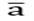</td>
<td>\overline{a}</td>
</tr>
<tr>
<td>2.</td>
<td>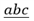</td>
<td>\underline{abc}</td>
</tr>
</table>

## Box

Add **box** equation to a Word document using the LaTeX through **appendMath** API.

The following code example illustrates how to create box equation using LaTeX in Word document.

  



//Creates a new Word document.
WordDocument document = new WordDocument();
//Adds one section and one paragraph to the document.
document.ensureMinimal();
//Append an box equation using LaTeX.
document.getLastParagraph().appendMath("\\box{a}");
//Saves the Word document.
document.save("Sample.docx", FormatType.Docx);
//Closes the document.
document.close();



 

The following table demonstrates the LaTeX equivalent to professional format box equations.

<table>
<thead>
<tr>
<th width="20%">S.No</th>
<th width="40%">Professional</th>
<th width="40%">LaTeX</th>
</tr>
</thead>
<tr>
<td>1.</td>
<td>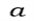</td>
<td>\box{a}</td>
</tr>
</table>

## Border Box

Add **border box** equations to a Word document using LaTeX through the **appendMath** API.

The following code example illustrates how to create a border box equation using LaTeX in a Word document.

  




//Creates a new Word document.
WordDocument document = new WordDocument();
//Adds one section and one paragraph to the document.
document.ensureMinimal();
//Append a border box equation using LaTeX.
document.getLastParagraph().appendMath("\\boxed{{x}^{2}+{y}^{2}={z}^{2}}");
//Saves the Word document.
document.save("Sample.docx", FormatType.Docx);
//Closes the document.
document.close();




 

The following table demonstrates the LaTeX equivalent to professional format border box equations.

<table>
<thead>
<tr>
<th width="20%">S.No</th>
<th width="40%">Professional</th>
<th width="40%">LaTeX</th>
</tr>
</thead>
<tr>
<td>1.</td>
<td>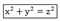</td>
<td>\boxed{{x}^{2}+{y}^{2}={z}^{2}}</td>
</tr>
</table>

## Delimiter

Add **delimiter** equation to a Word document using the LaTeX through **appendMath** API.

The following code example illustrates how to create delimiter equation using LaTeX in Word document.

  



//Creates a new Word document.
WordDocument document = new WordDocument();
//Adds one section and one paragraph to the document.
document.ensureMinimal();
//Append an delimiter equation using LaTeX.
document.getLastParagraph().appendMath("\\left(a\\right)");
//Saves the Word document.
document.save("Sample.docx", FormatType.Docx);
//Closes the document.
document.close();



 

The following table demonstrates the LaTeX equivalent to professional format delimiter equations.

<table>
<thead>
<tr>
<th width="20%">S.No</th>
<th width="40%">Professional</th>
<th width="40%">LaTeX</th>
</tr>
</thead>
<tr>
<td>1.</td>
<td>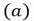</td>
<td>\left(a\right)</td>
</tr>
<tr>
<td>2.</td>
<td>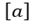</td>
<td>\left[a\right]</td>
</tr>
<tr>
<td>3.</td>
<td>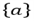</td>
<td>\left\{a\right\}</td>
</tr>
<tr>
<td>4.</td>
<td>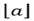</td>
<td>\left\lfloora\right\rfloor</td>
</tr>
<tr>
<td>5.</td>
<td>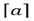</td>
<td>\left\lceila\right\rceil</td>
</tr>
<tr>
<td>6.</td>
<td>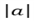</td>
<td>\left|a\right|</td>
</tr>
<tr>
<td>7.</td>
<td>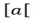</td>
<td>\left[a\right[</td>
</tr>
<tr>
<td>8.</td>
<td>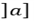</td>
<td>\left]a\right]</td>
</tr>
<tr>
<td>9.</td>
<td>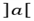</td>
<td>\left]a\right[</td>
</tr>
<tr>
<td>10.</td>
<td>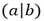</td>
<td>\left(a\middle|b\right)</td>
</tr>
<tr>
<td>11.</td>
<td>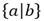</td>
<td>\left\{a\middle|b\right\}</td>
</tr>
<tr>
<td>12.</td>
<td>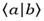</td>
<td>\left\langlea\middle|b\right\rangle</td>
</tr>
<tr>
<td>13.</td>
<td>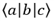</td>
<td>\left\langlea\middle|b\middle|c\right\rangle</td>
</tr>
<tr>
<td>14.</td>
<td>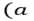</td>
<td>\left(a\right.</td>
</tr>
<tr>
<td>15.</td>
<td>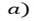</td>
<td>\left. a\right)</td>
</tr>
<tr>
<td>16.</td>
<td>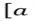</td>
<td>\left[a\right.</td>
</tr>
<tr>
<td>17.</td>
<td>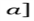</td>
<td>\left. a\right]</td>
</tr>
<tr>
<td>18.</td>
<td>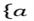</td>
<td>\left\{a\right.</td>
</tr>
<tr>
<td>19.</td>
<td>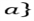</td>
<td>\left. a\right\}</td>
</tr>
<tr>
<td>20.</td>
<td>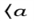</td>
<td>\left\langlea\right.</td>
</tr>
<tr>
<td>21.</td>
<td>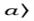</td>
<td>\left. a\right\rangle</td>
</tr>
<tr>
<td>22.</td>
<td>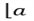</td>
<td>\left\lfloora\right.</td>
</tr>
<tr>
<td>23.</td>
<td>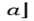</td>
<td>\left. a\right\rfloor</td>
</tr>
<tr>
<td>24.</td>
<td>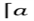</td>
<td>\left\lceila\right.</td>
</tr>
<tr>
<td>25.</td>
<td>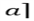</td>
<td>\left. a\right\rceil</td>
</tr>
<tr>
<td>26.</td>
<td>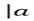</td>
<td>\left|a\right.</td>
</tr>
<tr>
<td>27.</td>
<td>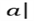</td>
<td>\left. a\right|</td>
</tr>
<tr>
<td>28.</td>
<td>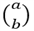</td>
<td>\binom{a}{b}</td>
</tr>
</table>

## Equation Array

Add **equation array** to a Word document using LaTeX through the **appendMath** API.

The following code example illustrates how to create an equation array using LaTeX in a Word document.

  



//Creates a new Word document.
WordDocument document = new WordDocument();
//Adds one section and one paragraph to the document.
document.ensureMinimal();
//Appends a box equation using LaTeX.
document.getLastParagraph().appendMath("\\eqarray{a@&b}");
//Saves the Word document.
document.save("Sample.docx", FormatType.Docx);
//Closes the document.
document.close();



 

The following table demonstrates the LaTeX equivalent to professional format equation arrays.

<table>
<thead>
<tr>
<th width="20%">S.No</th>
<th width="40%">Professional</th>
<th width="40%">LaTeX</th>
</tr>
</thead>
<tr>
<td>1.</td>
<td>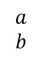</td>
<td>\eqarray{a@&b}</td>
</tr>
</table>

## Fraction

Add **fraction** equation to a Word document using LaTeX through the **appendMath** API.

The following code example illustrates how to create a fraction equation using LaTeX in a Word document.

  



//Creates a new Word document.
WordDocument document = new WordDocument();
//Adds one section and one paragraph to the document.
document.ensureMinimal();
//Appends a fraction equation using LaTeX.
document.getLastParagraph().appendMath("{\\frac{dy}{dx}}");
//Saves the Word document.
document.save("Sample.docx", FormatType.Docx);
//Closes the document.
document.close();



 

The following table demonstrates the LaTeX equivalent to professional format fraction equations.

<table>
<thead>
<tr>
<th width="20%">S.No</th>
<th width="40%">Professional</th>
<th width="40%">LaTeX</th>
</tr>
</thead>
<tr>
<td>1.</td>
<td>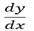</td>
<td>frac{\mathbit{dy}}{\mathbit{dx}}</td>
</tr>
<tr>
<td>2.</td>
<td>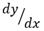</td>
<td>\sfrac{dy}{dx}</td>
</tr>
<tr>
<td>3.</td>   
<td>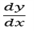</td>
<td>{\frac{dy}{dx}}</td>
</tr>
</table>

## Function

Add **delimiter** equation to a Word document using LaTeX through the **appendMath** API.

The following code example illustrates how to create a delimiter equation using LaTeX in a Word document.

  



// Creates a new Word document.
WordDocument document = new WordDocument();
// Adds one section and one paragraph to the document.
document.ensureMinimal();
// Appends a delimiter equation using LaTeX.
document.getLastParagraph().appendMath("\sin{\theta}");
// Saves the Word document.
document.save("Sample.docx", FormatType.Docx);
// Closes the document.
document.close();





The following table demonstrates the LaTeX equivalent to professional format function equations.

<table>
<thead>
<tr>
<th width="20%">S.No</th>
<th width="40%">Professional</th>
<th width="40%">LaTeX</th>
</tr>
</thead>
<tr>
<td>1.</td>
<td>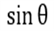</td>
<td>\sin{\theta}</td>
</tr>
<tr>
<td>2.</td>
<td>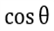</td>
<td>\cos{\theta}</td>
</tr>
<tr>
<td>3.</td>
<td></td>
<td>\tan{\theta}</td>
</tr>
<tr>
<td>4.</td>
<td></td>
<td>\csc{\theta}</td>
</tr>
<tr>
<td>5.</td>
<td></td>
<td>\sec{\theta}</td>
</tr>
<tr>
<td>6.</td>
<td></td>
<td>\cot{\theta}</td>
</tr>
<tr>
<td>7.</td>
<td></td>
<td>\sin^{-1}{\theta}</td>
</tr>
<tr>
<td>8.</td>
<td></td>
<td>\cos^{-1}{\theta}</td>
</tr>
<tr>
<td>9.</td>
<td></td>
<td>\tan^{-1}{\theta}</td>
</tr>
<tr>
<td>10.</td>
<td></td>
<td>\csc^{-1}{\theta}</td>
</tr>
<tr>
<td>11.</td>
<td></td>
<td>\sec^{-1}{\theta}</td>
</tr>
<tr>
<td>12.</td>
<td></td>
<td>\cot^{-1}{\theta}</td>
</tr>
<tr>
<td>13.</td>
<td></td>
<td>\sinh{\theta}</td>
</tr>
<tr>
<td>14.</td>
<td></td>
<td>\cosh{\theta}</td>
</tr>
<tr>
<td>15.</td>
<td></td>
<td>\tanh{\theta}</td>
</tr>
<tr>
<td>16.</td>
<td></td>
<td>\csch{\theta}</td>
</tr>
<tr>
<td>17.</td>
<td></td>
<td>\sech{\theta}</td>
</tr>
<tr>
<td>18.</td>
<td></td>
<td>\coth{\theta}</td>
</tr>
<tr>
<td>19.</td>
<td></td>
<td>\sinh^{-1}{\theta}</td>
</tr>
<tr>
<td>20.</td>
<td></td>
<td>\cosh^{-1}{\theta}</td>
</tr>
<tr>
<td>21.</td>
<td></td>
<td>\tanh^{-1}{\theta}</td>
</tr>
<tr>
<td>22.</td>
<td></td>
<td>\csch^{-1}{\theta}</td>
</tr>
<tr>
<td>23.</td>
<td></td>
<td>\sech^{-1}{\theta}</td>
</tr>
<tr>
<td>24.</td>
<td></td>
<td>\coth^{-1}{\theta}</td>
</tr>
<tr>
<td>25.</td>
<td></td>
<td>\arcsin{\theta}</td>
</tr>
<tr>
<td>26.</td>
<td></td>
<td>\arccos{\theta}</td>
</tr>
<tr>
<td>27.</td>
<td></td>
<td>\arctan{\theta}</td>
</tr>
<tr>
<td>28.</td>
<td></td>
<td>\arccsc{\theta}</td>
</tr>
<tr>
<td>29.</td>
<td></td>
<td>\arcsec{\theta}</td>
</tr>
<tr>
<td>30.</td>
<td></td>
<td>\arccot{\theta}</td>
</tr>
</table>

## Group character

Add **group character** equation to a Word document using LaTeX through the **appendMath** API.

The following code example illustrates how to create a group character equation using LaTeX in a Word document.

  



// Creates a new Word document.
WordDocument document = new WordDocument();
// Adds one section and one paragraph to the document.
document.ensureMinimal();
// Appends a group character equation using LaTeX.
document.getLastParagraph().appendMath("\overbrace{a-b}");
// Saves the Word document.
document.save("Sample.docx", FormatType.Docx);
// Closes the document.
document.close();





The following table demonstrates the LaTeX equivalent to professional format group character equations.

<table>
<thead>
<tr>
<th width="20%">S.No</th>
<th width="40%">Professional</th>
<th width="40%">LaTeX</th>
</tr>
</thead>
<tr>
<td>1.</td>
<td></td>
<td>\overbrace{a-b}</td>
</tr>
<tr>
<td>2.</td>
<td></td>
<td>\underbrace{a}</td>
</tr>
</table>

## Limit

Add **limit** equation to a Word document using LaTeX through the **appendMath** API.

The following code example illustrates how to create a limit equation using LaTeX in a Word document.

  



// Creates a new Word document.
WordDocument document = new WordDocument();
// Adds one section and one paragraph to the document.
document.ensureMinimal();
// Appends a limit equation using LaTeX.
document.getLastParagraph().appendMath("\lim\below{b}{a}");
// Saves the Word document.
document.save("Sample.docx", FormatType.Docx);
// Closes the document.
document.close();





The following table demonstrates the LaTeX equivalent to professional format limit equations.

<table>
<thead>
<tr>
<th width="20%">S.No</th>
<th width="40%">Professional</th>
<th width="40%">LaTeX</th>
</tr>
</thead>
<tr>
<td>1.</td>
<td></td>
<td>\lim\below{b}{a}</td>
</tr>
<tr>
<td>2.</td>
<td></td>
<td>\min\below{b}{a}</td>
</tr>
<tr>
<td>3.</td>
<td></td>
<td>\max\below{b}{a}</td>
</tr>
</table>

## Matrix

Add **matrix** equation to a Word document using LaTeX through the **appendMath** API.

The following code example illustrates how to create a matrix equation using LaTeX in a Word document.

  



// Creates a new Word document.
WordDocument document = new WordDocument();
// Adds one section and one paragraph to the document.
document.ensureMinimal();
// Appends a matrix equation using LaTeX.
document.getLastParagraph().appendMath("\begin{matrix}a&b\\\end{matrix}");
// Saves the Word document.
document.save("Sample.docx", FormatType.Docx);
// Closes the document.
document.close();





The following table demonstrates the LaTeX equivalent to professional format matrix equations.

<table>
<thead>
<tr>
<th width="20%">S.No</th>
<th width="40%">Professional</th>
<th width="40%">LaTeX</th>
</tr>
</thead>
<tr>
<td>1.</td>
<td></td>
<td>\begin{matrix}\mathbit{a}&\mathbit{b}\\\end{matrix}</td>
</tr>
</table>

## N-array

Add **N-array** equation to a Word document using LaTeX through the **appendMath** API.

The following code example illustrates how to create an N-array equation using LaTeX in a Word document.

  



//Creates a new Word document.
WordDocument document = new WordDocument();
//Adds one section and one paragraph to the document.
document.ensureMinimal();
//Append an N-array equation using LaTeX.
document.getLastParagraph().appendMath("\\sum{a}");
//Saves the Word document.
document.save("Sample.docx", FormatType.Docx);
//Closes the document.
document.close();





The following table demonstrates the LaTeX equivalent to professional format N-array equations.

<table>
<thead>
<tr>
<th width="20%">S.No</th>
<th width="40%">Professional</th>
<th width="40%">LaTeX</th>
</tr>
</thead>
<tr>
<td>1.</td>
<td></td>
<td>\sum{a}</td>
</tr>
<tr>
<td>2.</td>
<td></td>
<td>\sum_{l}^{u}a</td>
</tr>
<tr>
<td>3.</td>
<td></td>
<td>\sum_{l}^{u}a</td>
</tr>
<tr>
<td>4.</td>
<td></td>
<td>\sum_{l}a</td>
</tr>
<tr>
<td>5.</td>
<td></td>
<td>\sum_{b}a</td>
</tr>
<tr>
<td>6.</td>
<td></td>
<td>\prod{a}</td>
</tr>
<tr>
<td>7.</td>
<td></td>
<td>\amalg{a}</td>
</tr>
<tr>
<td>8.</td>
<td></td>
<td>\bigcup{a}</td>
</tr>
<tr>
<td>9.</td>
<td></td>
<td>\bigcap{a}</td>
</tr>
<tr>
<td>10.</td>
<td></td>
<td>\bigvee{a}</td>
</tr>
<tr>
<td>11.</td>
<td></td>
<td>\bigwedge{a}</td>
</tr>
</table>

## Radical

Add **radical** equation to a Word document using LaTeX through the **appendMath** API.

The following code example illustrates how to create a radical equation using LaTeX in a Word document.

  



//Creates a new Word document.
WordDocument document = new WordDocument();
//Adds one section and one paragraph to the document.
document.ensureMinimal();
//Append a radical equation using LaTeX.
document.getLastParagraph().appendMath("\\sqrt{a}");
//Saves the Word document.
document.save("Sample.docx", FormatType.Docx);
//Closes the document.
document.close();





The following table demonstrates the LaTeX equivalent to professional format radical equations.

<table>
<thead>
<tr>
<th width="20%">S.No</th>
<th width="40%">Professional</th>
<th width="40%">LaTeX</th>
</tr>
</thead>
<tr>
<td>1.</td>
<td></td>
<td>\sqrt{a}</td>
</tr>
<tr>
<td>2.</td>
<td></td>
<td>\sqrt[b]{a}</td>
</tr>
</table>

## SubSuperScript

Add **SubSuperScript** equation to a Word document using the LaTeX through **appendMath** API.

The following code example illustrates how to create SubSuperScript equation using LaTeX in Word document.

  



//Creates a new Word document.
WordDocument document = new WordDocument();
//Adds one section and one paragraph to the document.
document.ensureMinimal();
//Append an SubSuperScript equation using LaTeX.
document.getLastParagraph().appendMath("{a}^{b}");
//Saves the Word document.
document.save("Sample.docx", FormatType.Docx);
//Closes the document.
document.close();





The following table demonstrates the LaTeX equivalent to professional format SubSuperScript equations.

<table>
<thead>
<tr>
<th width="20%">S.No</th>
<th width="40%">Professional</th>
<th width="40%">LaTeX</th>
</tr>
</thead>
<tr>
<td>1.</td>
<td></td>
<td>{\mathbit{a}}^{\mathbit{b}}</td>
</tr>
<tr>
<td>2.</td>
<td></td>
<td>{\mathbit{a}}_{\mathbit{b}}</td>
</tr>
</table>

## Left SubSuperScript

Add **Left SubSuperScript** equation to a Word document using LaTeX through the **appendMath** API.

The following code example illustrates how to create a Left SubSuperScript equation using LaTeX in a Word document.

  



// Creates a new Word document.
WordDocument document = new WordDocument();
// Adds one section and one paragraph to the document.
document.ensureMinimal();
// Append a Left SubSuperScript equation using LaTeX.
document.getLastParagraph().appendMath("{_{40}^{20}}{100}");
// Saves the Word document.
document.save("Sample.docx", FormatType.Docx);
// Closes the document.
document.close();





The following table demonstrates the LaTeX equivalent to professional format Left SubSuperScript equations.

<table>
<thead>
<tr>
<th width="20%">S.No</th>
<th width="40%">Professional</th>
<th width="40%">LaTeX</th>
</tr>
</thead>
<tr>
<td>1.</td>
<td></td>
<td>{_{\mathbf{40}}^{\mathbf{20}}}{\mathbf{100}}</td>
</tr>
</table>

## Right SubSuperScript

Add **Right SubSuperScript** equation to a Word document using LaTeX through the **appendMath** API.

The following code example illustrates how to create a Right SubSuperScript equation using LaTeX in a Word document.

  



// Creates a new Word document.
WordDocument document = new WordDocument();
// Adds one section and one paragraph to the document.
document.ensureMinimal();
// Appends a Right SubSuperScript equation using LaTeX.
document.getLastParagraph().appendMath("{100}_{40}^{20}");
// Saves the Word document.
document.save("Sample.docx", FormatType.Docx);
// Closes the document.
document.close();





The following table demonstrates the LaTeX equivalent to professional format Right SubSuperScript equations.

<table>
<thead>
<tr>
<th width="20%">S.No</th>
<th width="40%">Professional</th>
<th width="40%">LaTeX</th>
</tr>
</thead>
<tr>
<td>1.</td>
<td></td>
<td>{\mathbf{100}}_{\mathbf{40}}^{\mathbf{20}}</td>
</tr>
</table>

## Format Equations

### Apply style to characters

Apply styles to characters, such as bold and bold-italic, for equations in a Word document using LaTeX with the Java Word library. Apply the following styles using LaTeX commands.

<table>
<thead> 
<tr>
<th>Styles</th>
<th>LaTeX</th>
</tr>
</thead>
<tr>
<td>
Bold  </td>
<td>
\mathbf  </td>
</tr>
<tr>
<td>
BoldItalic  </td>
<td>
\mathbit  </td>
</tr>
</table>

The following code example demonstrates how to apply styles to characters within equations in a Word document.

  



// Creates a new Word document.
WordDocument document = new WordDocument();
// Adds one section and one paragraph to the document.
document.ensureMinimal();
// Appends an accent equation with bold using LaTeX.
document.getLastParagraph().appendMath("\\dot{\\mathbf{a}}");
// Appends an accent equation with bold-italic using LaTeX.
document.getLastSection().addParagraph().appendMath("\\dot{\\mathbit{a}}");
// Saves the Word document.
document.save("Sample.docx", FormatType.Docx);
// Closes the document.
document.close();





### Apply scripts to the equation

Apply scripts, such as double-struck, fraktur, and more, to equations in a Word document using LaTeX with the Java Word library. Apply the following scripts using LaTeX commands.

<table>
<thead> 
<tr>
<th>Scripts</th>
<th>LaTeX</th>
</tr>
</thead>
<tr>
<td>
Double-struck  </td>
<td>
\mathbb  </td>
</tr>
<tr>
<td>
Fraktur  </td>
<td>
\mathfrak  </td>
</tr>
<tr>
<td>
Sans Serif  </td>
<td>
\mathsf  </td>
</tr>
<tr>
<td>
Script  </td>
<td>
\mathscr \mathcal </td>
</tr>
</table>

The following code examples show how to apply the scripts to equations in a Word document.

  



// Creates a new Word document.
WordDocument document = new WordDocument();
// Adds one section and one paragraph to the document.
document.ensureMinimal();
// Appends an accent equation with Double-Struck font using LaTeX.
document.getLastParagraph().appendMath("\\dot{\\mathbb{a}}");
// Appends an accent equation with Fraktur font using LaTeX.
document.getLastSection().addParagraph().appendMath("\\dot{\\mathfrak{a}}");
// Appends an accent equation with Sans Serif font using LaTeX.
document.getLastSection().addParagraph().appendMath("\\dot{\\mathsf{a}}");
// Appends an accent equation with Script using LaTeX.
document.getLastSection().addParagraph().appendMath("\\dot{\\mathcal{a}}");
// Appends an accent equation with Script using LaTeX.
document.getLastSection().addParagraph().appendMath("\\dot{\\mathscr{a}}");
// Saves the Word document.
document.save("Sample.docx", FormatType.Docx);
// Closes the document.
document.close();





### Preserve as normal text

By default, characters in equations in a Word document are in italics. However, you can also include normal text within an equation using LaTeX.

The following code example shows how to preserve text as normal text, without any default formatting, within an equation using LaTeX.

  



// Creates a new Word document.
WordDocument document = new WordDocument();
// Adds one section and one paragraph to the document.
document.ensureMinimal();
// Appends an accent equation as normal text using LaTeX.
document.getLastParagraph().appendMath("\\dot{\\mathrm{a}}");
// Saves the Word document.
document.save("Sample.docx", FormatType.Docx);
// Closes the document.
document.close();





## Apply Math Justification

Apply justification, such as Left, Right, and more to the equation in a Word document using the Java Word library.

The following code examples show how to apply the justification to equations in a Word document.

  




// Creates a new Word document.
WordDocument document = new WordDocument();
// Adds one section and one paragraph to the document.
document.ensureMinimal();
// Appends a border box equation using LaTeX.
WMath math = document.getLastParagraph().appendMath("\\boxed{{x}^{2}+{y}^{2}={z}^{2}}");
// Applies math justification.
math.getMathParagraph().setJustification(MathJustification.Left);
// Saves the Word document.
document.save("Sample.docx", FormatType.Docx);
// Closes the document.
document.close();






## Modify equation using LaTeX

You can modify the text of an equation by replacing the string value in the LaTeX API, which retrieves the LaTeX string representation of the professional equation in the Word document.

The following code snippet shows how to modify the LaTeX equation in a Word document.

  



// Creates a new Word document.
WordDocument document = new WordDocument("Template.docx", FormatType.Automatic);
// Adds one section and one paragraph to the document.
document.ensureMinimal();
		
// Accesses the first paragraph from the last section of the document.
WParagraph paragraph = (WParagraph)document.getLastSection().getBody().getChildEntities().get(0);
// Retrieves the first math equation in the paragraph, if it exists.
WMath math = (WMath) paragraph.getChildEntities().get(0);
if (math != null)
{
    // Gets the LaTeX representation of the math equation.
    String laTeX = math.getMathParagraph().getLaTeX();
    // Replaces occurrences of 'x' with 'k' in the LaTeX representation.
    math.getMathParagraph().setLaTeX(laTeX.replace("x", "k"));
}

// Saves the Word document.
document.save("Sample.docx", FormatType.Docx);
// Closes the document.
document.close();





