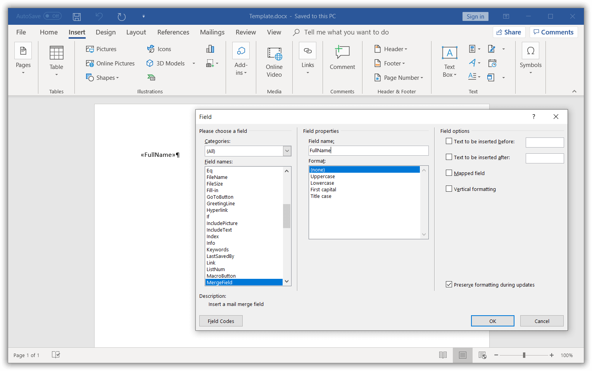
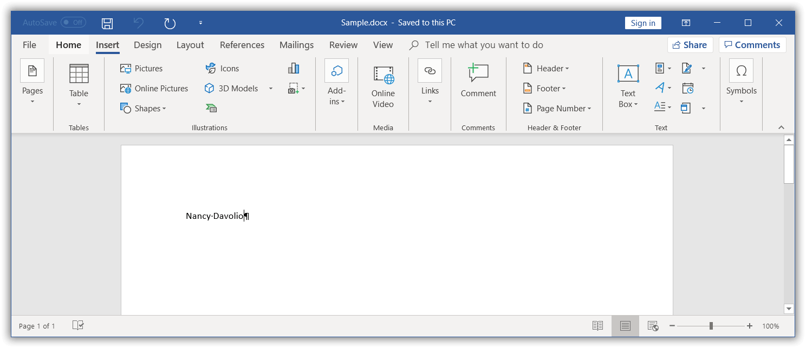

# Working with Mail Merge

Mail Merge is a process of merging data from a data source into a Word template document. The `WMergeField` class provides support for binding the template document and data source. The `WMergeField` instance is replaced with the actual data retrieved from the data source for the given merge field name in a template document.

The following data sources are supported by Essential&reg; DocIO for performing Mail Merge:

* String Arrays
* Java Objects

## Mail Merge Process

The Mail Merge process involves three documents:

1. **Template Word Document**: This document contains static or templated text and graphics, along with the merge fields (placeholders) for replacing dynamic data.

2. **Data Source**: This represents a file containing data to replace the merge fields in the template Word document.

3. **Final Merged Document**: This resultant document is a combination of the template Word document and the data from the data source.

T> 1. You can use conditional fields ([IF](https://support.microsoft.com/en-us/office/field-codes-if-field-9f79e82f-e53b-4ff5-9d2c-ae3b22b7eb5e?ui=en-us&rs=en-us&ad=us), [Formula](https://support.microsoft.com/en-us/office/field-codes-formula-field-32d5c9de-3516-4ec3-80ed-d1fc2b5bc21d?ui=en-us&rs=en-us&ad=us)) combined with merge fields when you require intelligent decisions in addition to simple Mail Merge (replacing merge fields with result text). To use conditional fields, execute Mail Merge and then update fields in the Word document using the `updateDocumentFields` API.
T> 2. You can replace the fields ([IF](https://support.microsoft.com/en-us/office/field-codes-if-field-9f79e82f-e53b-4ff5-9d2c-ae3b22b7eb5e?ui=en-us&rs=en-us&ad=us), [Formula](https://support.microsoft.com/en-us/office/field-codes-formula-field-32d5c9de-3516-4ec3-80ed-d1fc2b5bc21d?ui=en-us&rs=en-us&ad=us)) combined with merge fields with their most recent result and **generate a plain Word document** by unlinking the fields. Refer to this [link](https://help.syncfusion.com/document-processing/word/word-library/java/working-with-fields#unlink-fields) for more information.

### Create Word Document Template

You can create a template document with merge fields by using any Word editor application, such as Microsoft Word. By using a Word editor application, you can take advantage of the visual interface to design a unique layout, formatting, and more for your Word document template interactively.

The following screenshot shows how to insert a merge field in the Word document **using Microsoft Word.**

You need to add a prefix ("Image:") to the merge field name for merging an image in place of a merge field.

**For example:** The merge field name should be like "Image:Photo" (<<Image:MergeFieldName>>).

You can **create a Word document template programmatically** by adding merge fields to the Word document using Essential&reg; DocIO.

The following code example shows how to create a merge field in the Word document.

  


//Creates an instance of a WordDocument.
WordDocument document = new WordDocument();
//Adds a section and a paragraph to the document.
document.ensureMinimal();
//Appends merge field to the last paragraph.
document.getLastParagraph().appendField("FullName", FieldType.FieldMergeField);
//Saves the Word document. 
document.save("Template.docx", FormatType.Docx);
//Closes the Word document.
document.close();



### Execute Mail Merge

The following code example shows how to perform Mail Merge in the above Word document template using string arrays as the data source.

  

//Opens the template document.
FileInputStream fileStreamPath = new FileInputStream("Template.docx");
WordDocument document = new WordDocument(fileStreamPath, FormatType.Docx);
String[] fieldNames = new String[] { "FullName" };
String[] fieldValues = new String[] { "Nancy Davolio" };
//Performs the Mail Merge.
document.getMailMerge().execute(fieldNames, fieldValues);
//Saves the Word document.
document.save("Output.docx", FormatType.Docx);
//Closes the Word document.
document.close();



By executing the previous code example, it generates the resultant Word document as follows.

## Simple Mail Merge

The `MailMerge` class provides various overloads for the `Execute` method to perform Mail Merge from various data sources. For further information, click [here](https://help.syncfusion.com/document-processing/word/word-library/java/mail-merge/simple-mail-merge). 

## Performing Mail Merge for a Group

You can perform Mail Merge and append multiple records from the data source within a specified region to a template document. For further information, click [here](https://help.syncfusion.com/document-processing/word/word-library/java/mail-merge/mail-merge-for-group).

## Performing Nested Mail Merge for Group

You can perform nested Mail Merge with relational or hierarchical data sources and independent data tables in a template document. For further information, click [here](https://help.syncfusion.com/document-processing/word/word-library/java/mail-merge/mail-merge-for-nested-groups).

## Performing Mail Merge with Business Objects

You can perform Mail Merge with business objects in a template document. For further information, click [here](https://help.syncfusion.com/document-processing/word/word-library/java/mail-merge/mail-merge-for-group#mail-merge-with-Java-objects).

## Performing Nested Mail Merge with Relational Data Objects

Essential&reg; DocIO supports performing nested Mail Merge with implicit relational data objects without any explicit relational commands by using the `ExecuteNestedGroup` overload method. For further information, click [here](https://help.syncfusion.com/document-processing/word/word-library/java/mail-merge/mail-merge-for-nested-groups#mail-merge-with-implicit-relational-data).

## Event Support for Mail Merge

The `MailMerge` class provides event support to customize the document contents and merge image data during the Mail Merge process. The following events are supported by Essential&reg; DocIO in the Mail Merge process:

* `MergeField`: Occurs when a **Mail Merge field** except an image Mail Merge field is encountered.

* `MergeImageField`: Occurs when an **image Mail Merge field** is encountered.

* `BeforeClearGroupField`: Occurs when an **unmerged group field** is encountered.

### MergeField Event

You can customize the merging text during the Mail Merge process by using the `MergeField` event. For further information, click [here](https://help.syncfusion.com/document-processing/word/word-library/java/mail-merge/mail-merge-events#mergefield-event).

### MergeImageField Event

You can customize the merging image during the Mail Merge process by using the `MergeImageField` event. For further information, click [here](https://help.syncfusion.com/document-processing/word/word-library/java/mail-merge/mail-merge-events#mergeimagefield-event).

### BeforeClearGroupField Event

You can get the unmerged groups during the Mail Merge process by using the `BeforeClearGroupField` event. For further information, click [here](https://help.syncfusion.com/document-processing/word/word-library/java/mail-merge/mail-merge-events#beforecleargroupfield-event).

## Mail Merge Options

The `MailMerge` class allows you to customize the Mail Merge process with the following options:

### Field Mapping

You can automatically map the merge field names with data source column names during the Mail Merge process. For further information, click [here](https://help.syncfusion.com/document-processing/word/word-library/java/mail-merge/mail-merge-options#field-mapping).

### Retrieving the Merge Field Names

You can retrieve the merge field names and also merge field group names in the Word document. For further information, click [here](https://help.syncfusion.com/document-processing/word/word-library/java/mail-merge/mail-merge-options#retrieve-the-merge-field-names).

### Removing Empty Paragraphs

You can remove the empty paragraphs when the paragraph contains a merge field item without any data during the Mail Merge process. For further information, click [here](https://help.syncfusion.com/document-processing/word/word-library/java/mail-merge/mail-merge-options#remove-empty-paragraphs).

### Removing Empty Merge Fields

You can remove or keep the unmerged merge fields in the output document based on the `ClearFields` property during each Mail Merge execution. For further information, click [here](https://help.syncfusion.com/document-processing/word/word-library/java/mail-merge/mail-merge-options#remove-empty-merge-fields).

### Restart Numbering in Lists

You can restart the list numbering in a Word document during the Mail Merge process. For further information, click [here](https://help.syncfusion.com/document-processing/word/word-library/java/mail-merge/mail-merge-options#restart-numbering-in-lists).