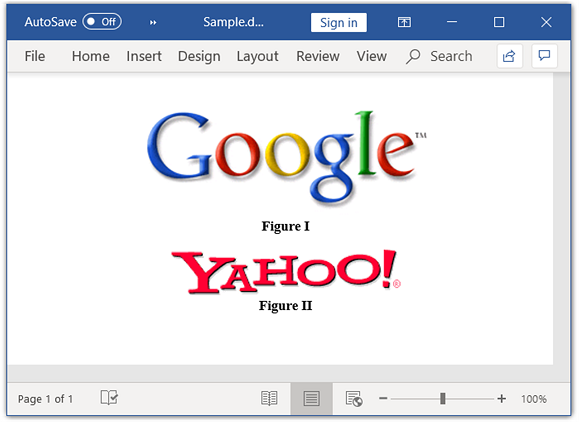

# Working with Paragraph

Paragraph is the basic element in a Word document that contains a textual and graphical contents. Each paragraph has its own formatting such as line spacing, alignment, indentation, and more. Within a paragraph, the contents are represented by one or more child elements such as `WTextRange`, `WPicture`, and `Hyperlink` and more. The `ParagraphItem` is the base class for the child elements of paragraph. The following elements can be the child elements of a paragraph.

* Text: Represented by an instance of `WTextRange`.
* Image: Represented by an instance of `WPicture`. 
* Comments: Represented by an instance of `WComment`.
* Hyperlink: Represented by an instance of `Hyperlink`. 
* Symbols: Represented by an instance of `WSymbol`. 
* Breaks: Represented by an instance of `Break`. 
* Shapes:  Represented by an instance of `Shape`. 
* TextBox: Represented by an instance of `WTextBox`. 
* Fields: Represented by an instance of `WField`.
* Form Fields: Represented by an instance of `WFormField`.
* Bookmarks: Represented by instances of `BookmarkStart` and `BookmarkEnd`. 
* Absolute Tab: Represented by an instance of `WAbsoluteTab`.

The following code example explains how to add a new paragraph.

  


//Create a new Word document. 
WordDocument document = new WordDocument();
//Add a new section to the document.
IWSection section = document.addSection();
//Add a new paragraph to the section.
IWParagraph paragraph = section.addParagraph();
//Add a new text to the paragraph.
paragraph.appendText("Adding new paragraph to the document");
//Save the Word document.
document.save("Sample.docx", FormatType.Docx);
//Close the document.
document.close();


  

The following code example shows how to modify an existing paragraph.

  


//Load the template document.
WordDocument document = new WordDocument("Template.docx");
//Get the text body of the first section.
WTextBody textBody = document.getSections().get(0).getBody();
//Get the paragraph at index 1.
WParagraph paragraph = textBody.getParagraphs().get(1);
//Iterate through the child elements of the paragraph.
for(Object item_tempObj : paragraph.getChildEntities())
{
	ParagraphItem item = (ParagraphItem)item_tempObj;
	if(item instanceof WTextRange)
	{
		WTextRange text = (WTextRange)(item);
		//Modify the character format of the text.
		text.getCharacterFormat().setBold(true);
		break;
	}
}
//Save the Word document.
document.save("Sample.docx",FormatType.Docx);
//Close the document.
document.close();


  

## Applying paragraph formatting

As in the Microsoft Word, the DocIO provides support for all the paragraph formatting options such as line spacing, indentation, spacing before and after, keep follow, and more. The following code example explains how to apply the formatting to a paragraph.

N>The `FirstLineIndent` can be used to update or retrieve both hanging and first line indents. Negative value for this property denotes the hanging indent and positive value denotes the first line indent of the paragraph.

 


//Create a new Word document. 
WordDocument document = new WordDocument();
//Add a new section to the document.
IWSection section = document.addSection();
//Add a new paragraph to the section.
IWParagraph paragraph = section.addParagraph();
//Add a new text to the paragraph.
IWTextRange firstText = paragraph.appendText("Paragraphs are the basic elements of the Word document. It can contain text and images.");
//Apply the paragraph formatting.
paragraph.getParagraphFormat().setAfterSpacing(18f);
paragraph.getParagraphFormat().setBeforeSpacing(18f);paragraph.getParagraphFormat().setBackColor(ColorSupport.getLightGray());
paragraph.getParagraphFormat().setFirstLineIndent(10f);
paragraph.getParagraphFormat().setLineSpacing(10f);paragraph.getParagraphFormat().setHorizontalAlignment(HorizontalAlignment.Right);
//Save the Word document.
document.save("Sample.docx", FormatType.Docx);
//Close the document.
document.close();




### Paragraph style  

The paragraph style contains a definition for both font (text) and paragraph formatting that can be applied to the contents of an entire paragraph. DocIO supports various pre-defined styles and also provides the ability to create custom paragraph styles.

T> You can define a custom style or modify any built-in style to the required formatting, and apply this style to the part of Word document to be formatted. You can reduce the file size and code length by using styles instead of formatting each element explicitly.

The following code example explains how to use the predefined styles.

  


//Create a new Word document. 
WordDocument document = new WordDocument();
//Add a new section to the document.
IWSection section = document.addSection();
//Add a new paragraph to the section.
IWParagraph firstParagraph = section.addParagraph();
//Add a new text to the paragraph.
IWTextRange firstText = firstParagraph.appendText("Built-in styles can be applied to the paragraph. Heading1 style is applied to this paragraph.");
//Apply the built-in style for the paragraph.
firstParagraph.applyStyle(BuiltinStyle.Heading1);
//Save the word document.
document.save("Sample.docx", FormatType.Docx);
//Close the document.
document.close();




### Custom paragraph style  

The following code example explains how to create a custom paragraph style and apply it to a paragraph.

 


//Create a new Word document. 
WordDocument document = new WordDocument();
//Add a new section to the document.
IWSection section = document.addSection();
//Create an user defined style.
IWParagraphStyle style = document.addParagraphStyle("User_defined_style");
style.getParagraphFormat().setBackColor(ColorSupport.getLightGray());
style.getParagraphFormat().setAfterSpacing(18f);
style.getParagraphFormat().setBeforeSpacing(18f);
style.getParagraphFormat().getBorders().setBorderType(BorderStyle.DotDash);
style.getParagraphFormat().getBorders().setLineWidth(0.5f);
style.getParagraphFormat().setLineSpacing(15f);
style.getCharacterFormat().setFontName("Calibri");
style.getCharacterFormat().setItalic(true);
//Add a new paragraph to the section.
IWParagraph paragraph = section.addParagraph();
IWTextRange text = paragraph.appendText("A new paragraph style is created and is applied to this paragraph.");
//Apply the new style to the paragraph.
paragraph.applyStyle("User_defined_style");
//Save the Word document.
document.save("Sample.docx", FormatType.Docx);
//Close the document.
document.close();




### Tab stop  

A tab stop is a horizontal position that is set for aligning text of the paragraph.  A tab character causes the carriage to go to the next tab stop.

Each paragraph has its own tab stop collection where the new tab stop can be added and existing tab stop can be removed.

The following code example explains how to add tab stops to the paragraph.

  


//Creates a new Word document. 
WordDocument document = new WordDocument();
//Add a new section to the document.
IWSection section = document.addSection();
//Add a new paragraph to the section.
IWParagraph paragraph = section.addParagraph();
//Add a tab stop at position 11.
Tab firstTab = paragraph.getParagraphFormat().getTabs().addTab(11, TabJustification.Left, TabLeader.Dotted);            
//Add a tab stop at position 62.
paragraph.getParagraphFormat().getTabs().addTab(62, TabJustification.Left, TabLeader.Single);
paragraph.appendText("This sample\t illustrates the use of tabs in the paragraph. Tabs\t can be inserted or removed from the paragraph.");
//Remove the tab stop from the collection.
paragraph.getParagraphFormat().getTabs().removeByTabPosition(11);
//Save the Word document.
document.save("Sample.docx", FormatType.Docx);
//Close the document.
document.close();




### RTL paragraph

You can set RTL (Right-to-left) direction to the paragraph in a Word document. The following code example shows how to set RTL (Right-to-left) for a paragraph in Word document.

  


//Load the template document.
WordDocument document = new WordDocument("Template.docx");
//Get the text body of the first section.
WTextBody textBody = document.getSections().get(0).getBody();
//Get the paragraph at index 1.
WParagraph paragraph = textBody.getParagraphs().get(1);
//Get a value indicating whether the paragraph is right-to-left. True indicates the paragraph direction is RTL.
boolean isRTL = paragraph.getParagraphFormat().getBidi();
//Set the RTL direction for a paragraph.
if(!isRTL)
	paragraph.getParagraphFormat().setBidi(true);
//Save the Word document.
document.save("Sample.docx", FormatType.Docx);
//Closes the document
document.close();


   

## Working with text 

Text within a paragraph is represented by one or more instances of the `WTextRange`. Each `WTextRange` instance can have its own font (text) formatting.  

The following code example explains how to append text to the paragraph.

 


//Create a new Word document. 
WordDocument document = new WordDocument();
//Add a new section to the document.
IWSection section = document.addSection();
//Add a new paragraph to the section.
IWParagraph firstParagraph = section.addParagraph();
//Add a new text to the paragraph.
IWTextRange firstText = firstParagraph.appendText("A new text is added to the paragraph.");
firstText.getCharacterFormat().setFontSize(14);
firstText.getCharacterFormat().setBold(true);
firstText.getCharacterFormat().setTextColor(ColorSupport.getGreen());
//Save the Word document.
document.save("Sample.docx", FormatType.Docx);
//Close the document.
document.close();


  

Text in the paragraph can be modified or replaced with a new text. This can be achieved by iterating through the paragraph items.

The following code example explains how to replace the text of a text range.

 


//Load the template document. 
WordDocument document = new WordDocument("Template.docx");
//Get the last paragraph.
WParagraph lastParagraph = document.getLastParagraph();
//Iterate through the paragraph items to get the text range and modifies its content.
for(int i = 0;i<lastParagraph.getChildEntities().getCount();i++)
{
	if(lastParagraph.getChildEntities().get(i) instanceof WTextRange)
	{
		WTextRange textRange = (WTextRange)(lastParagraph.getChildEntities().get(i));
		textRange.setText("First text range of the last paragraph is replaced");
		textRange.getCharacterFormat().setFontSize(14);
		break;
	}
}
//Save and close the Word document.
document.save("Sample.docx",FormatType.Docx);
document.close();


  

Text formatting enhances the appearance of text in the document. Text formatting includes font size, font color, font name, bold, italic, underline, etc. 

The following code example explains how to apply formatting to the text.

  


//Create a new Word document. 
WordDocument document = new WordDocument();
//Add a new section to the document.
IWSection section = document.addSection();
//Add a new paragraph to the section.
IWParagraph firstParagraph = section.addParagraph();
//Add a new text to the paragraph.
IWTextRange firstText = firstParagraph.appendText("This is the first text range. ");
//Apply formatting for the first text range.
firstText.getCharacterFormat().setBold(true);
firstText.getCharacterFormat().setFontSize(14);
firstText.getCharacterFormat().setShadow(true);
firstText.getCharacterFormat().setSmallCaps(true);
IWTextRange secondText = firstParagraph.appendText("This the second text range");
//Apply formatting for the second text range.
secondText.getCharacterFormat().setHighlightColor(ColorSupport.getGreenYellow());
secondText.getCharacterFormat().setUnderlineStyle(UnderlineStyle.DotDash);
secondText.getCharacterFormat().setItalic(true);
secondText.getCharacterFormat().setFontName("Times New Roman");
secondText.getCharacterFormat().setTextColor(ColorSupport.getGreen());
//Add a new paragraph to the section.
IWParagraph secondParagraph = section.addParagraph();
//Adds new text to the paragraph
IWTextRange thirdText = secondParagraph.appendText("שלום עולם");
thirdText.getCharacterFormat().setBidi(true);
//Sets language identifier for right to left characters.
thirdText.getCharacterFormat().setLocaleIdBidi((short)LocaleIDs.he_IL.getEnumValue());
//Save the Word document.
document.save("Sample.docx", FormatType.Docx);
//Close the document.
document.close();	


  

## Working with Images

DocIO provides support for both inline and absolute positioned images. 

* Inline images: The position of the image is constrained to the lines of text on the page.
* Absolute positioned images: The images can be positioned anywhere irrespective of the lines of text.

The following code example explains how to add an image to the paragraph.

   


//Create a new Word document. 
WordDocument document = new WordDocument();
//Add a new section to the document.
IWSection section = document.addSection();
//Add a new paragraph to the section.
IWParagraph firstParagraph = section.addParagraph();
//Add an image to the paragraph.
IWPicture picture = firstParagraph.appendPicture(new FileInputStream("Image.png"));
//Set the  height and width for the image.
picture.setHeight(100);
picture.setWidth(100);
//Saves the Word document.
document.save("Sample.docx", FormatType.Docx);
//Close the document.
document.close();


 

### Replace image

The image present in the document can be replaced with a new image. This can be achieved by iterating through the paragraph items.

The following code example explains how to replace an existing image.

   


//Load the template document.
WordDocument document = new WordDocument("Template.docx");
WTextBody textbody = document.getSections().get(0).getBody();
//Iterate through the paragraphs of the textbody.
for(Object paragraph_tempObj : textbody.getParagraphs())
{
	WParagraph paragraph = (WParagraph)paragraph_tempObj;
	//Iterate through the child elements of the paragraph.
	for(Object item_tempObj : paragraph.getChildEntities())
	{
		ParagraphItem item = (ParagraphItem)item_tempObj;
		if(item instanceof WPicture)
		{
			WPicture picture = (WPicture)(item);
			//Replace the image.
			if(picture.getTitle()=="Bookmark")
			{
				FileInputStream file = new FileInputStream("Image.png");
				byte[] byarr = new byte[(int) file.getChannel().size()];
				file.read(byarr);
				picture.loadImage(byarr);
			}
		}
	}
}
//Save the Word document.
document.save("Sample.docx",FormatType.Docx);
//Closes the document
document.close();


 

### Remove image

Images can be removed from the document by removing it from the paragraph items. 

The following code example explains how to remove the image from the paragraph items.

 


//Load the template document. 
WordDocument document = new WordDocument("Template.docx");
WTextBody textbody = document.getSections().get(0).getBody();
//Iterate through the paragraphs of the textbody.
for(Object paragraph_tempObj : textbody.getParagraphs())
{
	WParagraph paragraph = (WParagraph)paragraph_tempObj;
	//Iterate through the child elements of paragraph.
	for(int i = 0;i<paragraph.getChildEntities().getCount();i++)
	{
		if(paragraph.getChildEntities().get(i) instanceof WPicture)
		{
			//Remove the images from the paragraph.
			paragraph.getItems().removeAt(i);
			i--;
		}
	}
}
//Save the Word document.
document.save("Sample.docx",FormatType.Docx);
//Close the document.
document.close();


  

### Format and rotate images

Absolute positioned images have properties such as position, wrap formats, and alignments. These properties are not applicable when the text wrapping style is inline. You can also rotate an image and apply flipping (horizontal and vertical) to it.

The following code example explains how various picture formats can be applied to the picture.

 


//Create a new Word document. 
WordDocument document = new WordDocument();
//Add a new section to the document.
IWSection section = document.addSection();
//Add a new paragraph to the section.
IWParagraph paragraph = section.addParagraph();
paragraph.appendText("This paragraph has picture. ");
//Append the new picture to the paragraph.
WPicture picture = (WPicture) paragraph.appendPicture(new FileInputStream("Image.png"));
//Set the text wrapping style – When the wrapping style is inline, the images are not absolutely positioned. It is added next to the text range.
picture.setTextWrappingStyle(TextWrappingStyle.Square);
//Set the horizontal and vertical origin.
picture.setHorizontalOrigin(HorizontalOrigin.Page);
picture.setVerticalOrigin(VerticalOrigin.Paragraph);
//Set the width and height for the paragraph.
picture.setWidth(150);
picture.setHeight(100);
//Set the horizontal and vertical position for the picture.
picture.setHorizontalPosition(200);
picture.setVerticalPosition(150);
picture.setName("PictureName");
//Set the horizontal and vertical alignments.
picture.setHorizontalAlignment(ShapeHorizontalAlignment.Center);
picture.setVerticalAlignment(ShapeVerticalAlignment.Bottom);
//Set the 90 degree rotation.
picture.setRotation(90);
//Set the horizontal flip.
picture.setFlipHorizontal(true);
//Save the Word document.
document.save("Sample.docx", FormatType.Docx);
//Close the document.
document.close();


 

### Find an image by title 

An Image with a specific title can be retrieved by iterating the paragraph items that can be used for further manipulations.

The following code example explains how images can be iterated from the document elements.

  


//Create a new Word document. 
WordDocument document = new WordDocument("Template.docx");
//Get the textbody content.
WTextBody textBody = document.getSections().get(0).getBody();
//Iterate through the textbody child entities.
for(Object item_tempObj : textBody.getChildEntities())
{
	TextBodyItem item = (TextBodyItem)item_tempObj;
	if(item instanceof WParagraph)
	{
		WParagraph paragraph = (WParagraph)(item);
		for(Object paraItem_tempObj : paragraph.getChildEntities())
		{
			ParagraphItem paraItem = (ParagraphItem)paraItem_tempObj;
			if(paraItem instanceof WPicture)
			{
				//Get the image from its title and modifies its width and height.
				WPicture picture = (WPicture)(paraItem);
				if(picture.getTitle () == "Bookmark")
				{
					picture.setWidth(150);
					picture.setHeight(100);
				}
			}
		}
	}
}
//Save the Word document.
document.save("Sample.docx", FormatType.Docx);
//Closes the document
document.close();



 

### Add Image caption 

You can add caption to an image and update the caption numbers (Sequence fields) using `addCaption` method.

The following code example shows how to add caption to an image.

 


//Create a new document.
WordDocument document = new WordDocument();
//Add a new section to the document.
IWSection section = document.addSection();
//Set margin of the section.
section.getPageSetup().getMargins().setAll(72);
//Add a paragraph to the section.
IWParagraph paragraph = section.addParagraph();
paragraph.getParagraphFormat().setHorizontalAlignment(HorizontalAlignment.Center);
//Add an image to  the paragraph.
IWPicture picture = paragraph.appendPicture(new FileInputStream("Google.png"));
//Add an image caption.
IWParagraph lastParagragh = picture.addCaption("Figure", CaptionNumberingFormat.Roman, CaptionPosition.AfterImage);
//Align the caption.
lastParagragh.getParagraphFormat().setHorizontalAlignment(HorizontalAlignment.Center);
//Set after spacing.
lastParagragh.getParagraphFormat().setAfterSpacing(12f);
//Set before spacing.
lastParagragh.getParagraphFormat().setBeforeSpacing(1.5f);
//Add a paragraph to the section.
paragraph = section.addParagraph();
paragraph.getParagraphFormat().setHorizontalAlignment(HorizontalAlignment.Center);
//Add an image to  the paragraph.
picture = paragraph.appendPicture(new FileInputStream("Yahoo.png"));
//Add an image caption.
lastParagragh = picture.addCaption("Figure", CaptionNumberingFormat.Roman, CaptionPosition.AfterImage);
//Align the caption.
lastParagragh.getParagraphFormat().setHorizontalAlignment(HorizontalAlignment.Center);
//Set before spacing.
lastParagragh.getParagraphFormat().setBeforeSpacing(1.5f);
//Update the fields in a Word document.
document.updateDocumentFields();
//Save and close the document.
document.save("Sample.docx", FormatType.Docx);
document.close();
 

 

By executing the above code example, it generates output Word document as follows.

## Working with lists

Lists can organize and format the contents of a document in a hierarchical way. There are nine levels in the list, starting from level 0 to level 8. DocIO supports both built-in list styles and custom list styles. The following are the types of list supported in DocIO:

* Numbered list
* Bulleted list 

The following code example explains how to create a simple bulleted list.

 


//Create a new Word document. 
WordDocument document = new WordDocument();
//Add a new section to the document.
IWSection section = document.addSection();
//Add a new paragraph to the section.
IWParagraph paragraph = section.addParagraph();
//Apply the default numbered list style.
paragraph.getListFormat().applyDefBulletStyle();
//Add text to the paragraph.
paragraph.appendText("List item 1");
//Continue the list defined.
paragraph.getListFormat().continueListNumbering();
//Add the second paragraph.
paragraph = section.addParagraph();
paragraph.appendText("List item 2");
//Continue the last defined list.
paragraph.getListFormat().continueListNumbering();
//Add a new paragraph.
paragraph = section.addParagraph();
paragraph.appendText("List item 3");
//Continue the last defined list.
paragraph.getListFormat().continueListNumbering();
//Save the Word document.
document.save("simple bulleted list.docx", FormatType.Docx);
//Close the document.
document.close();


  

The following code example explains how to create a simple numbered list.

 


//Create a new Word document. 
WordDocument document = new WordDocument();
//Add a new section to the document.
IWSection section = document.addSection();
//Add a new paragraph to the section.
IWParagraph paragraph = section.addParagraph();
//Apply the default numbered list style.
paragraph.getListFormat().applyDefNumberedStyle();
//Add the text to the paragraph.
paragraph.appendText("List item 1");
//Continue the list defined.
paragraph.getListFormat().continueListNumbering();
//Add the second paragraph.
paragraph = section.addParagraph();
paragraph.appendText("List item 2");
//Continue the last defined list.
paragraph.getListFormat().continueListNumbering();
//Add a new paragraph.
paragraph = section.addParagraph();
paragraph.appendText("List item 3");
//Continue the last defined list.
paragraph.getListFormat().continueListNumbering();
//Save the Word document.
document.save("Sample.docx", FormatType.Docx);
//Close the document.
document.close();


  

The following code example explains how to create a multilevel bulleted list.

  


//Create a new Word document. 
WordDocument document = new WordDocument();
//Add a new section to the document.
IWSection section = document.addSection();
//Add a new paragraph to the section.
IWParagraph paragraph = section.addParagraph();
//Apply the default numbered list style.
paragraph.getListFormat().applyDefBulletStyle();
//Add the text to the paragraph.
paragraph.appendText("List item 1 - Level 0");
//Continue the list defined.
paragraph.getListFormat().continueListNumbering();
//Add the second paragraph.
paragraph = section.addParagraph();
paragraph.appendText("List item 2 - Level 1");
//Continue the last defined list.
paragraph.getListFormat().continueListNumbering();
//Increase the level indent.
paragraph.getListFormat().increaseIndentLevel();
//Add a new paragraph.
paragraph = section.addParagraph();
paragraph.appendText("List item 3 - Level 2");
//Continue the last defined list.
paragraph.getListFormat().continueListNumbering();
//Increase the level indent.
paragraph.getListFormat().increaseIndentLevel();
//Save the Word document.
document.save("Sample.docx", FormatType.Docx);
//Close the document.
document.close();


  

The following code example explains how to create multilevel numbered list.

  


//Create a new Word document. 
WordDocument document = new WordDocument();
//Add a new section to the document.
IWSection section = document.addSection();
//Add a new paragraph to the section.
IWParagraph paragraph = section.addParagraph();
//Apply the default numbered list style.
paragraph.getListFormat().applyDefNumberedStyle();
//Add the text to the paragraph.
paragraph.appendText("List item 1 - Level 0");
//Continue the list defined.
paragraph.getListFormat().continueListNumbering();
//Add the second paragraph.
paragraph = section.addParagraph();
paragraph.appendText("List item 2 - Level 1");
//Continue the last defined list.
paragraph.getListFormat().continueListNumbering();
//Increase the level indent.
paragraph.getListFormat().increaseIndentLevel();
//Add a new paragraph.
paragraph = section.addParagraph();
paragraph.appendText("List item 3 - Level 2");
//Continue the last defined list.
paragraph.getListFormat().continueListNumbering();
//Increase the level indent.
paragraph.getListFormat().increaseIndentLevel();
//Save the Word document.
document.save("Sample.docx", FormatType.Docx);
//Close the document.
document.close();


  

The list levels can be incremented or decremented by using the `increaseIndentLevel` and `decreaseIndentLevel` methods respectively. The following code example explains how to increase or decrease the list indent levels.

 


//Create a new Word document. 
WordDocument document = new WordDocument();
//Add a new section to the document.
IWSection section = document.addSection();
//Add a new paragraph to the section.
IWParagraph paragraph = section.addParagraph();
//Apply the default numbered list style.
paragraph.getListFormat().applyDefNumberedStyle();
//Add the text to the paragraph.
paragraph.appendText("Multilevel numbered list - Level 0");
//Continue the list defined.
paragraph.getListFormat().continueListNumbering();
//Add the second paragraph
paragraph = section.addParagraph();
paragraph.appendText("Multilevel numbered list - Level 1");
//Continue the last defined list.
paragraph.getListFormat().continueListNumbering();
//Increase the level indent.
paragraph.getListFormat().increaseIndentLevel();
//Add a new paragraph.
paragraph = section.addParagraph();
paragraph.appendText("Multilevel numbered list - Level 0");
//Continue the last defined list.
paragraph.getListFormat().continueListNumbering();
//Increase the level indent.
paragraph.getListFormat().decreaseIndentLevel();
//Add a new paragraph.
paragraph = section.addParagraph();
paragraph.appendText("Multilevel numbered list - Level 1");
//Continue he last defined list.
paragraph.getListFormat().continueListNumbering();
//Increase the level indent.
paragraph.getListFormat().increaseIndentLevel();
//Save the Word document.
document.save("Sample.docx", FormatType.Docx);
//Close the document.
document.close();


  

The following code example explains how to create user defined list styles.

  


//Create a new Word document. 
WordDocument document = new WordDocument();
//Add a new section to the document.
IWSection section = document.addSection(); 
//Add a new list style to the document.          
ListStyle listStyle = document.addListStyle(ListType.Numbered, "UserDefinedList");
WListLevel levelOne = listStyle.getLevels().get(0);
//Define the follow character, prefix, suffix, and start index for level 0.
levelOne.setFollowCharacter(FollowCharacterType.Tab);
levelOne.setNumberPrefix("(");
levelOne.setNumberSufix(")");
levelOne.setPatternType(ListPatternType.LowRoman);
levelOne.setStartAt(1);
levelOne.setTabSpaceAfter(5);
levelOne.setNumberAlignment(ListNumberAlignment.Center);
WListLevel levelTwo = listStyle.getLevels().get(1);
//Define the follow character, suffix, pattern, and start index for level 1.
levelTwo.setFollowCharacter(FollowCharacterType.Tab);
levelTwo.setNumberPrefix("}");
levelTwo.setPatternType(ListPatternType.LowLetter);
levelTwo.setStartAt(2); 
//Add a new paragraph to the section.
IWParagraph paragraph = section.addParagraph();  
//Add the text to the paragraph.
paragraph.appendText("User defined list - Level 0");
//Apply the default numbered list style.
paragraph.getListFormat().applyStyle("UserDefinedList");
//Add the second paragraph.
paragraph = section.addParagraph();
paragraph.appendText("User defined list - Level 1");
//Continue the last defined list.
paragraph.getListFormat().continueListNumbering();
//Increase the level indent.
paragraph.getListFormat().increaseIndentLevel();
//Save the Word document.
document.save("Sample.docx", FormatType.Docx);
//Close the document.
document.close();


  

The following code example explains how to create numbered list with prefix from previous level.

N> The `NumberPrefix` value for the numbered list should meet the syntax “\u000N” to update the previous list level value as a prefix to the current list level. For example, it should be represented as (“\u0000.” or “\u0000.\u0001.”).
  


//Create a new Word document. 
WordDocument document = new WordDocument();
//Add a new section to the document.
IWSection section = document.addSection(); 
//Add a new list style to the document.          
ListStyle listStyle = document.addListStyle(ListType.Numbered, "UserDefinedList");
WListLevel levelOne = listStyle.getLevels().get(0);
//Define the follow character, prefix from previous level, and start index for level 0.
levelOne.setFollowCharacter(FollowCharacterType.Nothing);
levelOne.setPatternType(ListPatternType.Arabic);
levelOne.setStartAt(1);
WListLevel levelTwo = listStyle.getLevels().get(1);
//Define the follow character, prefix from previous level, pattern, and start index for level 1.
levelTwo.setFollowCharacter(FollowCharacterType.Nothing);
levelTwo.setNumberPrefix("\u0000.");
levelTwo.setPatternType(ListPatternType.Arabic);
levelTwo.setStartAt(1);
WListLevel levelThree = listStyle.getLevels().get(2);
//Define the follow character, prefix from previous level, pattern, and start index for level 1.
levelThree.setFollowCharacter(FollowCharacterType.Nothing);
levelThree.setNumberPrefix("\u0000.\u0001.");
levelThree.setPatternType(ListPatternType.Arabic);
levelThree.setStartAt(1); 
//Add a new paragraph to the section.
IWParagraph paragraph = section.addParagraph();  
//Add a text to the paragraph.
paragraph.appendText("User defined list - Level 0");
//Apply the default numbered list style.
paragraph.getListFormat().applyStyle("UserDefinedList");
//Add the second paragraph.
paragraph = section.addParagraph();
paragraph.appendText("User defined list - Level 1");
//Continue the last defined list.
paragraph.getListFormat().continueListNumbering();
//Increase the level indent.
paragraph.getListFormat().increaseIndentLevel();
//Add the second paragraph.
paragraph = section.addParagraph();
paragraph.appendText("User defined list - Level 2");
//Continue the last defined list.
paragraph.getListFormat().continueListNumbering();
//Increase the level indent.
paragraph.getListFormat().increaseIndentLevel();
//Save the Word document.
document.save("Sample.docx", FormatType.Docx);
//Close the document.
document.close();


  

### Get list value

You can get the string that represents the appearance of **list value of the paragraph** in the Word document using the `ListString` API. 

This API holds the static string of the list value recently calculated while saving the document as Text. It is not updated automatically for each modification done in the Word document. Hence, you should either invoke the `getText()` method of `WordDocument` or save the Word document as Text to get the actual list value from this API.

The following example shows how to **get a string that represents the appearance of list value of the paragraph**.

  


//Load an existing Word document.
WordDocument document = new WordDocument("Template.docx");
//Get the document text.
document.getText();
//Get the string that represents the appearance of list value of the paragraph.
String listString = document.getLastParagraph().getListString();
//Save and close the WordDocument instance.
document.save("Sample.docx", FormatType.Docx);
document.close();




N> For a picture bulleted list, the `ListString` API is not valid and it will return an empty string.

## Working with hyperlinks

Hyperlink is a reference to data that can link to external contents like images, files, webpage, and more.  In Word document, a hyperlink may target to any one of the following sources:

* Webpage: Represents the web content.
* File: Represents the file in some location.
* Email: Represents an Email.
* Bookmark: Represents the bookmarks in the document.

Hyperlinks have two parts: the address and display content. 

The following code example explains how to insert a web link.

  


//Create a new Word document. 
WordDocument document = new WordDocument();
//Add a new section to the document.
IWSection section = document.addSection();
//Add a new paragraph to the section.
IWParagraph paragraph = section.addParagraph();
paragraph.appendText("Web Hyperlink:  ");
paragraph = section.addParagraph();
//Append the web hyperlink to the paragraph.
IWField field = paragraph.appendHyperlink("http://www.syncfusion.com", "Syncfusion", HyperlinkType.WebLink);
//Save the Word document.
document.save("Sample.docx", FormatType.Docx);
//Close the document.
document.close();


  
 
The following code example illustrates how to add an email link.

 


//Create a new Word document. 
WordDocument document = new WordDocument();
//Add a new section to the document.
IWSection section = document.addSection();
//Add a new paragraph to the section.
IWParagraph paragraph = section.addParagraph();
paragraph.appendText("Email hyperlink: ");
paragraph = section.addParagraph();
//Append an Email hyperlink to the paragraph.
paragraph.appendHyperlink("mailto:sales@syncfusion.com","Sales" , HyperlinkType.EMailLink);
//Save the Word document.
document.save("Sample.docx", FormatType.Docx);
//Close the document.
document.close();


  

The following code example explains how to add a file hyperlink.

  


//Create a new Word document. 
WordDocument document = new WordDocument();
//Add a new section to the document.
IWSection section = document.addSection();
//Add a new paragraph to the section.
IWParagraph paragraph = section.addParagraph();
paragraph.appendText("File Hyperlinks: ");
paragraph = section.addParagraph();
//Append the hyperlink field to the paragraph.
paragraph.appendHyperlink("Template.docx","File", HyperlinkType.FileLink);
//Save the Word document.
document.save("Sample.docx", FormatType.Docx);
//Close the document.
document.close();


  
  
The following code example explains how to add a bookmark hyperlink.

  


//Create a new Word document. 
WordDocument document = new WordDocument();
//Add a new section to the document.
IWSection section = document.addSection();
//Add a new paragraph to the section.
IWParagraph paragraph = section.addParagraph();
//Create a new Bookmark.
paragraph.appendBookmarkStart("Introduction");
paragraph.appendText("Hyperlink");
paragraph.appendBookmarkEnd("Introduction");
paragraph.appendText("\nA hyperlink is a reference or navigation element in a document to another section of the same document or to another document that may be on or part of a (different) domain.");
paragraph = section.addParagraph();
paragraph.appendText("Bookmark Hyperlink: ");
paragraph = section.addParagraph();
//Append a Bookmark hyperlink to the paragraph.
paragraph.appendHyperlink("Introduction", "Bookmark", HyperlinkType.Bookmark);
//Save the Word document.
document.save("Sample.docx", FormatType.Docx);
//Close the document.
document.close();


  

The display content for the Hyperlinks can also be an image that may redirect to some other contents.

The following code example explains how to add image hyperlink.

  


//Create a new Word document. 
WordDocument document = new WordDocument();
//Add a new section to the document.
IWSection section = document.addSection();
//Add a new paragraph to the section.
IWParagraph paragraph = section.addParagraph();
paragraph.appendText("Image Hyperlink");
paragraph = section.addParagraph();
//Create a new image instance and load image. 
WPicture picture = new WPicture(document);
picture.loadImage(new FileInputStream("Image.png"));
//Append a new image hyperlink to the paragraph.
paragraph.appendHyperlink("http://www.syncfusion.com", picture, HyperlinkType.WebLink);
//Save the Word document.
document.save("Sample.docx", FormatType.Docx);
//Close the document.
document.close();


  

The following code example explains how to modify the URL of an existing hyperlink.

  


//Load the template document.
WordDocument document = new WordDocument("Sample.docx",FormatType.Docx);
WParagraph paragraph = document.getLastParagraph();
//Iterate through the paragraph items.
for(Object item_tempObj : paragraph.getChildEntities())
{
	ParagraphItem item = (ParagraphItem)item_tempObj;
	if(item instanceof WField)
	{
		if(((WField)(item)).getFieldType() == FieldType.FieldHyperlink)
		{
			//Get the hyperlink field.
			Hyperlink link = new Hyperlink((WField)(item));
			if(link.getType() == HyperlinkType.WebLink)
			{
				//Modifies the URL of the hyperlink.
				link.setUri("http://www.google.com");
				link.setTextToDisplay("Google");
				break;
			}
		}
	}
}
//Save and close the Word document.
document.save("Sample.docx",FormatType.Docx);
document.close();


  
  
## Working with symbols

Symbols are used to add contents such as currencies, numbers, punctuations, and more. DocIO represents symbols with the `WSymbol` instance. Each symbol can be identified with their character codes.

The following code example explains how to add new symbol to the document.

  


//Create a new Word document. 
WordDocument document = new WordDocument();
//Add a new section to the document.
IWSection section = document.addSection();
//Add a new paragraph to the section.
IWParagraph paragraph = section.addParagraph();
paragraph.appendText("Example of adding symbols to the paragraph: ");
//Insert the symbol with character code 100.
paragraph.appendSymbol((byte) 100);
//Save and close the Word document.
document.save("Sample.docx", FormatType.Docx);
document.close();


  

The following code example explains how to modify an existing symbol.

 


//Load the template document.
WordDocument document = new WordDocument("Template.docx",FormatType.Docx);
//Get the textbody content.
WTextBody textbody = document.getSections().get(0).getBody();	
//Iterate through the paragraphs.
for(Object paragraph_tempObj : textbody.getParagraphs())
{
	WParagraph paragraph = (WParagraph)paragraph_tempObj;
	for(Object item_tempObj : paragraph.getChildEntities())
	{
		ParagraphItem item = (ParagraphItem)item_tempObj;
		if(item instanceof WSymbol)
		{
			//Get the symbol from the paragraph items.
			WSymbol symbol = (WSymbol)(item);
			if(symbol.getCharacterCode() == (byte)100)
			{
				//Modify the character code.
				symbol.setCharacterCode((byte) 40);
				symbol.setFontName("Wingdings");
			}
		}
	}
}
//Save and close the Word document.
document.save("Sample.docx",FormatType.Docx);
document.close();


  

## Appending breaks

Breaks allow the document contents to split into multiple parts to customize the appearance of the contents. The following are the types of breaks supported in the DocIO:

* Page break: Starts the content in the next page.
* Line break: Starts the content in a new line.
* Column break: Starts the content in the next column.

The following code example explains how various types of breaks can be appended to the paragraphs.

  


//Create a new Word document. 
WordDocument document = new WordDocument();
//Add a new section to the document.
IWSection section = document.addSection();
//Add a new paragraph to the section.
IWParagraph paragraph = section.addParagraph();
paragraph.appendText("Before line break");
//Add a line break to the paragraph.
paragraph.appendBreak(BreakType.LineBreak);
paragraph.appendText("After line break");
IWParagraph pageBreakPara = section.addParagraph();
pageBreakPara.appendText("Before page break");
//Add a page break to the paragraph.
pageBreakPara.appendBreak(BreakType.PageBreak);
pageBreakPara.appendText("After page break");
IWSection secondSection = document.addSection();
//Add columns to the section.
secondSection.addColumn(100, 2);
secondSection.addColumn(100, 2);
IWParagraph columnBreakPara = secondSection.addParagraph();
columnBreakPara.appendText("Before column break");
//Add a column break to the paragraph.
columnBreakPara.appendBreak(BreakType.ColumnBreak);
columnBreakPara.appendText("After column break");
//Save and close the document instance.
document.save("Sample.docx", FormatType.Docx);
document.close(); 


  

## Working with Text Box

Text box contains a group of textual and graphical contents. DocIO supports to create and manipulate the text box and its formatting by using the `WTextBox` instance.

The following code example explains how to add new text box to the paragraph.

  


//Create a new Word document. 
WordDocument document = new WordDocument();
//Add a new section to the document.
IWSection section = document.addSection();
//Add a new paragraph to the section.
IWParagraph paragraph = section.addParagraph();
//Append a new textbox to the paragraph.
IWTextBox textbox = paragraph.appendTextBox(150, 75);
//Add a new text to the textbox body.
IWParagraph textboxParagraph = textbox.getTextBoxBody().addParagraph();
textboxParagraph.appendText("Text inside text box");
textboxParagraph = textbox.getTextBoxBody().addParagraph();
//Add a new picture to textbox body.
IWPicture picture = textboxParagraph.appendPicture(new FileInputStream("Image.png"));
picture.setHeight(75);
picture.setWidth(50);
//Save and close the Word document.
document.save("Sample.docx", FormatType.Docx);
document.close();




### Format and rotate text box  

Text box has its own formatting such as outline color, fill effects, text direction, wrap formats, and more. You can also rotate the text box and apply flipping (horizontal and vertical) to it.

The following code example explains how to apply formatting and rotation for the text box.

  


//Create a new Word document. 
WordDocument document = new WordDocument();
//Add a new section to the document.
IWSection section = document.addSection();
//Add a new paragraph to the section.
IWParagraph paragraph = section.addParagraph();
//Append a new textbox to the paragraph.
IWTextBox textbox = paragraph.appendTextBox(150, 75);
//Add a new text to the textbox body.
IWParagraph textboxParagraph = textbox.getTextBoxBody().addParagraph();
textboxParagraph.appendText("Text inside text box");
//Set the fill color and line width for the textbox.
textbox.getTextBoxFormat().setFillColor(ColorSupport.getLightGreen());
textbox.getTextBoxFormat().setLineWidth(2);
//Apply the textbox text direction.
textbox.getTextBoxFormat().setTextDirection(TextDirection.VerticalTopToBottom);
//Set the text wrapping style.
textbox.getTextBoxFormat().setTextWrappingStyle(TextWrappingStyle.InFrontOfText);
//Set the horizontal and vertical position.
textbox.getTextBoxFormat().setHorizontalPosition(200);
textbox.getTextBoxFormat().setVerticalPosition(200); 
//Set the horizontal and vertical origin.
textbox.getTextBoxFormat().setVerticalOrigin(VerticalOrigin.Margin);
textbox.getTextBoxFormat().setHorizontalOrigin(HorizontalOrigin.Page);
//Set the top and bottom margin values.
textbox.getTextBoxFormat().getInternalMargin().setBottom(5f);
textbox.getTextBoxFormat().getInternalMargin().setTop(5f);
//Set the 90 degree rotation.
textbox.getTextBoxFormat().setRotation(90);
//Set the horizontal flip.
textbox.getTextBoxFormat().setFlipHorizontal(true);
//Save and close the Word document.
document.save("Sample.docx", FormatType.Docx);
document.close();


  