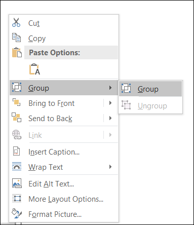

# Working with Shapes in a Word Document

Shapes are drawing objects that include lines, curves, circles, rectangles, etc. They can be preset or custom geometry. You can create and manipulate predefined shapes in DOCX and WordML format documents.

## Adding Shapes

The following code example shows how to add a predefined shape to the document.




// Create a new Word document.
WordDocument document = new WordDocument();
// Add a new section to the document.
IWSection section = document.addSection();
// Add a new paragraph to the section.
WParagraph paragraph = (WParagraph) section.addParagraph();
// Add a new shape to the document.
Shape rectangle = paragraph.appendShape(AutoShapeType.RoundedRectangle, 150, 100);
// Set position for the shape.
rectangle.setVerticalPosition(72);
rectangle.setHorizontalPosition(72);
paragraph = (WParagraph) section.addParagraph();
// Add text body contents to the shape.
paragraph = (WParagraph) rectangle.getTextBody().addParagraph();
IWTextRange text = paragraph.appendText("This text is in a rounded rectangle shape");
text.getCharacterFormat().setTextColor(ColorSupport.getGreen());
text.getCharacterFormat().setBold(true);
// Add another shape to the document.
paragraph = (WParagraph) section.addParagraph();
paragraph.appendBreak(BreakType.LineBreak);
Shape pentagon = paragraph.appendShape(AutoShapeType.Pentagon, 100, 100);
paragraph = (WParagraph) pentagon.getTextBody().addParagraph();
paragraph.appendText("This text is in a pentagon shape");
// Set position for the shape.
pentagon.setHorizontalPosition(72);
pentagon.setVerticalPosition(200);
// Save and close the Word document instance.
document.save("Result.docx", FormatType.Docx);
document.close();




### Format Shapes

Shapes can have formatting such as line color, fill color, positioning, wrap formats, etc. The following code example illustrates how to apply formatting options for a shape.




// Create a new Word document.
WordDocument document = new WordDocument();
// Add a new section to the document.
IWSection section = document.addSection();
// Add a new paragraph to the section.
IWParagraph paragraph = (WParagraph) section.addParagraph();
// Append a shape to the paragraph.
Shape rectangle = paragraph.appendShape(AutoShapeType.RoundedRectangle, 150, 100);
rectangle.setVerticalPosition(72);
rectangle.setHorizontalPosition(72);
paragraph = (WParagraph) section.addParagraph();
paragraph = (WParagraph) rectangle.getTextBody().addParagraph();
IWTextRange text = paragraph.appendText("This text is in a rounded rectangle shape");
// Apply format to the text.
text.getCharacterFormat().setTextColor(ColorSupport.getGreen());
text.getCharacterFormat().setBold(true);
// Apply fill color for the shape.
rectangle.getFillFormat().setFill(true);
rectangle.getFillFormat().setColor(ColorSupport.getLightGray());
// Apply wrap formats.
rectangle.getWrapFormat().setTextWrappingStyle(TextWrappingStyle.Square);
rectangle.getWrapFormat().setTextWrappingType(TextWrappingType.Right);
// Set horizontal and vertical origin.
rectangle.setHorizontalOrigin(HorizontalOrigin.Margin);
rectangle.setVerticalOrigin(VerticalOrigin.Page);
// Set line format.
rectangle.getLineFormat().setDashStyle(LineDashing.Dot);
rectangle.getLineFormat().setColor(ColorSupport.getDarkGray());
// Save and close the Word document instance.
document.save("Result.docx", FormatType.Docx);
document.close();




### Rotate Shapes

You can rotate a shape and also apply flipping (horizontal and vertical) to it. The following code example explains how to rotate and flip a shape.




// Create a new Word document.
WordDocument document = new WordDocument();
// Add a new section to the document.
IWSection section = document.addSection();
// Add a new paragraph to the section.
WParagraph paragraph = (WParagraph) section.addParagraph();
Shape rectangle = paragraph.appendShape(AutoShapeType.RoundedRectangle, 150, 100);
// Set position for the shape.
rectangle.setVerticalPosition(72);
rectangle.setHorizontalPosition(72);
// Set 90-degree rotation.
rectangle.setRotation(90);
// Set horizontal flip.
rectangle.setFlipHorizontal(true);
paragraph = (WParagraph) section.addParagraph();
paragraph = (WParagraph) rectangle.getTextBody().addParagraph();
IWTextRange text = paragraph.appendText("This text is in a rounded rectangle shape");
// Save the Word document.
document.save("Result.docx", FormatType.Docx);
// Close the document.
document.close();




## Grouping Shapes

The Word library now allows you to create or group multiple shapes, pictures, and text boxes as a group shape in a Word document (DOCX) and preserve it during DOCX and WordML format conversions.

You can create a document with group shapes by using Microsoft Word. It provides an option to group a set of shapes and images as a single shape or treat a group shape as an individual item.

**Key Features:**

1. You can easily manage a group of shapes, pictures, and text boxes as a group shape.
2. You can move several shapes or images simultaneously and apply the same formatting properties for children of group shapes.

N> 1. While grouping the shapes or other objects, the shapes should be positioned relative to the “Page”.
N> 2. While grouping the shapes or other objects, the wrapping style should not be "In Line with Text".

The following code example shows how to create a group shape in a Word document.




// Create a new Word document.
WordDocument document = new WordDocument();
// Add a new section to the document.
IWSection section = document.addSection();
// Add a new paragraph to the section.
WParagraph paragraph = (WParagraph) section.addParagraph();
// Create a new group shape.
GroupShape groupShape = new GroupShape(document);
// Add the group shape to the paragraph.
paragraph.getChildEntities().add(groupShape);
// Create a new shape.
Shape shape = new Shape(document, AutoShapeType.RoundedRectangle);
// Set height and width for the shape.
shape.setHeight(100);
shape.setWidth(150);
// Set horizontal and vertical position.
shape.setHorizontalPosition(72);
shape.setVerticalPosition(72);
// Set wrapping style for the shape.
shape.getWrapFormat().setTextWrappingStyle(TextWrappingStyle.InFrontOfText);
// Set horizontal and vertical origin.
shape.setHorizontalOrigin(HorizontalOrigin.Page);
shape.setVerticalOrigin(VerticalOrigin.Page);
// Add the specified shape to the group shape.
groupShape.add(shape);
// Create a new picture.
WPicture picture = new WPicture(document);
FileStreamSupport imageStream = new FileStreamSupport("Image.png", FileMode.Open, FileAccess.ReadWrite);
picture.loadImage(imageStream.toArray());
// Set wrapping style for the picture.
picture.setTextWrappingStyle(TextWrappingStyle.InFrontOfText);
// Set height and width for the image.
picture.setHeight(100);
picture.setWidth(100);
// Set horizontal and vertical position.
picture.setHorizontalPosition(400);
picture.setVerticalPosition(150);
// Set horizontal and vertical origin.
picture.setHorizontalOrigin(HorizontalOrigin.Page);
picture.setVerticalOrigin(VerticalOrigin.Page);
// Add the specified picture to the group shape.
groupShape.add(picture);
// Create a new textbox.
WTextBox textbox = new WTextBox(document);
textbox.getTextBoxFormat().setWidth(150);
textbox.getTextBoxFormat().setHeight(75);
// Add new text to the textbox body.
IWParagraph textboxParagraph = textbox.getTextBoxBody().addParagraph();
textboxParagraph.appendText("Text inside text box");
// Set wrapping style for the textbox.
textbox.getTextBoxFormat().setTextWrappingStyle(TextWrappingStyle.Behind);
// Set horizontal and vertical position.
textbox.getTextBoxFormat().setHorizontalPosition(200);
textbox.getTextBoxFormat().setVerticalPosition(200);
// Set horizontal and vertical origin.
textbox.getTextBoxFormat().setVerticalOrigin(VerticalOrigin.Page);
textbox.getTextBoxFormat().setHorizontalOrigin(HorizontalOrigin.Page);
// Add the specified textbox to the group shape.
groupShape.add(textbox);
// Save and close the Word document instance.
document.save("Result.docx", FormatType.Docx);
document.close();




### Nested Group Shapes

					   

The following code example illustrates how to group nested group shapes as a group shape in a Word document.




// Create a new Word document.
WordDocument document = new WordDocument();
// Add a new section to the document.
IWSection section = document.addSection();
// Add a new paragraph to the section.
WParagraph paragraph = (WParagraph) section.addParagraph();
// Create a new group shape.
GroupShape groupShape = new GroupShape(document);
// Add the group shape to the paragraph.
paragraph.getChildEntities().add(groupShape);
// Append a new shape to the document.
Shape shape = new Shape(document, AutoShapeType.RoundedRectangle);
// Set height and width for the shape.
shape.setHeight(100);
shape.setWidth(150);
// Set wrapping style for the shape.
shape.getWrapFormat().setTextWrappingStyle(TextWrappingStyle.InFrontOfText);
// Set horizontal and vertical position for the shape.
shape.setHorizontalPosition(72);
shape.setVerticalPosition(72);
// Set horizontal and vertical origin for the shape.
shape.setHorizontalOrigin(HorizontalOrigin.Page);
shape.setVerticalOrigin(VerticalOrigin.Page);
// Add the specified shape to the group shape.
groupShape.add(shape);
// Append a new picture to the document.
WPicture picture = new WPicture(document);
// Load image from the file.
FileStreamSupport imageStream = new FileStreamSupport("Image.png", FileMode.Open, FileAccess.ReadWrite);
picture.loadImage(imageStream.toArray());
// Set wrapping style for the picture.
picture.setTextWrappingStyle(TextWrappingStyle.InFrontOfText);
// Set height and width for the picture.
picture.setHeight(100);
picture.setWidth(100);
// Set horizontal and vertical position for the picture.
picture.setHorizontalPosition(400);
picture.setVerticalPosition(150);
// Set horizontal and vertical origin for the picture.
picture.setHorizontalOrigin(HorizontalOrigin.Page);
picture.setVerticalOrigin(VerticalOrigin.Page);
// Add the specified picture to the group shape.
groupShape.add(picture);
// Create a new nested group shape.
GroupShape nestedGroupShape = new GroupShape(document);
// Append a new textbox to the document.
WTextBox textbox = new WTextBox(document);
// Set width and height for the textbox.
textbox.getTextBoxFormat().setWidth(150);
textbox.getTextBoxFormat().setHeight(75);
// Add new text to the textbox body.
IWParagraph textboxParagraph = textbox.getTextBoxBody().addParagraph();
// Add new text to the textbox paragraph.
textboxParagraph.appendText("Text inside text box");
// Set wrapping style for the textbox.
textbox.getTextBoxFormat().setTextWrappingStyle(TextWrappingStyle.Behind);
// Set horizontal and vertical position for the textbox.
textbox.getTextBoxFormat().setHorizontalPosition(200);
textbox.getTextBoxFormat().setVerticalPosition(200);
// Set horizontal and vertical origin for the textbox.
textbox.getTextBoxFormat().setVerticalOrigin(VerticalOrigin.Page);
textbox.getTextBoxFormat().setHorizontalOrigin(HorizontalOrigin.Page);
// Add the specified textbox to the nested group shape.
nestedGroupShape.add(textbox);
// Append a new shape to the document.
shape = new Shape(document, AutoShapeType.Oval);
// Set height and width for the new shape.
shape.setHeight(100);
shape.setWidth(150);
// Set horizontal and vertical position for the shape.
shape.setHorizontalPosition(200);
shape.setVerticalPosition(72);
// Set horizontal and vertical origin for the shape.
shape.setHorizontalOrigin(HorizontalOrigin.Page);
shape.setVerticalOrigin(VerticalOrigin.Page);
// Set horizontal and vertical position for the nested group shape.
nestedGroupShape.setHorizontalPosition(72);
nestedGroupShape.setVerticalPosition(72);
// Add the specified shape to the nested group shape.
nestedGroupShape.add(shape);
// Add the nested group shape to the group shape of the paragraph.
groupShape.add(nestedGroupShape);
// Save and close the Word document instance.
document.save("Result.docx", FormatType.Docx);
document.close();




## Ungrouping Shapes

You can ungroup group shapes in the Word document to preserve each shape as an individual item.

The following code example shows how to ungroup a group shape in a Word document.




// Load the template document.
WordDocument document = new WordDocument("Template.docx", FormatType.Automatic);
// Get the last paragraph.
WParagraph lastParagraph = document.getLastParagraph();
// Iterate through the paragraph items to get the group shape.
for (int i = 0; i < lastParagraph.getChildEntities().getCount(); i++)
{
	if (lastParagraph.getChildEntities().get(i) instanceof GroupShape)
	{
		GroupShape groupShape = (GroupShape) lastParagraph.getChildEntities().get(i);
		// Ungroup the child shapes in the group shape.
		groupShape.ungroup();
		break;
	}
}
// Save and close the Word document instance.
document.save("Result.docx", FormatType.Docx);
document.close();


