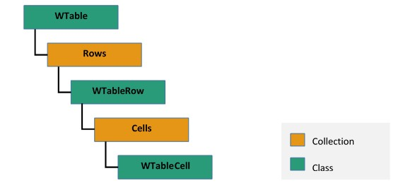

# Working with Tables in Word document

A table in Word document is used to arrange document content in rows and columns. `WTable` instance represents a table in Word document. A table must contain at least one row.

1. A row is a collection of cells and it is represented by an instance of `WTableRow`. Each row must contain at least one cell.
2. A cell can contain one or more paragraphs and tables. An instance of `WTableCell` represents a table cell. Each table cell must contain at least one paragraph.

N> Adding more than 63 columns not supported in Word document using Microsoft Word application. It shows alert when you attempt to insert table with more than 64 columns, which is a one of the behaviors of Microsoft Word and Essential DocIO does the same.

The following image illustrates how a table in Word document is organized in EssentialDocIO’s DOM:

The following code example illustrates how to create a simple table with predefined number of rows and cells.

  


//Create an instance of WordDocument class.
WordDocument document = new WordDocument();
//Add a section into Word document.
IWSection section = document.addSection();
//Add a new paragraph into Word document and appends text into paragraph.
IWTextRange textRange = section.addParagraph().appendText("Price Details");
textRange.getCharacterFormat().setFontName("Arial");
textRange.getCharacterFormat().setFontSize(12);
textRange.getCharacterFormat().setBold(true);
section.addParagraph();
//Add a new table into Word document.
IWTable table = section.addTable();
//Specify the total number of rows & columns.
table.resetCells(3, 2);
//Access the instance of the cell (first row, first cell) and add the content into cell.
textRange = table.get(0, 0).addParagraph().appendText("Item");
textRange.getCharacterFormat().setFontName("Arial");
textRange.getCharacterFormat().setFontSize(12);
textRange.getCharacterFormat().setBold(true);
//Access the instance of the cell (first row, second cell) and add the content into cell.
textRange = table.get(0, 1).addParagraph().appendText("Price($)");
textRange.getCharacterFormat().setFontName("Arial");
textRange.getCharacterFormat().setFontSize(12);
textRange.getCharacterFormat().setBold(true);
//Access the instance of the cell (second row, first cell) and add the content into cell.
textRange = table.get(1, 0).addParagraph().appendText("Apple");
textRange.getCharacterFormat().setFontName("Arial");
textRange.getCharacterFormat().setFontSize(10);
//Access the instance of the cell (second row, second cell) and add the content into cell.
textRange = table.get(1, 1).addParagraph().appendText("50");
textRange.getCharacterFormat().setFontName("Arial");
textRange.getCharacterFormat().setFontSize(10);
//Accessthe instance of the cell (third row, first cell) and add the content into cell.
textRange = table.get(2, 0).addParagraph().appendText("Orange");
textRange.getCharacterFormat().setFontName("Arial");
textRange.getCharacterFormat().setFontSize(10);
//Access the instance of the cell (third row, second cell) and add the content into cell.
textRange = table.get(2, 1).addParagraph().appendText("30");
textRange.getCharacterFormat().setFontName("Arial");
textRange.getCharacterFormat().setFontSize(10);
//Save the document in the given name and format.
document.save("Table.docx", FormatType.Docx);
//Release the resources occupied by WordDocument instance.
document.close();


  

The following code example illustrates how to create a simple table by dynamically adding rows.

 


//Create an instance of WordDocument class
WordDocument document = new WordDocument();
IWSection section = document.addSection();
section.addParagraph().appendText("Price Details");
section.addParagraph();
//Add a new table into Word document
IWTable table = section.addTable();
//Add the first row into table
WTableRow row = table.addRow();
//Add the first cell into first row 
WTableCell cell = row.addCell();
//Specify the cell width
cell.setWidth(200);
cell.addParagraph().appendText("Item");
//Add the second cell into first row 
cell = row.addCell();
//Specify the cell width
cell.setWidth(200);
cell.addParagraph().appendText("Price($)");
//Add the second row into table
row = table.addRow(true, false);
//Add the first cell into second row
cell = row.addCell();
//Specify the cell width
cell.setWidth(200);
cell.addParagraph().appendText("Apple");
//Add the second cell into second row
cell = row.addCell();
//Specify the cell width
cell.setWidth(200);
cell.addParagraph().appendText("50");
//Add the third row into table
row = table.addRow(true, false);
//Add the first cell into third row 
cell = row.addCell();
//Specify the cell width
cell.setWidth(200);
cell.addParagraph().appendText("Orange");
//Add the second cell into third row 
cell = row.addCell();
//Specify the cell width
cell.setWidth(200);
cell.addParagraph().appendText("30");
//Add the fourth row into table
row = table.addRow(true, false);
//Add the first cell into fourth row
cell = row.addCell();
//Specify the cell width
cell.setWidth(200);
cell.addParagraph().appendText("Banana");
//Add the second cell into fourth row 
cell = row.addCell();
//Specify the cell width
cell.setWidth(200);
cell.addParagraph().appendText("20");
//Add the fifth row to table
row = table.addRow(true, false);
//Adds the first cell into fifth row 
cell = row.addCell();
//Specify the cell width
cell.setWidth(200);
cell.addParagraph().appendText("Grapes");
//Add the second cell into fifth row 
cell = row.addCell();
//Specify the cell width
cell.setWidth(200);
cell.addParagraph().appendText("70");
//Save and close the document instance
document.save("Table.docx", FormatType.Docx);
document.close();


  

## Nested Table 

You can create a nested table by adding a new table into a cell. The following code example illustrates how to add a table into a cell.

 


//Create an instance of WordDocument class.
WordDocument document = new WordDocument();
IWSection section = document.addSection();
section.addParagraph().appendText("Price Details");
IWTable table = section.addTable();
table.resetCells(3, 2);
table.get(0, 0).addParagraph().appendText("Item");
table.get(0, 1).addParagraph().appendText("Price($)");
table.get(1, 0).addParagraph().appendText("Items with same price");
//Add a nested table into the cell (second row, first cell).
IWTable nestTable = table.get(1, 0).addTable();
//Create the specified number of rows and columns to nested table.
nestTable.resetCells(3, 1);
//Access the instance of the nested table cell (first row, first cell).
WTableCell nestedCell = nestTable.getRows().get(0).getCells().get(0);
//Specify the width of the nested cell.
nestedCell.setWidth(200);
//Add the content into nested cell.
nestedCell.addParagraph().appendText("Apple");
//Access the instance of the nested table cell (second row, first cell).
nestedCell = nestTable.getRows().get(1).getCells().get(0);
//Specify the width of the nested cell.
nestedCell.setWidth(200);
//Add the content into nested cell.
nestedCell.addParagraph().appendText("Orange");
//Access the instance of the nested table cell (third row, first cell).
nestedCell = nestTable.getRows().get(2).getCells().get(0);
//Specify the width of the nested cell.
nestedCell.setWidth(200);
//Add the content into nested cell.
nestedCell.addParagraph().appendText("Mango");
//Access the instance of the cell (second row, second cell).
nestedCell = table.getRows().get(1).getCells().get(1);
table.get(1, 1).addParagraph().appendText("85");
table.get(2, 0).addParagraph().appendText("Pomegranate");
table.get(2, 1).addParagraph().appendText("70");
//Save and close the document instance.
document.save("NestedTable.docx", FormatType.Docx);
document.close();


  

## Align text within a table

You can iterate the cells within a table and align text for each cell. Find more information about iterating the cells from [here](https://help.syncfusion.com/java-file-formats/word-library/working-with-tables#iterating-through-table-elements)

The following code example illustrates how to align text within a table.




private void alignCellContent(WTableCell tableCell,VerticalAlignment verticalAlignment,HorizontalAlignment horizontalAlignment)throws Exception
{
	//Set vertical alignment to the cell.
	tableCell.getCellFormat().setVerticalAlignment(verticalAlignment);
	//Iterate body items in table cell and set horizontal alignment.
	alignCellContentForTextBody(tableCell,horizontalAlignment);
}
private void alignCellContentForTextBody(WTextBody textBody,HorizontalAlignment horizontalAlignment)throws Exception
{
	for(int i = 0;i<textBody.getChildEntities().getCount();i++)
	{
		//IEntity is the basic unit in DocIO DOM. 
		//Access the body items as IEntity.
		IEntity bodyItemEntity = textBody.getChildEntities().get(i);
		//A Text body has 3 types of elements - Paragraph, Table and Block Content Control.
		//Decide the element type by using EntityType.
		switch(bodyItemEntity.getEntityType().toString())
		{
			case "Paragraph":
				WParagraph paragraph = (WParagraph)bodyItemEntity;
				//Set horizontal alignment for paragraph.
				paragraph.getParagraphFormat().setHorizontalAlignment(horizontalAlignment);
				break;
			case "Table":
				//Table is a collection of rows and cells.
				//Iterate through table's DOM and set horizontal alignment.
				alignCellContentForTable((WTable)bodyItemEntity,horizontalAlignment);
				break;
			case "BlockContentControl":
				//Iterate to the body items of Block Content Control and set horizontal alignment.
				BlockContentControl blockContentControl = (BlockContentControl)bodyItemEntity;
				alignCellContentForTextBody(blockContentControl.getTextBody(),horizontalAlignment);
				break;
		}
	}
}
private void alignCellContentForTable(WTable table,HorizontalAlignment horizontalAlignment)throws Exception
{
	//Iterate the row collection in a table.
	for(Object row_tempObj : table.getRows())
	{
		WTableRow row = (WTableRow)row_tempObj;
		//Iterate the cell collection in a table row.
		for(Object cell_tempObj : row.getCells())
		{
			//Iterate items in cell and set horizontal alignment.
			WTableCell cell = (WTableCell)cell_tempObj;
			alignCellContentForTextBody(cell,horizontalAlignment);
		}
	}
}




## Apply formatting to Table, Row and Cell

The following code example illustrates how to load an existing document and apply table formatting options such as Borders, LeftIndent, Paddings, IsAutoResize, etc.

N> 1. `BorderStyle.None` is the default value of `BorderType` property in `Borders` class which will not show borders for the table or cell. It is equivalent to border style not defined and borders can be inherited from style or parent formats.
N> 2. To hide border for a table or cell in the Word Document, you can set `BorderType` property with `BorderStyle.Cleared`. It means border style defined as no border (Don’t show border) and shouldn’t inherit from style or parent formats.
N> 3. To show/display border for a table or cell in the Word Document, you can set `BorderType` property with `BorderStyle` values (except `BorderStyle.None` and `BorderStyle.Cleared`).

  


//Create an instance of WordDocument class (Empty Word Document)
WordDocument document = new WordDocument();
//Open an existing Word document into DocIO instance
document.open("Table.docx", FormatType.Docx);
//Access the instance of the first section in the Word document
WSection section = document.getSections().get(0);
//Access the instance of the first table in the section
WTable table = section.getTables().get(0);
//Specify the title for the table
table.setTitle("PriceDetails");
//Specify the description of the table
table.setDescription("This table shows the price details of various fruits");
//Specify the left indent of the table
table.setIndentFromLeft(50);
//Specify the background color of the table
table.getTableFormat().setBackColor(ColorSupport.fromArgb(192, 192, 192));
//Specify the horizontal alignment of the table
table.getTableFormat().setHorizontalAlignment(RowAlignment.Left);
//Specify the left, right, top and bottom padding of all the cells in the table
table.getTableFormat().getPaddings().setAll(10);
//Specify the auto resize of table to automatically resize all cell width based on its content
table.getTableFormat().setIsAutoResized(true);
//Specify the table top, bottom, left and right border line width
table.getTableFormat().getBorders().setLineWidth(2f);
//Specify the table horizontal border line width
table.getTableFormat().getBorders().getHorizontal().setLineWidth(2f);
//Specify the table vertical border line width
table.getTableFormat().getBorders().getVertical().setLineWidth(2f);
//Specify the tables top, bottom, left and right border color
table.getTableFormat().getBorders().setColor(ColorSupport.getRed());
//Specify the table Horizontal border color
table.getTableFormat().getBorders().getHorizontal().setColor(ColorSupport.getRed());
//Specify the table vertical border color
table.getTableFormat().getBorders().getVertical().setColor(ColorSupport.getRed());
//Specify the table borders border type
table.getTableFormat().getBorders().setBorderType(BorderStyle.Double);
//Accesses the instance of the first row in the table
WTableRow row = table.getRows().get(0);
//Specify the row height
row.setHeight(20);
//Specify the row height type
row.setHeightType(TableRowHeightType.AtLeast);
//Save and close the document instance
document.save("TableFormatting.docx", FormatType.Docx);
document.close();


  

### Applying cell formatting
  
The following code example illustrates how to load an existing document and apply cell formatting options such as VerticalAlignment, TextDirection, Paddings, Borders, etc.

 


//Create an instance of WordDocument class.
WordDocument document = new WordDocument();
document.open("Table.docx",FormatType.Docx);
WSection section = document.getSections().get(0);
//Access the instance of the first row in the table.
WTable table = section.getTables().get(0);
//Specify the row height.
WTableRow row = table.getRows().get(0);
row.setHeight(20);
//Specify the row height type.
row.setHeightType(TableRowHeightType.AtLeast);
//Access the instance of the first cell in the row.
WTableCell cell = row.getCells().get(0);
//Specify the cell back ground color.
cell.getCellFormat().setBackColor(ColorSupport.fromArgb(192,192,192));
//Specify the same padding as table option as false to preserve current cell padding.
cell.getCellFormat().setSamePaddingsAsTable(false);
//Specify the left, right, top and bottom padding of the cell.
cell.getCellFormat().getPaddings().setLeft(5);
cell.getCellFormat().getPaddings().setRight(5);
cell.getCellFormat().getPaddings().setTop(5);
cell.getCellFormat().getPaddings().setBottom(5);
//Specify the vertical alignment of content of text.
cell.getCellFormat().setVerticalAlignment(VerticalAlignment.Middle);
//Disable the text wrap option to avoid displaying longer text on multiple lines.
cell.getCellFormat().setTextWrap(false);
//Access the instance of the second cell in the row.
cell=row.getCells().get(1);
cell.getCellFormat().setBackColor(ColorSupport.fromArgb(192,192,192));
cell.getCellFormat().setSamePaddingsAsTable(false);
//Specify the left, right, top and bottom padding of the cell.
cell.getCellFormat().getPaddings().setAll(5);
cell.getCellFormat().setVerticalAlignment(VerticalAlignment.Middle);
//Disable the text wrap option to avoid displaying longer text on multiple lines.
cell.getCellFormat().setTextWrap(false);
//Save and close the document instance.
document.save("TableCellFormatting.docx",FormatType.Docx);
document.close();


 

### Working with Table Style

A table style defines a set of table, row, cell and paragraph level formatting that can be applied to a table. `WTableStyle` instance represents table style in a Word document.

N>  Essential DocIO currently provides support for table styles in DOCX and WordML formats alone. The visual appearance is also preserved in Word to HTML conversion.

The following code example illustrates how to apply the built-in table styles to the table.

 


//Create an instance of WordDocument class.
WordDocument document = new WordDocument("Table.docx", FormatType.Docx);
WSection section = document.getSections().get(0);
WTable table = section.getTables().get(0);
//Apply "LightShading" built-in style to table.
table.applyStyle(BuiltinTableStyle.LightShading);
//Save and close the document instance.
document.save("TableStyle.docx", FormatType.Docx);
document.close();


  

### Table style options

Once you have applied a table style, you can enable or disable the special formatting of the table. There are six options: first column, last column, banded rows, banded columns, header row and last row.  

The following code example illustrates how to enable and disable the special table formatting options of the table styles

 


//Create an instance of WordDocument class.
WordDocument document = new WordDocument("Table.docx",FormatType.Docx);
WSection section = document.getSections().get(0);
WTable table = section.getTables().get(0);
//Apply"LightShading" built-in style to table.
table.applyStyle(BuiltinTableStyle.LightShading);
//Enable special formatting for banded columns of the table.
table.setApplyStyleForBandedColumns(true);
//Enable special formatting for banded rows of the table.
table.setApplyStyleForBandedRows(true);
//Disables special formatting for first column of the table.
table.setApplyStyleForFirstColumn(false);
//Enable special formatting for header row of the table.
table.setApplyStyleForHeaderRow(true);
//Enable special formatting for last column of the table.
table.setApplyStyleForLastColumn(true);
//Disable special formatting for last row of the table.
table.setApplyStyleForLastRow(false);
//Save and close the document instance.
document.save("TableStyle.docx",FormatType.Docx);
document.close();




### Custom table style

The following code example illustrates how to apply a custom table style to table.

 


//Creates an instance of WordDocument class.
WordDocument document = new WordDocument("Table.docx", FormatType.Docx);
WSection section = document.getSections().get(0);
WTable table = section.getTables().get(0);
//Adds a new custom table style.
WTableStyle tableStyle = (WTableStyle)document.addTableStyle("CustomStyle");
//Applies formatting for whole table.
tableStyle.getTableProperties().setRowStripe(1);
tableStyle.getTableProperties().setColumnStripe(1);
tableStyle.getTableProperties().getPaddings().setTop(0);
tableStyle.getTableProperties().getPaddings().setBottom(0);
tableStyle.getTableProperties().getPaddings().setLeft(5.4f);
tableStyle.getTableProperties().getPaddings().setRight(5.4f);
//Applies conditional formatting for first row.
ConditionalFormattingStyle firstRowStyle = tableStyle.getConditionalFormattingStyles().add(ConditionalFormattingType.FirstRow);
firstRowStyle.getCharacterFormat().setBold(true);
firstRowStyle.getCharacterFormat().setTextColor(ColorSupport.fromArgb(255,255,255,255));
firstRowStyle.getCellProperties().setBackColor(ColorSupport.getBlue());
//Applies conditional formatting for first column.
ConditionalFormattingStyle firstColumnStyle = tableStyle.getConditionalFormattingStyles().add(ConditionalFormattingType.FirstColumn);
firstColumnStyle.getCharacterFormat().setBold(true);
//Applies conditional formatting for odd row.
ConditionalFormattingStyle oddRowBandingStyle = tableStyle.getConditionalFormattingStyles().add(ConditionalFormattingType.OddRowBanding);
oddRowBandingStyle.getCellProperties().setBackColor(ColorSupport.getWhiteSmoke());
//Applies the custom table style to the table.
table.applyStyle("CustomStyle");
//Saves and closes the document instance
document.save("TableStyle.docx",FormatType.Docx);
document.close();


  
 
## Merging cells vertically and horizontally

You can combine two or more table cells located in the same row or column into a single cell.

The following code example illustrates how to apply horizontal merge to specified range of cells in a specified row.

  


//Create an instance of WordDocument class.
WordDocument document = new WordDocument();
IWSection section = document.addSection();
section.addParagraph().appendText("Horizontal merging of Table cells");
IWTable table = section.addTable();
table.resetCells(5,5);
//Specify the horizontal merge from second cell to fifth cell in third row.
table.applyHorizontalMerge(2,1,4);
//Save and close the document instance.
document.save("HorizontalMerge.docx",FormatType.Docx);
document.close();


  

The following code example illustrates how to apply vertical merge to specified range of rows in a specified column.

  


//Create an instance of WordDocument class.
WordDocument document = new WordDocument();
IWSection section = document.addSection();
section.addParagraph().appendText("Vertical merging of Table cells");
IWTable table = section.addTable();
table.resetCells(5,5);
//Specify the vertical merge to the third cell, from second row to fifth row.
table.applyVerticalMerge(2,1,4);
//Save and close the document instance.
document.save("VerticalMerge.docx",FormatType.Docx);
document.close();


  

The following code example illustrate how to create a table that contains horizontal merged cells.

  


//Create an instance of WordDocument class.
WordDocument document = new WordDocument();
IWSection section = document.addSection();
section.addParagraph().appendText("Horizontal merging of Table cells");
IWTable table = section.addTable();
table.resetCells(2,2);
//Add content to table cell.
table.get(0,0).addParagraph().appendText("First row, First cell");
table.get(0,1).addParagraph().appendText("First row, Second cell");
table.get(1,0).addParagraph().appendText("Second row, First cell");
table.get(1,1).addParagraph().appendText("Second row, Second cell");
//Specifies the horizontal merge start to first row, first cell.
table.get(0,0).getCellFormat().setHorizontalMerge(CellMerge.Start);
//Modify the cell content.
table.get(0,0).getParagraphs().get(0).setText("Horizontally merged cell");
//Specify the horizontal merge continue to second row second cell.
table.get(0,1).getCellFormat().setHorizontalMerge(CellMerge.Continue);
//Save and close the document instance.
document.save("HorizontalMerge.docx",FormatType.Docx);
document.close();


 

The following code example illustrates how to create a table with vertical merged cells.

 


//Create an instance of WordDocument class.
WordDocument document = new WordDocument();
IWSection section = document.addSection();
section.addParagraph().appendText("Vertical merging of Table cells");
IWTable table = section.addTable();
table.resetCells(2,2);
//Add content to table cells.
table.get(0,0).addParagraph().appendText("First row, First cell");
table.get(0,1).addParagraph().appendText("First row, Second cell");
table.get(1,0).addParagraph().appendText("Second row, First cell");
table.get(1,1).addParagraph().appendText("Second row, Second cell");
//Specify the vertical merge start to first row first cell.
table.get(0,0).getCellFormat().setVerticalMerge(CellMerge.Start);
//Modify the cell content.
table.get(0,0).getParagraphs().get(0).setText("Vertically merged cell");
//Specify the vertical merge continue to second row first cell.
table.get(1,0).getCellFormat().setVerticalMerge(CellMerge.Continue);
//Save and close the document instance.
document.save("VerticalMerge.docx",FormatType.Docx);
document.close();


  
  
## Specifying table header row to repeat on each page

You can specify one or more rows in a table to be repeated as header row at the top of each page, when the table spans across multiple pages. 

* In the case of a single header row, it must be the first row in the table. 
* In the case of multiple header rows, then header rows must be consecutive from the first row of the table.

N>  Heading rows do not have any effect with nested tables in Microsoft Word as well as DocIO 

The following code example illustrates how to create a table with a single header row.

  


//Create an instance of WordDocument class.
WordDocument document = new WordDocument();
IWSection section = document.addSection();
IWTable table = section.addTable();
table.resetCells(50,1);
WTableRow row = table.getRows().get(0);
//Specify the first row as a header row of the table.
row.setIsHeader(true);
row.setHeight(20);
row.setHeightType(TableRowHeightType.AtLeast);
row.getCells().get(0).addParagraph().appendText("Header Row");
for(int i = 1;i<50;i++)
{
	row=table.getRows().get(i);
	row.setHeight(20);
	row.setHeightType(TableRowHeightType.AtLeast);
	row.getCells().get(0).addParagraph().appendText("Text in Row" + i);
}
//Save and close the document instance.
document.save("TableWithHeaderRow.docx",FormatType.Docx);
document.close();


  

## Keeping rows from breaking across pages

You can enable or disable the table row content to split across multiple pages, when the row contents do not fit in a previous page.

The following code example illustrates how to disable all the table rows from splitting across multiple pages.

 


//Creates an instance of WordDocument class.
WordDocument document = new WordDocument("Template.docx");
WSection section = document.getSections().get(0);
WTable table = section.getTables().get(0);
//Disable breaking across pages for all rows in the table.
for(Object row_tempObj : table.getRows())
{
	WTableRow row = (WTableRow)row_tempObj;
	row.getRowFormat().setIsBreakAcrossPages(false);
}
//Save and close the document instance.
document.save("Result.docx",FormatType.Docx);
document.close();


 
  
## Iterating through table elements

The following code example illustrates how to iterate through the table and apply back color to a particular cell.

 


//Create an instance of WordDocument class.
WordDocument document = new WordDocument("Template.docx");
WSection section = document.getSections().get(0);
WTable table = section.getTables().get(0);
//Iterate the rows of the table.
for(Object row_tempObj : table.getRows())
{
	WTableRow row = (WTableRow)row_tempObj;
	//Iterate through the cells of rows.
	for(Object cell_tempObj : row.getCells())
	{
		WTableCell cell = (WTableCell)cell_tempObj;
		//Iterate through the paragraphs of the cell.
		for(Object paragraph_tempObj : cell.getParagraphs())
		{
			WParagraph paragraph = (WParagraph)paragraph_tempObj;
			//When the paragraph contains text Panda then apply green as back color to cell.
			if(paragraph.getText().contains("panda"))
				cell.getCellFormat().setBackColor(ColorSupport.getGreen());
		}
	}
}
//Save and close the document instance.
document.save("Sample.docx",FormatType.Docx);
document.close();
document.Close();




## Removing the table

You can remove a table from a text body by its instance or by its index position in the text body item collection. The following code example shows how to remove a table in Word document.

 


//Create an instance of WordDocument class.
WordDocument document = new WordDocument("Template.docx");
//Access the instance of the first section in the Word document.
WSection section = document.getSections().get(0);
//Access the instance of the first table in the section.
WTable table = section.getTables().get(0);
//Remove a table from the text body.
section.getBody().getChildEntities().remove(table);
//Save the Word document.
document.save("Sample.docx",FormatType.Docx);
//Close the document.
document.close();


