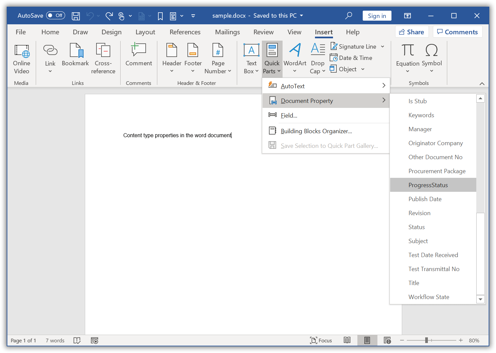

# Working with Word document

## Iterating through document elements

The following are the important points to be remembered while iterating the document elements

* Document consists of one or more sections.
* Section contains the contents present in Headers, Footers and main document through the instances of `WTextBody`.
* `WTextBody` contains three type of elements – either paragraph, table or block content control.

The following code example shows how to iterate throughout the Word document and remove the paragraph with a particular style.

 


//Open an existing document from file system through constructor of WordDocument class.
WordDocument document = new WordDocument("TestDocument.docx");
//Process the body contents for each section in the Word document.
for(Object section_tempObj : document.getSections())
{
	//Access the Body of section where all the contents in document are apart.
	WSection section = (WSection)section_tempObj;
	WTextBody sectionBody = section.getBody();
	iterateTextBody(sectionBody);
	//Consider that OddHeader and OddFooter are applied to this document.
	//Iterate through the TextBody of OddHeader and OddFooter.
	WHeadersFooters headersFooters = section.getHeadersFooters();
	iterateTextBody(headersFooters.getOddHeader());
	iterateTextBody(headersFooters.getOddFooter());
}
//Save and close the document instance.
document.save("Result.docx");
document.close();


  

The following code example provides supporting methods for the above code.

  

private void iterateTextBody(WTextBody textBody)throws Exception
{
	//Iterate through each of the child items of WTextBody.
	for(int i = 0;i<textBody.getChildEntities().getCount();i++)
	{
		//IEntity is the basic unit in DocIO DOM. 
		//Access the body items (should be either paragraph, table or block content control) as IEntity.
		IEntity bodyItemEntity = textBody.getChildEntities().get(i);
		//A Text body has 3 types of elements - Paragraph, Table and Block Content Control.
		//Decide the element type by using EntityType.
		switch(bodyItemEntity.getEntityType().toString())
		{
			case "Paragraph":
				//Check for particular style name and removes the paragraph from DOM.
				WParagraph paragraph = (WParagraph)bodyItemEntity;
				if(paragraph.getStyleName().equals("MyStyle"))
				{
					int index = textBody.getChildEntities().indexOf(paragraph);
					textBody.getChildEntities().removeAt(index);
				}
				break;
			case "Table":
				//Table is a collection of rows and cells.
				//Iterate through table's DOM.
				iterateTable((WTable)bodyItemEntity);
				break;
			case "BlockContentControl":
				//Iterate to the body items of Block Content Control.
				BlockContentControl blockContentControl = (BlockContentControl)bodyItemEntity;
				iterateTextBody(blockContentControl.getTextBody());
				break;
		}
	}
}


  

The following code example provides supporting methods for the above code.

  

private void iterateTable(WTable table)throws Exception
{
	//Iterate the row collection in a table.
	for(Object row_tempObj : table.getRows())
	{
		//Iterate the cell collection in a table row.
		WTableRow row = (WTableRow)row_tempObj;
		for(Object cell_tempObj : row.getCells())
		{
			//Table cell is derived from (also a) TextBody.
			//Reusing the code meant for iterating TextBody.
			WTableCell cell = (WTableCell)cell_tempObj;
			iterateTextBody(cell);
		}
	}
}


  

The following code example shows how to iterate throughout the paragraph and modify the hyperlink (Hyperlink)Uri and specific text (WTextRange)with another.

  


//Open an existing document from file system through constructor of WordDocument class.
WordDocument document = new WordDocument("TestDocument.docx");
//Process the body contents for each section in the Word document.
for(Object section_tempObj : document.getSections())
{
	//Access the Body of section where all the contents in document are apart.
	WSection section = (WSection)section_tempObj;
	WTextBody sectionBody = section.getBody();
	iterateTextBody(sectionBody);
	WHeadersFooters headersFooters = section.getHeadersFooters();
	//Consider that OddHeader & OddFooter are applied to this document.
	//Iterate through the TextBody of OddHeader and OddFooter.
	iterateTextBody(headersFooters.getOddHeader());
	iterateTextBody(headersFooters.getOddFooter());
}
//Save and close the document instance.
document.save("Result.docx");
document.close();



  
The following code example provides supporting methods for the above code.

 


private void iterateTextBody(WTextBody textBody)throws Exception
{
	//Iterate through each of the child items of WTextBody.
	for(int i = 0;i<textBody.getChildEntities().getCount();i++)
	{
		//IEntity is the basic unit in DocIO DOM. 
		//Access the body items (should be either paragraph, table or block content control) as IEntity.
		IEntity bodyItemEntity = textBody.getChildEntities().get(i);
		//A Text body has 3 types of elements - Paragraph, Table and Block Content Control.
		//Decide the element type by using EntityType.
		switch(bodyItemEntity.getEntityType().toString())
		{
			case "Paragraph":
				//Process the paragraph contents.
				//Iterate through the paragraph's DOM.
				WParagraph paragraph = (WParagraph)bodyItemEntity;
				terateParagraph(paragraph.getItems());
				break;
			case "Table":
				//Table is a collection of rows and cells.
				//Iterate through table's DOM.
				iterateTable((WTable)bodyItemEntity);
				break;
			case "BlockContentControl":
				//Iterate to the body items of Block Content Control.
				BlockContentControl blockContentControl = (BlockContentControl)bodyItemEntity;
				iterateTextBody(blockContentControl.getTextBody());
				break;
		}
	}
}


 

The following code example provides supporting methods for the above code.

 

private void iterateTable(WTable table)throws Exception
{
	//Iterate the row collection in a table.
	for(Object row_tempObj : table.getRows())
	{
		//Iterate the cell collection in a table row.
		WTableRow row = (WTableRow)row_tempObj;
		for(Object cell_tempObj : row.getCells())
		{
			//Table cell is derived from (also a) TextBody.
			//Reusing the code meant for iterating TextBody.
			WTableCell cell = (WTableCell)cell_tempObj;
			iterateTextBody(cell);
		}
	}
}



 
The following code example provides supporting methods for the above code.

 

private void iterateParagraph(ParagraphItemCollection paraItems)throws Exception
{
	for(int i = 0;i<paraItems.getCount();i++)
	{
		//A paragraph can have child elements such as text, image, hyperlink, symbols, etc.,.
		//Decide the element type by using EntityType.
		Entity entity = paraItems.get(i);
		switch(entity.getEntityType().toString())
		{
			case "TextRange":
				//Replace the text with another.
				WTextRange textRange = (WTextRange)entity;
				if(textRange.getText().equals("Andrew"))
				{
					((WTextRange)entity).setText("Fuller");
				}
			break;
		case "Field":
			//Create hyperlink instance from field to manipulate the hyperlink.
			WField field = (WField)entity;
			//Modify the Uri of the hyperlink
			if(field.getFieldType().getEnumValue()==FieldType.FieldHyperlink.getEnumValue())
			{
				Hyperlink hyperlink = new Hyperlink((WField)entity);
				if(hyperlink.getType().getEnumValue()==HyperlinkType.WebLink.getEnumValue() && hyperlink.getTextToDisplay().equals("HTML"))
				{
					hyperlink.setUri("http://www.w3schools.com/");
				}
			}
			break;
		case "TextBox":
			//Iterate to the body items of textbox.
			WTextBox textBox = (WTextBox)entity;
			iterateTextBody(textBox.getTextBoxBody());
			break;
		case "Shape":
			//Iterate to the body items of shape.
			Shape shape = (Shape)entity;
			iterateTextBody(shape.getTextBody());
			break;
		case "InlineContentControl":
			//Iterate to the paragraph items of inline content control.
			InlineContentControl inlineContentControl = (InlineContentControl)entity;
			iterateParagraph(inlineContentControl.getParagraphItems());
			break;
		}
	}
}




## Cloning a Word document

You can create a deep copy of a Word document by using `clone` method of `WordDocument` class. You can read the template document from file system or stream and create multiple document copies by cloning it. This improves the performance of document generation, as there is no need to read the Word document each time.

 


//Open an existing document.
WordDocument inputTemplateDoc = new WordDocument(fileName);
//Create a clone of Input Template.
WordDocument clonedDocument = inputTemplateDoc.clone();
//Save and close the cloned document instance.
clonedDocument.save("ClonedDocument.docx");
clonedDocument.close();
//Close the input template document instance.
inputTemplateDoc.close();


  
 
You can also create a deep copy of document elements such as sections, paragraphs, Tables, Text, Image, Shapes, TextBoxes and etc., The following code example illustrates how to clone the section and save each cloned section as a Word document. 

 


//Open a source document.
WordDocument sourceDocument = new WordDocument("SourceDocument.docx");
//Process the each section in the Word document.
for (int i = 0; i < sourceDocument.getSections().getCount();i++)
{
	//Create new WordDocument instance to add cloned section.
	WordDocument destinationDocument = new WordDocument();
	//Clone and adds source document sections to the destination document.
	destinationDocument.getSections().add(sourceDocument.getSections().get(i).clone());
	//Save and close the document instance.
	destinationDocument.save("Section_" + i + ".docx");
	destinationDocument.close();
}
//Close the source document instance.
sourceDocument.close();


  
   
## Merging Word documents

You can merge multiple Word documents into single Word document by using DocIO’s capability of importing contents from one document to another. The imported contents are appended at the end of document.  The following code example illustrates how to import the contents from source document into destination document where the contents are appended. 

 


//Open the source document.
WordDocument sourceDocument = new WordDocument(sourceFileName);
//Open the destination document. 
WordDocument destinationDocument = new WordDocument(targetFileName);
//Import the contents of source document at the end of destination document.
destinationDocument.importContent(sourceDocument, ImportOptions.UseDestinationStyles);
//Save the destination document.
destinationDocument.save(outputFileName, FormatType.Docx);
//close the document instances.
sourceDocument.close();
destinationDocument.close();


  

In the resultant document, the imported contents start from a new page followed by existing contents in a destination document. This is the default behavior.

When your requirement is to append the contents from the same page instead of starting from a new page, you need to set the break code of first section of Source document as NoBreak. The following code example illustrates the importing contents from the same page.

  


//Open the source document.
WordDocument sourceDocument = new WordDocument(sourceFileName);
//Open the destination document. 
WordDocument destinationDocument = new WordDocument(targetFileName);
//Set the break-code of First section of source document as NoBreak to avoid imported from a new page.
sourceDocument.getSections().get(0).setBreakCode(SectionBreakCode.NoBreak); 
//Import the contents of source document at the end of destination document.
destinationDocument.importContent(sourceDocument, ImportOptions.UseDestinationStyles);
//Save the destination document.
destinationDocument.save(outputFileName, FormatType.Docx);
//Close the document instances.
sourceDocument.close();
destinationDocument.close();


  

### Maintain Imported List style information

The following code example shows how to maintain information about imported list styles in a Word document while cloning and merging multiple Word documents.

  


//Open the source document.
WordDocument sourceDocument = new WordDocument(sourceFileName);
//Open the destination document.
WordDocument destinationDocument = new WordDocument(targetFileName);
//Set true value to maintain imported list style cache to destination document.
destinationDocument.getSettings().setMaintainImportedListCache(true);
//Process the body contents for each section in the Word document.
for(Object section_tempObj : sourceDocument.getSections())
{
	//Access the body of section where all the contents in document are apart.
	WSection section = (WSection)section_tempObj;
	for(Object bodyItem_tempObj : section.getBody().getChildEntities())
	{
		TextBodyItem bodyItem = (TextBodyItem)bodyItem_tempObj;
		destinationDocument.getLastSection().getBody().getChildEntities().add(bodyItem.clone());
	}
}
//Close the source document.
sourceDocument.close();
//Set false value to exclude imported list style cache to destination document.
destinationDocument.getSettings().setMaintainImportedListCache(false);
//Save the destination document.
destinationDocument.save(outputFileName,FormatType.Docx);
//Close the destination document.
destinationDocument.close();




## Working with Styles

A style is a predefined set of table, numbering, paragraph, and character properties that can be applied to regions within a document. DocIO provides the following functionalities related with styles.

* Access and modify the existing styles in the word document
* Create new paragraph style. 
* Apply built-in styles.

### Access Styles

Paragraph and character styles present in the existing document are accessible through the `Styles` property of `WordDocument` class. 

This following code example demonstrates how a style can be accessed and style properties like text color and first line indent can be updated.

  


//Open an input Word template.
WordDocument document = new WordDocument(inputFileName);
//Access the styles collection that contains paragraph and character styles in Word document.
IStyleCollection styleCollection = document.getStyles();
//Find the style with the name "Heading 1".
WParagraphStyle heading1ParagraphStyle = (WParagraphStyle)styleCollection.findByName("Heading 1");
//Change the text color of style "Heading 1" as DarkBlue.
heading1ParagraphStyle.getCharacterFormat().setTextColor(ColorSupport.getDarkBlue());
//Change the first line indent of Paragraph as 36 points.
heading1ParagraphStyle.getParagraphFormat().setFirstLineIndent(36);
//Save and close the document instance.
document.save(outputFileName,FormatType.Docx);
document.close();


  

### Creating a new Paragraph Style

You can create a new paragraph style by using `WordDocument.addParagraphStyle` method and apply it by using `applyStyle` method of `WParagraph` class.

  


//Open an input Word template.
WordDocument document = new WordDocument();
//This method adds a section and a paragraph in the document.
document.ensureMinimal();
//Add a new paragraph style named "MyStyle".
IWParagraphStyle myStyle = document.addParagraphStyle("MyStyle");
//Set the formatting of the style.
myStyle.getCharacterFormat().setFontSize(16f);
myStyle.getCharacterFormat().setTextColor(ColorSupport.getDarkBlue());
myStyle.getParagraphFormat().setHorizontalAlignment(HorizontalAlignment.Right);
//Append the contents into the paragraph.
document.getLastParagraph().appendText("AdventureWorks Cycles, the fictitious company on which the AdventureWorks sample databases are based, is a large, multinational manufacturing company.");
//Apply the style to paragraph.
document.getLastParagraph().applyStyle("MyStyle");
//Save and close the document instance.
document.save(outputFileName, FormatType.Docx);
document.close();


  

### Applying built-in styles

DocIO provides a set of predefined styles. You can apply those predefined styles as shown in the following code example.

 


//Open an input Word template.
WordDocument document = new WordDocument();
//This method adds a section and a paragraph in the document.
document.ensureMinimal();
IWParagraph paragraph = document.getLastParagraph();
//Append the content into the paragraph.
paragraph.appendText("AdventureWorks Cycles, the fictitious company on which the AdventureWorks sample databases are based, is a large, multinational manufacturing company.");
//Apply the style to paragraph.
paragraph.applyStyle(BuiltinStyle.Emphasis);
//Save and close the document instance.
document.save(outputFileName, FormatType.Docx);
document.close();


  

## Working with Word document properties

Document properties, also known as metadata, are details about a file that describe or identify it. You can also define the additional custom document properties for the documents by using DocIO Document properties that are classified as two categories. 

* Built-in document properties - includes details such as title, author name, subject, and keywords that identify the document's topic or contents.
* Custom document properties - defines the user-defined document properties.

### Built-in document properties

The Built-in document properties of a word document is represented by `BuiltinDocumentProperties` property of `WordDocument` class. The following code example illustrates how to access and modify the Built-in document properties of the document.

 


//Open an existing Word document.
WordDocument document = new WordDocument(inputFileName);
//Access the built-in document properties.
System.out.println(StringSupport.format("Title - {0}",document.getBuiltinDocumentProperties().getTitle()));
System.out.println(StringSupport.format("Author - {0}",document.getBuiltinDocumentProperties().getAuthor()));
//Modify or set the category and company Built-in document properties.
document.getBuiltinDocumentProperties().setCategory("Sales reports");
document.getBuiltinDocumentProperties().setCompany("Northwind traders");
document.save("outputFileName",FormatType.Docx);
document.close();


  

### Adding Custom Document properties

You add a new custom document properties through `add` method of `CustomProperties` class. The following code example illustrates how to add a new custom document properties.

 


//Open an input word template.
WordDocument document = new WordDocument(inputFileName);
//Add the custom document properties of various data types.
document.getCustomDocumentProperties().add("PropertyA", "Value of A");
document.getCustomDocumentProperties().add("PropertyB", 12.5);
document.getCustomDocumentProperties().add("PropertyC", true);
document.getCustomDocumentProperties().add("PropertyD", LocalDateTime.of(2015, 7, 20, 0, 0));
//Save and close the document.
document.save(outputFileName, FormatType.Docx);
document.close();


  

### Accessing & Modifying Custom Document Properties

You can access and modify an existing document property as shown in the following code example.

 


//Open an input word template.
WordDocument document = new WordDocument(inputFileName);
//Accesses an existing custom document property
DocumentProperty property = document.getCustomDocumentProperties().get("PropertyA");
//Modifies the value of DocumentProperty instance
property.setValue("Hello world");
//Save and close the document.
document.save(outputFileName, FormatType.Docx);
document.close();


  

## Working with Content Type Properties

Content type properties refers the metadata stored in a Word document, such as author name, subject, and company. DocIO represents metadata with MetaProperty instance and you can access in the Word document (DOCX, WordML) by using the ContentTypeProperties collection of WordDocument class.

The following screenshots shows the content type property in the input Word document.

N> You can use Content Type Properties only in documents that are saved in the DOCX or WordML Format.

### Accessing and modifying the Content Type Properties

You can access and modify the value of existing metadata in the Word document (DOCX, WordML).

The following code example explains how to access and modify the value of an existing metadata in the Word document.
 


// Loads the template document
WordDocument document = new WordDocument("Template.docx");
// Processes the metaproperty collection in the Word document
MetaProperties metaProperties = document.getContentTypeProperties();
// Iterates through each of the child items of metaproperties
for (int i = 0; i < metaProperties.getCount(); i++) 
{
	// Checks for particular display name of meta data and modifies its value
	switch (metaProperties.get(i).getDisplayName()) 
	{
		case "ProgressStatus":
			if (metaProperties.get(i).getType() == MetaPropertyType.Text && !metaProperties.get(i).getIsReadOnly())
				metaProperties.get(i).setValue("Completed");
			break;
		case "Reviewed":
			if (metaProperties.get(i).getType() == MetaPropertyType.Boolean && !metaProperties.get(i).getIsReadOnly())
				metaProperties.get(i).setValue(true);
			break;
		case "Date":
			if (metaProperties.get(i).getType() == MetaPropertyType.DateTime && !metaProperties.get(i).getIsReadOnly())
				metaProperties.get(i).setValue(LocalDateTime.now(ZoneId.of("UTC")));
			break;
		case "Salary":
			if ((metaProperties.get(i).getType() == MetaPropertyType.Number || metaProperties.get(i).getType() == MetaPropertyType.Currency) && !metaProperties.get(i).getIsReadOnly())
				metaProperties.get(i).setValue(12000);
			break;
		case "Url":
			if (metaProperties.get(i).getType() == MetaPropertyType.Url && !metaProperties.get(i).getIsReadOnly())
			{
				String[] value = { "https://www.syncfusion.com", "Syncfusion page" };
				metaProperties.get(i).setValue(value);
			}
			break;
		case "User":
			if (metaProperties.get(i).getType() == MetaPropertyType.User && !metaProperties.get(i).getIsReadOnly()) 
			{
				String[] value = { "1234", "Syncfusion" };
				metaProperties.get(i).setValue(value);
			}
			break;
		default:
			break;
	}
}
// Saves the Word document
document.save("Sample.docx", FormatType.Docx);
// Closes the document
document.close();


 
  
## Setting the Background for a Word document

Essential DocIO allows to apply background such as color, gradient and picture to the Word document. A background of a Word document is represented by `Background` property of `WordDocument' class. 

The following code illustrates how to apply gradient as background to the document.




//Create a new Word document.
WordDocument document = new WordDocument();
//Add new section to the document.
WSection section = (WSection) document.addSection();
//Add new paragraph to the section
IWParagraph paragraph = section.addParagraph();
//Append text to the paragraph.
paragraph.appendText("Sample for applying document background");
//Set the background type as gradient.
document.getBackground().setType(BackgroundType.Gradient);
//Set color for gradient.
document.getBackground().getGradient().setColor1(ColorSupport.getLightGray());
document.getBackground().getGradient().setColor2(ColorSupport.getLightGreen());
//Set the shading style .
document.getBackground().getGradient().setShadingStyle(GradientShadingStyle.DiagonalUp);
document.getBackground().getGradient().setShadingVariant(GradientShadingVariant.ShadingDown);
//Save the document.
document.save("Sample.docx", FormatType.Docx);
//Close the document.
document.close();


  

The following code illustrates how to apply image as background for the document.

 


//Create a new Word document
WordDocument document = new WordDocument();
//Add new section to the document 
IWSection section = document.addSection();
//Add new paragraph to the section
IWParagraph paragraph = section.addParagraph();
//Append text to the paragraph
paragraph.appendText("Sample for applying document background");
//Set the background type as picture
document.getBackground().setType(BackgroundType.Picture);
MemoryStreamSupport inputStream = new MemoryStreamSupport(
new FileInputStream(new File("Image.png")));
document.getBackground().setPicture (inputStream.toArray());
//Save the document
document.save("Sample.docx", FormatType.Docx);
//Close the document
document.close();




## Working with Alternate chunks

Updating Alternate chunk in the Word document, imports the content from the embedded alternate chunk into the main document. When saving the Word document containing alternate chunk as DOCX format document, the alternate chunk content preserved by default. But, when saving as DOC format or other formats, the alternate chunk content will not be preserved. You can use `updateAlternateChunks` method to preserve the alternate chunk content by importing into the main document.

The following examples show how to update the alternate chunk in the word document.
 

//Open an existing document from file system through constructor of WordDocument class.
try(WordDocument document = new WordDocument("Sample.docx",FormatType.Docx))
{
	//Update the alternate chunks in the document
	document.updateAlternateChunks();
	//Save and closes the document instance
	document.save("Result.docx");
}



